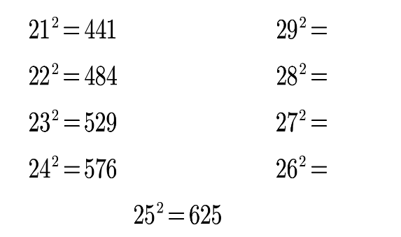
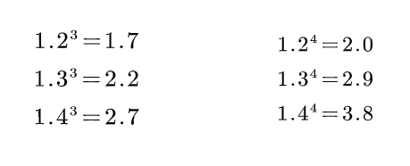

# 特殊增长率
## 一、间隔增长率[时间考法:关于时间的增长率，注意圈时间]
`考查最多`：间隔一年（99%的题目） 

`推导`： 已知：2018 年增长率为𝑟1，2017 年增长率为𝑟2，2018 年比 2016 年 增长+%？

如果 2016 年记为 A，此时 2017 年=A×(1+r2)，2018 年=A×(1+r2)×(1+r1)，则所求

$ r=\frac{现期-基期}{基期}=\frac{2018年-2016年}{2016年}=\frac{\text{A×(1+r2)}×(1+r1)-A}{A}=1+r1+r2+r1×r2-
1=r1+r2+r1×r2。 $

公式：$ 𝑟间隔=𝑟1+𝑟2+𝑟1×𝑟2 $（和+积）

`识别`：2018 年比 2016 年增长+%？（隔一年，求增长率（以率求率、间隔一 年））r1、r2 怎么找

2018 年比 2016 年增长了百分之几？ 

r1：2018 年的同比增长率, r2：2017 年的同比增长率 

`速算`： 

①r1、r2 的绝对值均小于 10%，𝑟1+𝑟2 的和与选项差一个百分点以上，r1*r2 可以忽略（10%*10%=1%）

②化成分数；化成小数 

③结合选项看答案 

5.01%+8.02%+5.01%*8.02%≈ 

A.11.2%  B.12.7%  √`C.13.4%`  D.14.7% 

28%+25%+28%*25%≈？

> 25%=1/4，原式=53%+（ $ \frac{28\%}{4} $）=53%+7%=60%
>

40%+15%+40%*15%≈？

> 原式=55%+（0.4*15%）≈55%+6%=61%
>

`坑点：𝑟2，给还是没给 `

给了直接用。 

没给需要计算。如已知 2018 年同比增长率为 10%，增速提高了 3 个百分点， 此时 r1 直接给出，r2 需要计算→r2=10%-3%=7%。

### 题型延伸 1：间隔倍数 
特征：间隔一年，求倍数

举例：2020 年工资同比增长了 30%，2019 年同比增长了 20%，则 2020 年工资是 2018 年的多少倍？

> r 间=30%+20%+30%*20%=50%+600/10000=50%+6%=56%
>

间隔倍数=1+56%=1.56 倍 

`两步走`：

①先求出 r 间 

②间隔倍数=r 间+1 

### 题型延伸 2：间隔基期量 
`特征`：间隔一年，求基期

`举例`：2020 年工资额是 400 元，同比增长了 10%，2019 年同比增长了 20%，则 2018 年的工资是多少元？

> r 间隔=10%+20%+10%*20%=32%$ \text{间隔基期}=\frac{\text{现期量}}{1+\text{r 间}}=\frac{400}{1+32\%}\approx303.03 $
>

两步走： 

① 先求出 r 间 

② $ 间隔基期=\frac{现期量}{1+r间} $

****

## 二、年均增长率
`识别`：年均增长最快、年均增速排序；年均增长率为…

`公式`：$ (1+\mathrm{r})^{\mathrm{n}}=\frac{\text{现期量}}{\text{基期量}} $（n 为现期和基期的年份差）

年均增长类问题基期的选择 

江苏省考：2011 年～2015 年：年份差为 5（基期往前推一年） 

国家规定：五年规划，“十几五”期间：年份差为 5（基期往前推）“十三五”（2016～2020），基期：2015 年；现期：2020 年，n=5

比较：n 相同，直接比较$ \frac{现期量}{基期量} $

$ (1+\mathrm{r})^n=\frac{\text{现期量}}{\text{基期量}}\to1+\mathrm{r}=\sqrt[n]{\frac{\text{现期量}}{\text{基期量}}}\to\mathrm{r}=\sqrt[n]{\frac{\text{现期量}}{\text{基期量}}}-1 $，为负也满足定理

`计算`：平方数，居中代入，排除选项做题

①21²=441，21 和 29 关于 25 对称，21 与 25 差 4，25 和 29 差 4，差 4 加 400，29²=841。 

②22²=484，22 和 28 关于 25 对称，22 与 25 差 3，28 和 25 差 3，差 3 加 300，28²=784。

③ 23²=529，23 和 25 差 2，25 和 27 差 2，差 2 加 200，27²=729。 

④ 24²=576，24 和 25 差 1，25 和 26 差 1，差 1 加 100，26²=676。

⑤ 25²=625。

例题：2010 年的产值是 172227，增长率为 30%，保持此增长率，问 8 年后的产值是现在的多少倍？

> 答：所求=$ \frac{172227×(1+30\%)^8}{17227} $=1.38=（1.3²）4=1.694≈1.74=（1.7²）²=2.89²≈2.9 ²=8.41。
>

`年均增长率最常考平方数，近似记忆（这是法宝）`

规律为 1.7、2.2、2.7 是公差为 0.5 的等差数列，2.0、2.9、3.8 是公差为 0.9 的等差数列。

## 三、混合增长率

`题型识别`：部分 1+部分 2=整体的增长率关系 

房产、地产→房地产进口、出口→进出口邮政、电信→邮电

上半年、下半年→全年 一季度+二季度=上半年 （1～2 月）+3 月=一季度 

求增长率，但缺少直接数据，则考虑是否为混合。

`根据选项判断口诀`： 

（1）居中但不中（最小 r＜总体 r＜最大 r） 

（2）从中间偏向基期量较大的 

（3）偏向搞不定，线段法精算 

注：求混合增长率，做题时无基期量，一般用现期量近似代替基期量

`线段法：推导 `

浓度为 13%的溶液 A 克与浓度为 23%的溶液 B 克，混合后的浓度为 17%。

13%*A+23%*B=17%*（A+B），（23%-17%）*B=（17%-13%）*A 

（17%-13%）和（23%-17%）是距离，A 和 B 是量，距离*量= 距离*量，距 

离和量的乘积相等，说明距离和量成反比。习惯性的将小的 13%写在线段左边， 

大的 23%写在线段右边，符合数轴，13%和 23%混合后浓度为 17%（写在线段中 

间）；17%-13%=4%， 23%-17%=6%，距离之比 4%：6%=2：3，量之比为 3：2。

`线段法口诀`： 

（1）混合之前写两边，混合之后写中间。

（2）距离和量成反比。 

（3）距离指和混合后的距离（也就是做差）。 

练习：浓度为 13%的溶液 200 克与浓度为 23%的溶液 B 克，混合后的浓度为 15%。 

> 答：混合之前（13%、23%）写两边，混合之后（15%）写中间，距离之比为 2%：8%=1：4，距离与量成反比，则量之比为 4：1，13%的溶液为 200g，则 23% 的溶液为 50g。

线段法的拓展运用：重点注意，量是分母

增长率= 增长量 基期量（资料），混合增长率的量是基期量 

平均数= 总 人数 量（数量、资料），混合平均数的量是人数

资料分析中，问人数比例，但是无任何人数的数据。方法：用混合平均数线 

段法（平均数的量是人数）。

