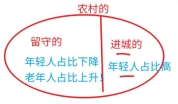

# 第3章 逻辑论证之数量论证

数量论证：一种“数学+逻辑”的综合题目，题干中存在的逻辑漏洞和数学知识有关，可针对常见逻辑漏洞攻击。

## 3.1 比例类论证

`比例类论证：`此类问题常犯的逻辑错误是用“分子的多少”代替“分子/分母的比例”得出结论，题干往往包含数字（分子部分），我们需要在选项中找到带“数字”的分母部分，识别题型，可以秒杀。

---

【例】某次考试只有四海和五湖同学参加，上岸考生中四海占比 40%、五湖占比 60%； 

由此可知，五湖教学效果更好。 

A．该次考试参考考生中五湖占比高于 60% 

B．该次考试参考考生中五湖占比等于 60% 

C．该次考试参考考生中五湖占比小于 60%

:::note

假设本次上岸人数共 100 人，四海 40 人，五湖 60 人。

四海$\frac{40}{400^-}>10\%$，五湖${\frac{60}{600^+}}<10\%$则四海上岸率更高，A 为质疑项；

四海$\frac{40}{400}>10\%$，五湖=10%则四海、五湖教学效果一样好，B为质疑项；

四海$\frac{40}{400^+}<10\%$，五湖${\frac{60}{600^-}}>10\%$则五湖效果更好，C为支持项

:::

---

例题 1（2020 上海事业单位） 

在第二次世界大战期间，大约有 37.5 万美国平民丧生，40.8 万美国武装部队的人员在海外牺牲。根据这个数据可以得出，第二次世界大战期间，被派往海外的人员并没有比留在美国的平民危险多少。 

下列哪项如果为真，最能揭示上述论断的荒谬之处： 

A．除上述对比外，还应该对比在美国因为意外事故死亡的人数和在战争中死亡的人数 

B．不应该单纯比较死亡人数总量，而应该就各自群体每千人中死亡的人数进行比较 

C．除了统计美国武装部队在海外死亡的人数外，还要计算整个美国武装部队的人数 

D．应该把武装部队中因疾病导致的死亡人数与因战争受伤而导致的死亡人数区别开来

:::note

假设在美国本土共有1亿人：派出海外80万：则本土死亡率： $\frac{40万}{1亿}$，派出死亡率：$\frac{40万}{80万}$可知派往海外人员更危险

C：应计算派出的武装部队总人数和在家的平民总数。

:::

---

例题 2（2015 广东） 

有甲、乙两家公司，甲公司售后服务部门接到的产品投诉电话是乙公司的 3 倍。因此，甲公司产品的质量没有乙公司的好。 

以下最能反驳上述结论的是： 

A．乙公司的产品操作相对来说更为简单 

B．甲公司接到电话大多数是咨询电话 

C．甲公司的咨询电话机数量比乙公司多 

D．甲公司产品的市场占有率达到 76%

:::note

投诉率=$\frac{消费者数量}{投诉电话}$，假设投诉电话总量为 100，消费者总数为 1000；则甲公司有 75 通投诉电话，乙公司有 25 通投诉电话则：甲公司投诉率=$\frac{75}{760}<10\%$,乙公司投诉率=$\frac{25}{240}>10\%$,甲公司质量更好。

:::

---

例题 3（2017 事业单位联考） 

某县支行在对其储户进行统计分析时发现，在该行存款 10 万元以上的大额储户中，有 55%的储户是城镇居民，该行某负责人由此向县领导建议：为了增加大额储户的比例，县政府应该鼓励农村居民向城镇转移。 

以下哪项如果为真，最能质疑该负责人的建议： 

A．有很多农村居民更愿意将钱存入银行 

B．城镇居民由于消费水平高，通常会更积极努力工作 

C．该县农村居民平均存款额只有城镇居民的 70% 

D．该县城镇居民的比例超过 60%

:::note

:::

---

例题 4（2012 国考） 

一项调查结果显示，78%的儿童中耳炎患者均来自二手烟家庭，研究人员表示，二手烟环境会增加空气中的不健康颗粒，其中包括尼古丁和其他有毒物质。与居住在无烟环境的孩子相比，居住于二手烟环境的孩子患中耳炎几率更大，因此医学专家表示，父母等家人吸烟，是儿童罹患中耳炎的重要原因。 

下列哪项如果为真，最能削弱上述论证： 

A．调查中还显示，无烟家庭的比率呈逐年上升的趋势 

B．研究证明，二手烟家庭中儿童中耳炎的治愈率较高 

C．门诊数据显示，儿童中耳炎就诊人数下降了 4.6% 

D．在这次调查的人群中，只有 20%的儿童来自无烟家庭

:::note

:::

---

例题 5（2021 江苏） 

从 2019 年 5 月 1 日至 2019 年底，某机构统计的新能源车辆事故共计 113 起，着火事故占有一定比例。在着火事故车辆中，乘用车占比达到69.6%，专用车次之，公交车最低。这说明，在新能源车辆中，乘用车的安全性大大低于专用车和公交车。 

以下哪项如果为真，最能质疑上述结论： 

A．新能源汽车中乘用车的利润最高，企业对其安全性设施的研发投入也最高 

B．新能源专用车和公交车的司机一般驾龄较长、水平较高，出车事故率较低 

C．在新能源汽车的着火事故中，乘用车的伤亡人数远远少于专用车和公交车 

D．据该机构统计，新能源专用车和公交车保有量不到新能源汽车总量的 10%

:::note

:::

---

例题 6（2023 山东） 

一项针对某高校学生的调查显示：90%考试不及格的同学喜欢打游戏。有人据此认为，打游戏更容易导致学生考试不及格。 

以下哪项如果为真，最能削弱上述结论： 

A．不打游戏的学生只占全体学生的一成 

B．有研究表明，打游戏会促进智力发展 

C．小张不喜欢打游戏，但经常考试不及格 

D．题目难度大，也是考试不及格的一个原因

:::note

:::

---

例题 7（事业单位） 

一项对某高校教员的健康调查表明，80%的胃溃疡病患者都有夜间工作的习惯。因此，夜间工作易造成的植物神经功能紊乱是诱发胃溃疡病的重要原因。 

以下哪项如果为真，将严重削弱上述论证： 

A．医学研究尚不能清楚揭示消化系统的疾病和神经系统的内在联系 

B．该校的胃溃疡病患者主要集中在中老年教师中 

C．该校的胃溃疡病患者近年来有上升的趋势 

D．该校只有近五分之一的教员没有夜间工作的习惯 

:::note

:::

---

例题 8（2010 深圳市考） 

据调查，某地 90%以上有过迷路经历的司机都没有安装车载卫星导航系统。这说明，车载卫星导航系统能有效防止司机迷路。 

以下最能削弱上述论证的是： 

A．很多老司机没有安装车载卫星导航系统，很少迷路 

B．车载卫星导航系统的使用效果不理想，对防止迷路没有多大作用 

C．当地目前只有不足 10%的汽车安装了车载卫星导航系统 

D．安装了车载卫星导航系统的司机，90%以上经常使用

:::note

:::

---

## 3.2 抽样类论证

`抽样类论证`：此类问题常犯的逻辑错误是从某一特殊群体中抽样，该群体并不能代表整体情况。

---

例题 9（2022 四川事业单位） 

“闪婚”是指男女双方恋爱不到半年就结婚。某研究所对某市法院审理的所有离婚案件做了调查。结果显示，闪婚夫妻三年内起诉离婚的比例远远高于非闪婚夫妻。由此，该研究机构认为闪婚是目前夫妻离婚的一个重要原因。 

下列哪项如果为真，最能削弱以上论证： 

A．调查发现，离婚最快的夫妻往往不是闪婚夫妻 

B．到该市民政部门办理的协议离婚案件占该市离婚案件总量的 70% 

C．调查显示，闪婚夫妻婚后感情更加融洽 

D．调查显示，恋爱时间过长的夫妻离婚率高于闪婚夫妻

:::note

A：并非讨论哪种夫妻离婚最快，属无关项。

B：“到该市民政部门办理的协议离婚案件占该市离婚案件总量的 70%”可知，到法院起诉离婚的可能只占总量 30%，由 30%的案件中推导结论，结论可靠性不强。

C：即便感情融洽也无法改变起诉离婚比例高这一事实；

D：恋爱时间过长也可能成为离婚的一个原因，与题干不矛盾。

【正确选项】B

:::

---

例题 10（2023 四川省考） 

某消费导向杂志在读者中做了一项调查，以预测明年的消费趋势。在被调查者中，有 57%的人在明年有奢侈品项目消费的计划。该杂志由此推测：明年消费者的消费能力会很强。 

以下哪项如果为真，最能削弱该杂志的推测? 

A．该刊物的读者要比一般消费者富有 

B．并非所有该刊物的读者都对调查作了回答 

C．大多没有奢侈品项目消费计划的人都打算存钱买房 

D．计划购买的奢侈品大多是进口的，并不能刺激国内市场

:::note

本题论据为：调查中 57%的人在明年有奢侈品项目消费的计划；结论为：明年消费者的消费能力会很强。 

A：调查本身存在问题，调查对象本身即为相对富有的人，其调查结果无法推整体。

其他选项：C、D 选项均未提及，B 选项即便未调查全部读者其结果依旧有意义。

:::

---

例题 11（2017 国考）

某平台发布了一份网购调研报告，分析亚洲女性网购特点。分析显示，当代亚洲女性在网购服饰、化妆品方面的决策权为88%，在网购家居用品方面的决策权为85%。研究者由此认为，那些喜爱网购的亚洲女性在家庭中拥有更大的控制权。

以下哪项如果为真，最能反驳上述结论：

A．一些亚洲女性经济不独立，家庭收入没有贡献

B．亚洲女性在购买贵重商品时往往会与丈夫商量，共同决定

C．亚洲女性中，习惯上网购物的人数只占女性总人数的30%左右

D．喜爱网购的亚洲女性的网购支出只占其家庭消费支出的25%

:::note

论据为：亚洲女性在网购中决策权大 

结论：喜爱网购的亚洲女性在家庭中有更大的控制权。

C：若 C 当选，应为“喜欢上网购物的亚洲女性有决策权→亚洲女性都有更大的控制权”

D：网购在家庭消费中占比很低，故无法推出整体

:::

---

## 3.3 盐水类论证

`盐水类论证`：可看成盐水问题，混合浓度要在两部分浓度之间。

---

例题 12（2019 上海市考） 

研究人员研究了来自 110 万人的 DNA，得出了一个评分系统。利用该系统可以通过检测某人的 DNA 来大致预测某人的受教育程度。结果发现，那些基因得分最低的人只有 10%的机会从大学毕业；相比之下，那些基因得分在前五分之一的人，有 50%的机会从大学毕业。这是有史以来最大规模的人类认知遗传学研究。有些人据此以为，人类的基因与学历之间有极大联系。

下列哪项如果为真，最能质疑这些人的观点： 

A．在 110 万被研究者中，抽样显示，只有不到 30%的人是大学毕业的 

B．在大学毕业的被研究者中，其父母之一是大学毕业的超过 50% 

C．在 110 万被研究者中，有超过 60%的人是大学毕业的 

D．基因得分最居中的人，也有 40%的机会从大学毕业

:::note

A：整体大学毕业率是 30%，50%＞30%＞10%，二者之间存在正相关，确实基因得分越高，大学毕业的可能越大，具有支持力度

B：与父母无关，题干中没提及父母

C：整体大学毕业率 60%，整体在中间，基因得分高的应该超过 60%，但是现在并没有，因此无法说明二者之间存在极大联系

D：中间这些人，40%大学毕业率，50%＞40%＞10%，二者之间确实存在正相关，基因得分越高，大学毕业的可能越大，具有支持力度

注：极大联系看作正相关不能推到所有题中，是在这道题中，题干想表达的这种联系 

是基因得分高，大学毕业率高。

:::

---

例题 13（2021 事业单位联考） 

截至 2019 年末，全国 60 岁以上的老年人超 2.5 亿，其中农村老人占 1.3 亿。估计未来可能还有近 10%的农村人口会转移到城市居住，但仍有 4 亿多的农村人口。根据预测，到 2028 年的时候，农村老年人口的比重或将突破农村人口的 30%。由此可见，我国农村的老龄化水平要高于城市，农村面临着更为严重的老龄化问题。 

以下各项如果为真，除哪项外均能支持以上论述： 

A．农村的年轻人越来越多地向城市转移并改变其户籍性质 

B．截至 2019 年末，我国农村人口在总人口中的占比不足 50% 

C．未来，我国将采取更有力的措施积极应对农村人口老龄化 

D．农村转移到城市居住的人口中，六十岁以上的老人占比不到 30%

:::note

【参考答案】C 

【参考解析】结论：农村老龄化比城市更严重。

A：进城的年轻人多，因此城市的老龄化问题没有农村严重，支持；

B：农村分子大，分母小，因此老龄化更严重，支持；

C：具有质疑力度，至少是无关项，出台措施会在一定程度上解决问题，出台措施说明以后农村老龄化不一定会像现在呈现的那么严重，有可能农村的老龄化程度不比城市更严重；

D：农村的老年人占比为：$\frac{1.3}{4}=30\%^+$, 说明农村的老龄化问题严重，支持

:::

---

