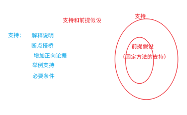

# 第6章 逻辑论证之支持、前提、解释

## 6.1 支持、前提假设、解释说明的整体概述

`常见问法`： 

- 支持论证类“以下哪项如果为真，最能加强上述论证”、“以下哪项如果为真，最能支持上述发现” 

- 前提假设类“如果上述结论为真，需要补充的前提是”、“上述推测还需要隐含哪一项假设” 

- 解释说明类“以下最能解释这一现象的是”、“以下哪项为真，最能解释这一情况” 

`支持类常见支持方式`：解释说明、断点搭桥、增加正向论据、必要条件、举例支持等。

`前提假设类常见选项形式`：断点搭桥（同支持类）、补充漏洞（类似增加正向论据）、 必要条件（同支持类）。 

解释说明类：此类问题题干中存在一个“让人费解”的现象，此现象看似“不寻常”实则“正常”，需要我们为其找到一个合理的理由，这个理由不能像借口，越能让人接受越好；此类问题的正确选项往往是出题人故意未提及且大家也容易忽略的合理事实，只要加上此事实，就可让人疑惑顿消。 

`支持和前提关系`：前提假设可看作“特殊支持类”，解法相对固定，重点考虑上述三类选项，但逻辑本质也是支持，属于补充论证过程缺少内容的支持。 支持包含前提假设，前提假设是一种特殊的支持。

`支持和解释关系`：解释也可看作“特殊支持类”，通过解释说明支持题干现象的合理性，类似支持类的解释说明支持。 

## 6.2 五种常见支持方式

### 6.2.1 解释说明

解释了为什么得到此结论，读懂了该选项应有豁然开朗之感。此类问题相对简单。

---

例题 1（2022 新疆） 

近日，有研究统计全球疟原虫感染率与癌症死亡率的关系，发现剔除经济、环境、医疗水平等干扰因素后，二者之间仍然存在显著的负相关性。在后续的实验中，实验者让小鼠患上刘易斯肺癌，接着对实验组小鼠注射疟原虫，结果显示，感染疟原虫的小鼠生存时间大大增加。于是研究者宣称“疟原虫感染可以 

治疗癌症”。

以下哪项如果为真，最能支持上述结论： 

A．疟原虫感染率越高的地区，癌症死亡率越高 

B．实验时间普遍较短，长期的安全性与有效性未知 

C．小鼠感染疟原虫后的症状与人类不同，动物实验有效不等于人体治疗有效 

D．疟原虫入侵人体之后，可以激活 NK 细胞，NK 细胞可以同时杀死疟原虫和癌细胞

:::note

A：题干结论说的是感染率越高死亡率越低，A 说反了变成质疑了。 

B：挑实验的毛病，属于质疑，实验瑕疵质疑。

C：说不一定有效，是质疑。 

D：说为什么能治疗癌症，是对结论解释说明，可以支持，当选。

【答案】D 

【解析】 

结论：二者是负相关性，疟原虫感染率越高，癌症死亡率越低。 

:::

---

例题 2（2016 联考） 

酒精本身没有明显的致癌能力。但是许多流行病学调查发现，喝酒与多种癌症的发生风险正相关--也就是说，喝酒的人群中，多种癌症的发病率升高了。 

以下哪项如果为真，最能支持上述发现： 

A．酒精在体内的代谢产物乙醛可以稳定地附着在 DNA 分子上，导致癌变或者突变 

B．东欧地区的人广泛食用甜烈性酒，该地区的食管癌发病率很高 

C．烟草中含有多种致癌成分，其在人体内代谢物与酒精在人体内代谢物相似 

D．有科学家估计，如果美国人都戒掉烟酒，那么 80%的消化道癌可以避免

:::note

A：解释了为什么酒精能让癌症发病率高，当选。 

B：举例子，个例支持不足以说明结论，不知道其他地区是什么样。

C：主体不一致，题干说酒精，没说烟草。 

D：美国也是个例，而且忌烟酒避免消化道癌，不知道是忌烟起的作用还是忌酒起的作用。 

【答案】A 

【解析】 

结论：喝酒的人癌症发病率高。

:::

---

例题 3（2022 浙江省考） 

有些人的心情比较容易受到外界影响，比如飞行员担心遇到雷暴，虽然没有什么奇招，但有些食物的确能让大脑更好地运作，可可就是其中之一。这是因为可可含有大量的茶碱和咖啡因，它们可以有效的减轻压力和缓解疼痛。 

以下哪项如果为真，最能支持上述观点： 

A．虽然可可富含咖啡因，但咖啡因只有在特定条件下才能发挥其减压作用 

B．据研究显示，可可中含有的茶碱和咖啡因可以刺激大脑分泌内啡酞，而内啡酞对减轻压力和缓解疼痛非常有效 

C．每天摄入主要原料为可可的黑巧克力对情绪会有一定影响 

D．每天至少 30 分钟的运动，有助于大脑产生缓解压力和焦虑所需的激素

:::note

A：说只在特定条件下起作用，无法支持结论。 

B：解释说明为什么可可可以减轻压力和缓解疼痛，当选。 

C：是什么影响好的坏的没说。 

D：没说可可的事，无关选项。

【答案】B 

【解析】 

结论：可可能减轻压力和缓解疼痛。

:::

---

### 6.2.2 断点搭桥

若题干的结论中存在论据没有的“新内容”，此新内容一定在选项中要有所体现，并能够和论据中的关键信息进行搭桥。

---

例题 4（2020 江苏） 

为了研究早餐前锻炼和早餐后锻炼对健康的影响，研究人员进行了连续 8 周的实验，其中，实验组在早餐前锻炼，对照组在早餐后锻炼。结果发现，实验组锻炼过程中平均燃烧的脂肪量是对照组的 2 倍。体检结果进一步显示，实验组胰岛素反应能力得到了改善，而对照组没有。研究人员由此认为，相较于早餐后锻炼，早餐前锻炼更能降低罹患心血管疾病的风险。 

以下哪项如果为真，最能支持上述研究人员的观点： 

A．胰岛素反应能力强能有效稳定人体的血糖含量 

B．脂肪量过高是罹患心血管疾病的主要原因 

C．饱食状态下锻炼常常会引起胃穿孔等意外 

D．实验对象都是已经患有心血管疾病的个体

:::note

A：胰岛素能提高血糖，没提心血管疾病。

B：将脂肪量和心血管病进行搭桥联系，可以支持，当选。 

C：同样没说心血管疾病。 

D：也没有说燃烧脂肪或者胰岛素能力是不是能降低心血管疾病。

【答案】B 

【解析】 

论据：实验组早餐前锻炼燃烧脂肪量多，胰岛素能力改善。 

结论：早餐前锻炼更能降低罹患心血管疾病风险。 

思考燃烧脂肪量及胰岛素能力和心血管疾病的关系进行搭桥。

:::

---

例题 5（2022 辽宁事业单位） 

研究人员招募了 33 名年龄在 50-65 岁之间的糖尿病前期患者。这些患者超重，并且随着年龄增长，记忆力下降。在 12 周的时间里，除了每天早餐或晚餐食用一包可与水混合的补充粉剂之外，参与者被要求禁食任何种类的浆果类水果。其中一半的参与者接受了相当于半杯完整蓝莓的粉末，而另一半则接受了安慰剂。研究人员测试了参与者某些认知能力的下降水平，如工作记忆、心理灵活性和自我控制等执行功能后发现，蓝莓治疗组的患者此方面表现有明显改善。因此研究人员认为，在某些中年人群的日常饮食中添加蓝莓或会降低患老年痴呆症的几率。 

下列选项如果为真，最能加强上述结论的是： 

A．蓝莓含有高水平的抗氧化剂花青素，有助于增强细胞内的能量产生 

B．增强记忆力可以促进大脑细胞发育，有效降低老年痴呆的发生几率 

C．蓝莓因其丰富的营养价值被联合国粮农组织列为人类五大健康食品之一 

D．本次研究还发现蓝莓治疗组的患者空腹胰岛素水平相对安慰剂治疗组较低

:::note

A：没说到老年痴呆，不能和结论建立联系。 

B：把提高记忆和老年痴呆建立了联系，搭上了桥，当选。 

C：也没说老年痴呆。 

D：同样和老年痴呆无关。

【答案】B 

【解析】 

论据：吃蓝莓组工作记忆、心理灵活性、自我控制能力提高！ 

结论：吃蓝莓降低老年痴呆风险。 

思考吃蓝莓和老年痴呆之间关系，进行搭桥。

:::

---

