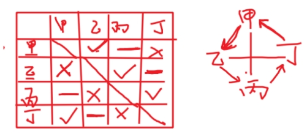

# 第7章 翻译推理

## 7.1 等价推出

`等价推出`指的是将题干逻辑关系和选项逻辑关系分别翻译后，二者完全一致。考察的是对翻译规则的掌握，常用知识点有命题的传递和原命题、逆否命题等价。

题干中无逻辑关联词的部分不需要关注，直接寻找带有逻辑关联词的语句即可。

`翻译规则如下`：

| 常见提示词                                                   | 翻译            |
| ------------------------------------------------------------ | --------------- |
| p 并且 q、p 和 q、p 同时 q、p 也 q、p 还 q、p，q             | p 且 q          |
| p 或 q、p q 至少一个、非 p 非 q 至多一个                     | p 或 q          |
| 如果 p 那么 q、若 p 则 q、只要 p 就 q、一 p 则 q、所有 p 都是 q | p→q             |
| 只有 p 才 q、必须 p 才 q、不 p 不 q                          | q→p             |
| 除非 p 否则 q、必须 p 否则 q、p 否则 q                       | 非 p→q（非q→p） |
| q 是 p 的基础/关键/前提、p 离不开/必须/需要 q、q 必不可少/不可或缺 | p→q             |

### **7.1.1 与题干等价**

`解题技巧`：

1. 若将题干翻译为 A→B，可以翻译为 A→B 或非 B→非 A 为正确选项。因此，以 B 或非A（肯后或否前）开头的选项可先排除。
2. 若题干有多个带有逻辑关联词的句子，先不需要联立，有时答案只和其中一句有关；

---

例题 1（2019 天津事业单位） 

只要今晚台风不登陆上海，轮船就按时开。 

以下哪项正确地表达了上述断定： 

（1）如果轮船按时起航，则今晚台风一定没有登陆上海 

（2）如果轮船不按时起航，则今晚台风登陆上海了 

（3）除非台风登陆上海，否则轮船按时起航 

A．只有（1） 

B．只有（2）和（3） 

C．只有（3） 

D．（1）、(2)和（3） 

:::note

只要…就…

翻译为台风不登录→按时开

始发站：不登录/不按时终点站：登录/按时

【答案】B 

【解析】根据分析发现：按时是终点 

①按时→…，根据批注分析，“按时”不能做始发站，直接排除； 

②不按时→登录，是题干的逆否，正确； 

③除非…否则…，按照否 A 则 B，翻译为不登录→按时，正确。 所以只有（2）和（3）正确。 

:::

---

例题 2（2019 江苏省考） 

没有人民支持和参与，任何改革都不可能取得成功。只有充分尊重人民意愿，形成广泛共识，人民才会积极支持改革、踊跃投身改革。要坚持人民主体地位，发挥群众首创精神，紧紧依靠人民推动改革开放。 

根据以上陈述，可以得出以下哪项： 

A．只有人民支持和参与，改革才可能取得成功 

B．只有坚持人民主体地位，才能发挥群众首创精神 

C．如果人民踊跃投身改革，则说明形成了广泛共识 

D．如果没有充分尊重人民意愿，人民就不会积极支持改革

:::note

“不…不…”，取得成功→人民支持和参与；逆否：没有人民支持和参与→改革不成功

【答案】A 

【解析】A 选项为“只有…才…”，翻译为改革成果→人民支持和参与，直接选出。

原文为并列关系，B 选项无中生有，排除

C选项、D 选项出自“有充分尊重人民意愿，形成广泛共识，人民才会积极支持改革、踊跃投身改革”，翻译为 积极支持改革且踊跃投身革命→充分尊重人民意愿且形成广泛共识，且关系需要同时满足才能推下去。 

而 C 选项只提及投身改革，不足以推出形成共识； 

D 选项为原文逆反，但是只提及没有尊重人民意愿，不足以推出不支持改革。 

:::

---

例题 3（2022 青海省考） 

在面向我国科技强国和现代化强国建设目标的背景下，要满足经济社会发展科技的要求，就要不断强化科技创新对经济社会发展的战略支撑。只有大力促进科技治理体系和治理能力现代化，才能充分发挥科技创新对经济社会发展的促进作用。 

由此可以推出： 

A．只要不断强化科技创新对经济社会发展的战略支撑，就能满足经济社会发展科技的要求 

B．如果不能满足经济社会发展科技的要求，就不能强化科技创新对经济社会发展的战略支撑 

C．如果不大力促进科技治理体系与治理能力现代化，就不能充分发挥科技创新对经济社会发展的促 

进作用 

D．除非充分发挥科技创新对经济社会发展的促进作用，否则不能大力促进科技治理体系与治理能力 

的现代化

:::note

满足发展要求→强化战略支撑发挥作用→促进现代化

始发站：满足发展要求，不强化支撑，发挥作用，不促进现代化

终点站：不满足发展要求，强化支撑，不发挥作用，不促进现代化终点不能在前。因此 AB 可以快速排除

【答案】C 

【解析】 

A 选项：翻译为“强化支撑→”，强化支撑属于终点站，不能放在前面，直接排除； 

B 选项：不…不…结构，翻译为“强化支撑→”，同 A，直接排除； 

C 选项：不…不…结构，翻译为“发挥作用→促进现代化”，符合题干，当选； 

D 选项：除非…否则…结构，否 A 推 B，翻译为“不发挥促进作用→不促进现代化”，不符合题干，排除。 

:::

---

例题 4（2023 国考） 

面对需求收缩、供给冲击、预期转弱三重压力，要想实现国内经济发展稳中求进，关键是要稳住市场主体。只有围绕市场主体需求实施更大力度减税降费，才能帮助其渡过资金难关。除了减税降费外，还需继续深化“放管服”改革，才能为市场主体营造更加市场化、法治化的营商环境。只有营商环境更加市场 

化、法治化，市场主体才会获得内生动力，从而进一步增强国内经济的吸引力、创造力、竞争力。 

由此可以推出： 

A．实施更大力度减税降费，是帮助市场主体渡过资金难关的必要举措 

B．只要稳住市场主体，就能实现国内经济发展稳中求进 

C．如果深化“放管服”改革，就能营造更加市场化、法治化的营商环境 

D．若市场主体不具有内生动力，国内经济就不会有吸引力、创造力、竞争力

:::note

恢复状态→提高科学性，看做 C→D

同时做到两方面→提高科学性，看做 A→B

AB 选项都是 D（提高科学性）开头，直接排除

B开头，直接排除

只有围绕市场主体需求实施更大力度减税降费，才能帮助其渡过资金难关：渡过难关→减税降费

必要举措：必要举措就是必要条件

【答案】A 

【解析】 

A 选项翻译为：帮助主体度过难关→更大力度减税降费，直接选出。 

D 选项：“从而进一步增强国内经济的吸引力、创造力、竞争力。”没有逻辑关联词，无中生有，排除。

:::

---

例题 5（2023 吉林省考） 

土地荒漠化是人为因素和自然因素综合作用的结果，想要在土地退化的地区恢复人与自然和谐共生的状态，必须提高土地荒漠化防治的科学性。一方面，把握积极作为和有所不为的平衡，即一手抓人工治理，一手抓自然修复；另一方面，提高防治精细化水平。如果同时做到上述两个方面，土地荒漠化防治的科学性自然得到了提高。 

由此可推出： 

A．只有在土地退化的地区恢复人与自然和谐共生的状态，才能提高土地荒漠化防治的科学性 

B．如果土地荒漠化防治的科学性得到了提高，则说明在土地退化的地区恢复了人与自然和谐共生的状态 

C．如果土地荒漠化防治的科学性没有得到提高，则说明或者没有把握积极作为和有所不为的平衡，或者没有提升防治精细化水平 

D．如果土地荒漠化防治的科学性得到了提高，则说明把握积极作为和有所不为的平衡，以及提升防治精细化水平一定同时得以实现

:::note

【答案】C 

【解析】A 选项翻译为“提高科学性→恢复状态”，和原文相反，排除。 B 选项：翻译为“提高科学性→恢复状态”，和原文相反，排除 

C 选项：原文“如果同时做到两个方面，土地荒漠化防治的科学性自然得到提高” 逆否翻译为“科学性没有提高→非（把握平衡且提高水平），即非把握平衡或未提高水平”，C 选项正确； 

D 选项：和原文相反，排除。

:::

---

例题 6（2018 事业单位联考） 

未来人工智能将取代旅游行业内 90%的服务类工作，带来巨大变革。人工智能不是要模仿人类，而是要超越人类。未来的十年一定是人工智能的时代，我们可以通过人工智能的技术解决旅游行业的很多问题。要促进人工智能在旅游行业的深入发展，技术变革和创新型人才必不可少，而高薪和福利将成为招纳人才的关键。 

由此可以推出： 

A．如果不实行技术变革，人工智能难以在旅游行业深入发展 

B．未来是人工智能的时代，人工智能的发展必会颠覆传统旅游行业 

C．若能招募到创新型人才，人工智能在旅游行业的变革将会成功实现 

D．高薪和福利是当前创新型人才在择业时首先考虑的问题

:::note

【答案】A 

【解析】题干中选中句可翻译为：深入发展→技术变革且创新型人才，逆否命题为：非技术变革 或 非创新型人才→不深入发展，“或”的关系一真则真，“非技术变革→不深入发展”成立，A 选项正确；B 选项“必会颠覆”无中生有；C 选项看标绿部分，二者之间不存在推出关系，并且“变革将会成功实现”为无中生有；D 选项“首先考虑的问题”题干中并未体现。

举例：花生十四小朋友吃完面条 或 吃完米饭→可以去看电视，吃完一种就可以去看电视了，一真则真。

等价推出类题目，题干中没有的信息一定不选。

此类题目只存在一个充分条件和一个必要条件，是不是首先考虑的问题并不知道。

:::

---

例题 7（2019 江苏） 

信仰、信念、信心，任何时候都至关重要。小到一个人、一个集体，大到一个政党、一个民族、一个国家。只要有信仰、信念、信心，就会愈挫愈奋、愈战愈勇，否则就会不战自败、不打自垮。 

根据以上陈述，可以得出以下哪项： 

A．没有信仰、信念、信心，我们就会不战自败、不打自垮 

B．没有信仰、信念、信心，我们就不会愈挫愈奋，愈战愈勇 

C．如果不战自败、不打自垮，就说明我们没有信仰、信念、信心 

D．如果愈挫愈奋、愈战愈勇，我们就不会不战自败、不打自垮

:::note

举例：只要努力，就有机会，否则不能成功。可以翻译为：①只要努力，就有机会。②要努力，否则不能成功。

【答案】A 

【解析】题干中选中句可翻译为：①只要有信仰、信念、信心，就会愈挫愈奋、愈战愈勇。②必须有信仰、信念、信心，否则就会不战自败、不打自垮。 

②可翻译为“没有信仰、信念、信心→不战自败、不打自垮”，A 选项当选；①可翻译

为“有信仰、信念、信心→愈挫愈奋、愈战愈勇”，②逆否后和①串联为：非（不战自败）

→信仰→愈战愈勇，D 选项从“终点站”出发，推不下去；C 选项“不战自败”相当于从“终点站”出发，推不下去。 

:::

---

例题 8（2013 国考） 

有人说，工作的时候，我们要将重要事务放在主要位置。重要事务是必要条件，关系着一件事情成功与否。重要的事务没做好，一定不成功。但是，细节也是很重要的，细节是成功的充分条件，同样也与一件事情成功与否相关。一个成功的人是能够协调好重要事务与细节的关系的。 

由此可以推出： 

A．成功并不代表着所有细节都处理好了 

B．如果不成功则说明重要事务没有做好 

C．成功的前提条件是既要做好重要事务，又要处理好细节 

D．虽然处理好了细节，但没做好重要事务，也不一定成功

:::note

【答案】A 

【解析】题干中标黄句可翻译为：①成功→重要事务（A→B），②非重要事务→不成功，③细节→成功，①③串联得：细节→成功→重要事务，A 选项可翻译为：成功推不出细节，当选；B 选项可翻译为：非成功→非重要事务（相当于①的非 A→非 B），推不出，排除；C 选项可翻译为：成功→重要事务且细节，成功推不出细节，排除；D 选项根据“①③串联”可知：处理好细节一定做好了重要事务，自身矛盾，排除。

:::

---

例题 9（2014 国考） 

一个人生活虽然很难，但也必须学会一个人，不要轻易依赖别人。这样以后身边的人都离开你的时候，你还可以好好活下去。 

如果以上为真，则以下哪项为真： 

A．不能独自生活的人，在身边的人都离开他的时候，就无法好好活下去 

B．一个人生活虽然很难，但也比身边的人都离开他的时候要来得容易些 

C．不要轻易依赖别人，因为一个人生活的时候会很艰难，无法好好活下去 

D．身边人都离开时还可以好好活，未必是因你以前学会如何一个人生活

:::note

【答案】A 

【解析】

法 1：题干中出现“必须”，很有可能是逻辑关联词表必要条件。B 选项的比较题干中未出现，排除；CD 选项的因果关系题干中未出现，排除；选 A。 

法 2 ：题干中标黄句可翻译为：以后身边人都离开你的时候，你想好好活下去，就必须学会一个人生活。即：一个人想好好活下去→学会一个人生活。A 选项可翻译为：没有学会一个人生活（不能独立生活的人），在身边人都离开时→无法好好活下去（题干的逆否命题），当选。其它翻译方式如下： 

必须学会一个人，在身边人都离开时，才能好好活下去！（必须p才q）

不会一个人生活(不能独自生活)在身边人都离开时，不能好好活下去（非p->非q）

必须学会一个人否则在身边人离开时无法好好活下（必须p否则q）

没学会一个人-》身边人离开时，无法好好活下去（非p->q）

:::

---

### 7.1.2 与题干不等价

`解题技巧`：若题干`只有一个`逻辑关系，可`直接翻译选项`，选项三个相同一个不同，直接`选不同`的选项即可。

---

例题 10（2017 江西省考） 

孔子说：“己所不欲，勿施于人。” 

以下哪项不是上面这句话的逻辑推理： 

A．若己所欲，则施于人 

B．只有己所欲，才能施于人 

C．除非己所欲，否则不施于人 

D．凡施于人的都应该是己所欲的

:::note

题干不需翻译。若翻译，则为：施于人→己所欲。

【答案】A 

【解析】A 选项可翻译为：己所欲→施于人；B 选项可翻译为：施于人→己所欲；D 选项可翻译为：施于人→己所欲；BD 选项相同，A 选项不同，A 选项当选。

此类题目一定为三个相同、一个不同的。

:::

---

例题 11（2020 广西事业单位） 

我国传统俗谚：“吃得苦中苦，方为人上人。”据此，不能推出： 

A．只有吃得苦中苦，才能成为人上人 

B．除非吃得苦中苦，否则成不了人上人 

C．若能吃得苦中苦，则能成为人上人 

D．凡成为人上人的都要吃得苦中苦

:::note

“方”是“才”的意思。

“除非否则”最难翻译，可以跳过先看其他选项。（除非A否则B，可以推得 非B->A）

【答案】C 

【解析】A 选项可翻译为：人上人→苦中苦；C 选项可翻译为：苦中苦→人上人；D 选项可翻译为：人上人→苦中苦，C 选项不同，当选。 

:::

---

例题 12（2023 湖北事业单位） 

隐蔽工程未经项目监理机构进行检查验收，不得进行工程隐蔽或下道工序的施工。 

下列选项无法由此推出的是： 

A．所有经过项目监理机构的检查验收的隐蔽工程都能进行工程隐蔽或下道工序的施工 

B．经过项目监理机构的检查验收是隐蔽工程进行工程隐蔽或下道工序的施工的必要条件 

C．经过项目监理机构检查验收是隐蔽工程进行工程隐蔽或下道工序的施工的前提 

D．隐蔽工程只有经过项目监理机构的检查验收，才能进行工程隐蔽或下道工序的施工

:::note

【答案】A 

【解析】A 选项可翻译为：经过验收→工程隐蔽 或 下道工序；BCD 选项均可翻译为：工程隐蔽 或 下道工序→经过验收；A 选项不同，当选。 

:::

---

例题 13（2022 北京市考） 

要稳定地提高在逻辑考试上的成绩，关键是要在基本概念上有真正的理解，如果没有真正的理解，即使投入再多的精力，做再多的练习，也不可能取得真正稳定的好成绩。 

以下各选项中，除了哪项外，都表达了与上述言论相同的意思： 

A．只有在基本概念上有真正的理解，才能取得真正稳定的好成绩 

B．除非在基本概念上有真正的理解，否则不能取得真正稳定的好成绩 

C．只要在基本概念上有真正的理解，即使没有花很多精力，也能取得真正稳定的好成绩 

D．如果取得了真正稳定的好成绩，说明一定在基本概念上有了真正的理解

:::note

【答案】C 

【解析】A 选项可翻译为：好成绩→理解；C 选项可翻译为：理解→好成绩；D 选项可翻译为：好成绩→理解，C 选项不同，当选。 

对于C：除非否则一般跳过，看其他三个选项。本题中 B选项可翻译为：不理解→非好成绩，逆否为：好成绩→理解。

:::

---

## 7.2 根据已知事实正推

`解题技巧`：无需将题干中的多个命题联立，根据已知事实，按照逻辑传递规则推出即可。

---

例题 14（2020 国考） 

小张这个夏天如果去新疆，就要游吐鲁番和喀纳斯，否则就不去；只有与小李同游，小张才会游吐鲁番或天池；如果与小李同游，小张一定要与小李做约定；如果小张与小李做约定，则小李这个夏天一定要有时间。遗憾的是，这个夏天小李单位来了一项紧急任务，相关人员一律不得请假，小李也不例外。 

由此可以推出： 

A．小张这个夏天去游天池 

B．小张这个夏天去游吐鲁番 

C．小张这个夏天未去新疆 

D．小张这个夏天去游喀纳斯

:::note

有否则翻译为：否 A 则 B。

【答案】C 

【解析】已知小李没时间，小李没时间→没做约定→不同游→非（吐鲁番或天池）＝非吐鲁番且非天池，题干标绿部分可以翻译为：非吐鲁番 或 喀纳斯→小张不去新疆，C 选项当选。

:::

---

例题 15（2020 上海市考） 

经过全力检测和排查，省重大动物疫情监测中心的专家确定了如下事实： 

（1）如果 S 村和 Q 乡出现了非洲猪瘟疫情，则 X 镇未出现； 

（2）X 镇出现了非洲猪瘟疫情，而且有关 W 村的疫情监测报告是准确的； 

（3）只有 W 村的监测报告不准确，Q 乡才未出现非洲猪瘟疫情。 

根据以上陈述，可以得出下列哪项： 

A．S 村没有出现非洲猪瘟疫情，Q 乡出现了 

B．S 村和 X 镇都出现了非洲猪瘟疫情 

C．S 村出现了非洲猪瘟疫情，Q 乡未出现 

D．X 镇和 W 村都出现了非洲猪瘟疫情

:::note

【答案】A 

【解析】根据（2）X 镇出现非洲猪瘟疫情，将（1）进行逆否可得：X 镇出现非洲猪瘟疫情→非（S 且 Q）＝非 S 或 非 Q；再根据（2）W 村报告准确，将（3）翻译为“不不”，即 W 村报告准确→Q 乡出现非洲猪瘟疫情，再根据“否一推一”可得“S 未出现猪瘟”，A 选项当选。 

:::

---

例题 16（2020 天津事业单位） 

小张、小李、小薛三名研究生在选择导师时有如下标准： 

小张：只要他是正教授，我就报考他的研究生 

小李：只有正教授才可以当我的研究生导师 

小薛：只要他有真才实学，我就报考他的研究生 

如果有一位有真才实学的副教授正招收研究生，不可能做他学生的是： 

A．小张 

B．小李 

C．小薛 

D．小张和小李

:::note

【答案】B 

【解析】翻译题干信息如下：①正教授→张报考②不是正教授→不是李的导师③真才实学→薛报考他的研究生。已知“真才实学 且 副教授”，根据③可知薛是他的学生；根据②可知李不是他的学生；根据①“否前”无法知道“张是否是他的学生”，B 选项当选。

:::

---

例题 17（2023 新疆区考） 

某医院刘佳、郑毅、郭斌、丁晓、吴芳、施文 6 位医生拟报名参加“一心向党健康为民”进社区义诊活动，已知下列情况为真： 

（1）要么刘佳参加，要么郑毅参加； 

（2）只有吴芳参加，刘佳才参加； 

（3）如果郭斌和吴芳都参加，那么施文也会参加； 

（4）或者丁晓不参加，或者郭斌参加； 

（5）施文、丁晓至少有 1 人参加。 

现施文确定无法参加，那么 6 位医生中最后参加义诊活动的是： 

A．刘佳、郭斌、丁晓 

B．郑毅、郭斌、丁晓 

C．郑毅、丁晓、吴芳 

D．刘佳、丁晓、吴芳

:::note

【答案】B 

【解析】已知非施文，根据（5）可知“丁晓参加”，根据（4）可知“郭斌参加”，根据（3）的逆否：非施文→非郭斌 或 非吴芳，所以郭斌参加可知“吴芳不参加”，根据（2）可知“刘佳不参加”，根据（1）可知“郑毅参加”，故丁晓、郭斌、郑毅参加，B 选项当选。

:::

---

例题 18（2019 广东事业单位） 

某地官员腐败成风，已知的情况有： 

（1）当且仅当丙不贪污，甲和乙贪污； 

（2）“丙不贪污或甲不贪污”是谎言。 

由此可知，下列说法一定错误的是： 

A．甲、乙、丙三人都贪污 

B．如果甲不贪污，那么乙不贪污 

C．如果乙不贪污，那么丙贪污 

D．如果丙贪污，那么甲贪污

:::note

【答案】A 

【解析】翻译题干信息如下：（1）非丙→甲且乙、甲且乙→非丙（逆否为：丙→非甲 或非乙），（2）非（非丙或非甲）=丙且甲。丙贪污为真，则“非甲 或 非乙”，又因为甲贪污为真，“否一推一”所以“非乙”成立，所以甲贪污、丙贪污、乙不贪污，A 选项一定为假，当选。

:::

---

## **7.3 根据所需结果逆推**

`解题思路`：要想得到 C，根据 B→C，需要 B 成立，要想得到 B，根据 A→B，需要 A 成立，一步一步逆推即可。此类题目最常考察考点是“p 或 q”的“否一推一”，即要想 p 成立，需要 q 不成立。

---

例题 19（2018 下重庆市考） 

如果甲和乙都没有考上研究生，那么丙就考上研究生。 

要得出甲考上研究生的结论，还需基于以下哪一前提为真： 

A．丙考上研究生 

B．丙没有考上研究生 

C．乙和丙都没有考上研究生 

D．乙和丙没有都考上研究生

:::note

【答案】C

【解析】 题干：非甲且非乙—》丙 。要想得到甲考上的结论需要将题干逆否一下：非丙—》甲或乙（A 或 B 命题，一真为真，全假为假；否一推一，一个不成立另一个一定成立。）。要让甲一定成立，那么非丙成立，甲或乙是否一推一关系，乙不成立则甲一定成立！所以选择 C. D 选项没有都=非所有=有些不。

:::

---

例题 20（2020 浙江选调） 

假设“如果甲爱看越剧或乙不爱看越剧，那么丙爱看越剧”为真。 

由下列哪项可推出“乙爱看越剧”的结论： 

A．丙不爱看越剧 

B．甲不爱看越剧 

C．甲和丙都爱看越剧 

D．甲和丙有一个不爱看越剧

:::note

【答案】A 

【解析】 题干：甲或非乙—》丙。要想得到乙，逆否题干：非丙—》非（甲或非乙）=非甲且乙。 所以要想乙成立，通过非丙就可以推出。选 A

:::

---

例题 21（2021 云南） 

吴老师、张老师、孙老师、苏老师都是某校教师，每位只教授语文、生物、物理、化学中的一门课程。 

已知： 

①如果吴老师教语文，那么张老师不教生物 

②或者孙老师教语文，或者吴老师教语文 

③如果张老师不教生物，那么苏老师也不教物理 

④或者吴老师不教化学，或者苏老师教物理 

下列哪项如果为真，可以推出孙老师教语文： 

A．吴老师教语文 

B．张老师不教生物 

C．吴老师教化学 

D．苏老师不教物理

:::note

【答案】C

【解析】想推出孙教语文②里边否一推一，吴不教语文可以推出； 想推出吴不教语文①的逆否命题张教生物可以推出； 想推出张教生物，③逆否命题，苏教物理可推出； 想推出苏教物理，④否一推一，吴教化学可推出。选 C

:::

---

例题 22（2019 联考） 

下列动物如果都只能归属一种门类，并且满足一下条件： 

（1）如果动物 B 不是鸟，那么动物 A 是哺乳动物 

（2）或者动物 C 是哺乳动物，或者动物 A 是哺乳动物 

（3）如果动物 B 不是鸟，那么动物 D 不是鱼 

（4）或者动物 D 是鱼，或者动物 E 不是昆虫 

（5）如果动物 E 不是昆虫，那么动物 B 不是鸟 

以下哪项如果为真，可以得出“动物 C 是哺乳动物”的结论： 

A．动物 D 不是鱼 

B．动物 E 是昆虫 

C．动物 B 不是鸟 

D．动物 A 是哺乳动物

:::note

【答案】B

【解析】想推出 C 是哺乳，2 否一推一，A 不是哺乳；想推出 A 不是哺乳，1 逆否，B 是鸟；想推出 B 是鸟，3 逆否，D 是鱼；想推出 D 是鱼，4 否一推一，E 是昆虫。选 B。

:::

---

## **7.4 两难推理**

由命题推事实

`解题方法`：A→B、非 A→B，可推出 B 成立（可翻译成无论是否 A，都会 B）；A→B、A→非 B，可推出非 A 成立。

---

例题 23（2019 河南事业单位） 

如果张生喜欢摄影，则他会喜欢旅游；如果他不喜欢摄影，则他会喜欢驾车；但是，如果张生不喜欢旅游，则他对驾车也就不感兴趣了。 

据此，可以推出张生： 

A．喜欢旅游 

B．喜欢驾车 

C．不喜欢驾车 

D．喜欢摄影

:::note

【答案】A

【解析】 题干：1.喜欢摄影—》喜欢旅游； 2.不喜欢摄影—》喜欢驾车；3.不喜欢旅游—》不喜欢驾车 。 将 3 逆否： 喜欢驾车—》喜欢旅游 。2 和 3联合，不喜欢摄影—》喜欢驾车—》喜欢旅游 。喜不喜欢摄影，都喜欢旅游，两难推理，选 A。

:::

---

例题 24（2024 河南事业单位） 

某高校需派 2 名左右的学生到乡村支教。众学子纷纷报名。学校经过综合考虑，将人选集中在甲、乙、 

丙三人身上，并达成一致意见: 

①如果甲去，那么乙也去； 

②只有丙去，甲才不会去； 

③如果乙去，那么丙就去； 

④甲和丙不可能都去。 

据此可知： 

A．甲会去，而丙不会去 

B．乙会去，而甲不会去 

C．丙会去，而甲不会去 

D．丙会去，而乙不会去

:::note

【答案】C

【解析】1 逆否与 2 连起来，非乙—》非甲—》丙；3 乙—》丙：两难推理，无论乙还是非乙，丙成立，丙为真。然后看 4，甲和丙不可能都去，所以甲不会去。选 C

:::

---

例题 25（2024 浙江事业单位） 

某大学有高等数学、线性代数选修。甲、乙、丙 3 个学生针对选择的情况有如下说法： 

甲:“如果乙选高等数学，那么我不选高等数学” 

乙:“如果丙选择线性代数，那么我不选高等数学” 

丙:“如果我不选线性代数，那么甲选高等数学” 

如果他们三个说的都是正确的，那么以下说法一定正确的是： 

A．甲选高等数学 

B．乙不选高等数学 

C．丙选线性代数 

D．丙不选高等数学

:::note

【答案】B

【解析】1 乙高—》甲非高 ；2 乙：丙线—》乙非高；3 丙：丙非线—》甲高.将 1 逆否与 3 连起来：丙非线—》甲高—》乙非高。不管丙线或非线，乙非高，两难推理，乙非高。选 B。

:::

---

例题 26（2023 辽宁事业单位） 

某象棋比赛前，甲、乙、丙三人对丁、戊两人能否进入决赛发表了自己的看法。 

甲:只有戊没有进入决赛，丁才会没有进入决赛； 

乙:或者丁没有进入决赛，或者戊进入决赛； 

丙:除非戊没有进入决赛，否则丁没有进入决赛； 

如果甲、乙、丙三人均未猜错，则以下哪项正确: 

A．戊进入了决赛，丁没有进入决赛 

B．丁、戊两人均进入了决赛 

C．丁进入了决赛，戊没有进入决赛 

D．丁、戊两人均没有进入决赛

:::note

【解析】甲：非丁—》非戊 ；丙：丁—》非戊 。两难推理，无论丁成不成立，非戊。乙：非丁或戊。否一推一，非丁为真。 所以 戊没进，丁没进。选 D

:::

---

## **7.5 推出信息**

`解题思路`：根据所给命题的真假，判定选项命题或事实的真假。

---

例题 27（2019 天津事业单位） 

“并非只有上大学才能成才。”与这一判断等值的是： 

A．不上大学就不能成才 

B．不上大学但也能成才 

C．如果上大学，就能成才 

D．并非如果不成才就是没上大学

:::note

【答案】B

【解析】非（只有上大学才能成才）=非（成才—》上大学）并非就是假 。成才—》上大学假命题是：成才且非大学 选 B .

:::

---

例题 28（2015 贵州事业单位） 

小李对小夏说：“你只有既加强锻炼又多吃保健产品，才能保持身体健康。”小夏说：“你这个观点我不同意。” 

下列哪项判断是小夏所同意的观点： 

A．能保持身体健康；但如果加强锻炼，就不多吃保健产品 

B．能保持身体健康；但如果不多吃保健产品，就加强锻炼 

C．能保持身体健康；但既不加强锻炼，又不多吃保健产品 

D．能保持身体健康；但既加强锻炼，又多吃保健产品

:::note

【答案】A

【解析】 小李：健康—》锻炼且保健食品 小夏：并非（健康—》锻炼且保健食品 ）=健康且 非锻炼或非保健 排除 CD AB 通过否 1 推 1，锻炼就一定非保健，可以推出。选择 A。

:::

---

例题 29（2015 贵州事业单位） 

根据对最新卫星云图的分析，早前预报的“梅花”台风下周将正面影响上海的情况不一定会发生。 

以下哪项最接近题干所表述的含义： 

A．“梅花”台风下周将正面影响上海一定不会发生 

B．“梅花”台风下周将正面影响上海可能会发生 

C．“梅花”台风下周将正面影响上海可能不会发生 

D．“梅花”台风下周将正面影响上海的可能性并不比不影响的可能性大

:::note

【答案】C

【解析】 非必然=可能不 不一定=可能不 梅花不一定发生=没话可能不发生 选 C

:::

---

例题 30（2022 广东省考） 

某高校调查本校学生的兴趣爱好后发现，喜欢打羽毛球的学生中，来自体育学院的学生一定喜欢登山。 

根据以上条件，下列情况必定属实的是： 

A．甲喜欢打羽毛球和登山，则甲是体育学院的学生 

B．乙是体育学院的学生，且喜欢登山，则乙喜欢打羽毛球 

C．丁不喜欢打羽毛球和登山，则丁不是体育学院的学生 

D．丙喜欢打羽毛球，不喜欢登山，则丙不是体育学院的学生

:::note

【答案】D

【解析】 喜欢打羽毛球是大前提 必须在这里边讨论 .来自体育学院—》喜欢登山 逆否命题:不喜欢登山—》不是体育学院的学生, 选 D.

:::

---

例题 31（2019 北京事业单位） 

在 A 市的 B 区有多家茶馆，这些茶馆要么会有评书表演，要么会有弹唱表演。 

如果上述论断为真，则以下哪项一定为真? 

①如果 A 市的一家茶馆没有任何文艺表演，那么它一定不在 B 区。 

②如果 A 市的一家茶馆有文艺表演，那么它一定在 B 区。 

③A 市 B 区的一些茶馆有评书表演。 

A．仅① 

B．仅② 

C．仅③ 

D．①②③

:::note

【答案】A

【解析】A 市的 B 区茶馆—》要么有评书表演要么有弹唱表演（要么…… 要么…… ： 只有一真为真，全真全假都为假）；逆否命题为：没有评书且没有弹唱 或 有评书且有弹唱—》非 A 市的 B 区茶馆。 1 真，2 假，3 极端情况可能都是弹唱。所以仅 1 真，选 A.

:::

---

例题 32（2021 北京市考） 

H 市在公共场所中的每一块绿地都配备了垃圾桶。这些垃圾桶或者标有“可回收垃圾”或者标有“不可回收垃圾”。 

如果上述陈述为真，则下列哪项一定为真： 

Ⅰ.H 市配备的垃圾桶上有的标有“可回收垃圾” 

Ⅱ.如果 H 市有一块绿地没有配备垃圾桶，那么该绿地不属于公共场所 

Ⅲ.如果 H 市有块绿地配备了标有“不可回收垃圾”的垃圾桶，那么它属于公共场所 

A．只有Ⅰ 

B．只有Ⅱ 

C．只有Ⅲ 

D．Ⅰ和Ⅱ

:::note

题干的第一句话：所有...都....（前推后）H 市公共场所的绿地→垃圾箱；或者标有“可回收垃圾”或者标有“不可回收垃圾”

【答案】B

【解析】第一句话：H 市公共场所的绿地→垃圾箱

第二句话：或者标有“可回收垃圾”或者标有“不可回收垃圾”

Ⅰ.H 市配备的垃圾桶上有的标有“可回收垃圾”——不一定，说不定全是不可回收垃圾（左侧批注里的第二种），排除；

Ⅱ.如果 H 市有一块绿地没有配备垃圾桶，那么该绿地不属于公共场所——是文段第一句话的逆否，为真；

Ⅲ.如果 H 市有块绿地配备了标有“不可回收垃圾”的垃圾桶，那么它属于公共场所——“垃圾桶”在箭头之后（终点站），推不出，排除。综上，选 B。

在逻辑里“有些”可能是所有人都是（1 到所有）或者是一部分所以文段说：或者标有“可回收垃圾”或者标有“不可回收垃圾”，可能是一种很极端的情况，只标有其中的一种

:::

---

## 7.6 题型分类梳理

| 题型分类                                        | 题干形式                                                     | 解题思路                                                     | 选项形式   |
| ----------------------------------------------- | ------------------------------------------------------------ | ------------------------------------------------------------ | ---------- |
| 等价推出                                        | 单个或多个命题（命题之间有关系也可能没什么关系做题只需要把带逻辑关联词的画出来，然后看选项，从选项入手，看对应的是哪句话（选项命题和题干命题）是等价的) | 翻译后找等价                                                 | 命题       |
| 正推                                            | 命题+已知事实                                                | 命题联立和逻辑传递（题干：A→B→C→D选型告诉 A 成立，能推出 D 是一个事实） | 事实       |
| 逆推（题干：A→B→C→D想让 D 成立，就需要 A 成立） | 命题+需要结果                                                | 命题联立和逻辑传递                                           | 事实       |
| 两难推理                                        | 多个命题（两难推理：没有事实，多个命题记住;无论 A 不 A，都 B） | 两难推理规则                                                 | 事实       |
| 推出信息                                        | 命题                                                         | 根据命题真假判定信息                                         | 命题或事实 |

## 7.7 范畴推理

`范畴推理`指的是根据直言命题（所有、有些、特指）之间关系和性质进行推理的题目，也包括判定各集合之间包含、交叉等关系的题目。

`相关知识点如下`：

### 7.7.1 直言命题考察

例题 33（2023 湖北事业单位） 

年末，研究院发现有新员工没有登记自己的紧急联系人。若该命题为真，则下列陈述不确定真假的是： 

①所有新员工都没有登记自己的紧急联系人 

②所有新员工都登记了自己的紧急联系人 

③有的新员工登记了自己的紧急联系人 

④新员工小红登记了自己的紧急联系人 

A．①②③④ 

B．仅②③④ 

C．仅①②③ 

D．仅①③④

:::note

陈述不确定真假＝推不出真假

【答案】D

【解析】题干：有些员工没有登记＝有些不

①所有新员工都没有登记自己的紧急联系人（＝所有不） 有些不推不出所有不，①推不出；

②所有新员工都登记了自己的紧急联系人（＝所有都） 有些不和所有都矛盾关系，题干说了有些不为真，所以所有都为假，能推出为假，排除；

③有的新员工登记了自己的紧急联系人（＝有些是） 有些不推不出有些是，③推不出；

④新员工小红登记了自己的紧急联系人（特例）有些不推不出特例，④推不出；本题为选非题，综上，选 D。

:::

---

例题 34（2019 福建选调） 

品学兼优的学生不都读研究生。如果以上论述为真，则下列命题能判断真假的有几个： 

Ⅰ.有些品学兼优的学生读研究生 

Ⅱ.有些品学兼优的学生不读研究生 

Ⅲ.所有品学兼优的学生都读研究生 

Ⅳ.所有品学兼优的学生都不读研究生

A．1 

B．2 

C．3 

D．4

:::note

【答案】B

【解析】题干：“不都”＝不所有（所有的否定）＝有些不（两次互换，后面加不）

Ⅰ.有些品学兼优的学生读研究生（＝有些） 有些不推不出有些，推不出真假；

Ⅱ.有些品学兼优的学生不读研究生（＝有些不） 和题干一样，能推出为真；

Ⅲ.所有品学兼优的学生都读研究生（＝所有） 有些不和所有是矛盾，题干有些不为真，所以所有为假，能推出为假；

Ⅳ.所有品学兼优的学生都不读研究生（=所有不）有些不与不出所有不，推不出真假；综上，2、3 能判断出真假，选 B.

:::

---

例题 35（2017 四川事业单位） 

这个班级已发现有学生考试作弊，如果上述断定是真的，则在下述三个断定中： 

①这个班级没有学生考试不作弊 

②这个班级有的学生考试没有作弊 

③这个班级所有学生考试都没有作弊 

不能确定真假的只有： 

A．① 

B．② 

C．②③ 

D．①②

:::note

【答案】D

【解析】题干：有些为真

①这个班级没有学生考试不作弊（=没有...不=所有都作弊）有些推不出所有，①推不出；

②这个班级有的学生考试没有作弊（=有些不） 有些推不出有些不，②推不出；

③这个班级所有学生考试都没有作弊（所有不）有些和所有不矛盾，能推出

为假；综上，推不出的是①、②，选 D。

:::

---

例题 36（2020 广东事业单位） 

小吴家有人参与了义务植树活动。除非家里有人参与了义务植树活动，否则该家庭不可能领取到“义务植树参与证”。小李家领取了“义务植树参与证”。 

如果以上描述为真，则下列选项中，无法判断真伪的是： 

①小吴家可以领取“义务植树参与证” 

②小李家有人参与了义务植树活动 

③小吴家里有人未参加义务植树活动 

A．仅② 

B．仅③ 

C．①和③ 

D．①②③

:::note

否 A 则 B题干是除非有些人参与，除非否则＝否 A 则 B否（有些人）=所有不=没人参与

【答案】C

【解析】题干：家里没人参与义务植树活动→家庭不可能领到“义务植树参

与证”小吴家有人参与了义务植树活动；小李家领取了“义务植树参与证”；

①小吴家可以领取“义务植树参与证”（=否 A）第一句话逆否：植树参与证→参与义务植树活动 否 A 在箭头后面，推不下去；

②小李家有人参与了义务植树活动题干说了小李家领取了“义务植树参与证”能推出小李家有人参与了义务植树活动，能推出为真；

③小吴家里有人未参加义务植树活动（=有些不）题干说的是小吴家有人参与了义务植树活动，有些推不出有些不；综上，推不出的是①③，选 C。

:::

---

例题 37（2021 四川省考） 

中国共产党党章是对每一位共产党员的基本要求。党员领导干部要做学习党章、遵守党章的模范。凡是党章规定党员必须做到的，领导干部要首先做到；凡是党章规定党员一定不能做的，领导干部要带头不 

做。 

根据以上信息，可以得出以下哪项： 

A．凡是党章规定领导干部首先做到的，党员必须做到 

B．凡是党章规定领导干部带头不做的，党员一定不能做 

C．有些党章规定领导干部要首先做到的，党员必须做到 

D．有些党章没有规定党员必须做的，领导干部要首先去做

:::note

【答案】C

【解析】题干：1.所有党章规定党员必须做到的→领导干部要首先做到；

2.所有党章规定党员一定不能做的→领导干部要带头不做。

A 选型“领导干部首先做的”是题干第一句 A→B 的 B，推不出，排除；

B 选项“领导干部带头不做的”是题干第二句 A→B 的 B，推不出，排除；

C 选项“有些党章规定领导干部要首先做到的，党员必须做到”

根据题干第一句话“所有党章规定党员必须做到的→领导干部要首先做到”，

可知所有可以推出有些，即有些党章规定党员必须做到的→领导干部要首先做

到当选；再运用知识点有些 A 是 B 能推出有些 B 是 A,可以推出“有些党章规定领导干部要首先做到的，党员必须做到”，当选。

D 选型“有些党章没有规定党员必须做的”是第一句的非 A,第一句逆否应该是非 B→非 A，非 A 在箭头后面，推不出。

:::

---

例题 38（2023 山东省考） 

有如下两句话，“我从来没有对她说过谎”，“我曾多次对她说谎”。 

下列选项中与这两句话真假情况相同的是： 

A．“有的同学上课很认真”，“有的同学上课不认真” 

B．“所有工作人员都到达了现场”，“有的工作人员没有到达现场” 

C．“该科室所有人都放假了”，“该科室所有人都没有放假” 

D．“他从未成功过”，“他将来会成功”

:::note

【答案】C

【解析】

题干：“我从来没有对她说过谎” =说谎=0 “我曾多次对她说谎” =说谎＞2但是还有一种情况，就是只说过一次谎话题干真假情况：一真一假，也可以同时为假

 

A 选项：一真一假也可以同时为真，与题干真假情况不一致，排除；有的认真 有的不认真

 

B 选项：所有和有些不是矛盾，必须一真一假，与题干真假情况不一致，排除；

C 选项：可以一真一假，也可以同时为假，与题干真假情况一致，当选；都放假 都没放假

 

 

D 选项，过去和将来无关，排除；

:::

### **7.7.2 集合关系考察**

题干有所有 A 都是 B;所有 C 都是非 B，用 B 和非 B 一分为二

---

例题 39（2013 上海市考） 

某中学的教师都很有爱心。有些经常志愿献血的教师免费为学习困难的学生补课，凡是资助了贫困生的教师都和困难家庭结成了帮困对子，但所有免费为学习困难的学生补课的教师都没有人和困难家庭结成帮困对子。 

根据以上前提，下列哪项一定为真： 

A．有些经常志愿献血的教师没有资助贫困生 

B．有些资助了贫困生的教师没有志愿献血 

C．有些资助了贫困生的教师经常献血 

D．有些经常志愿献血的教师跟困难家庭结成了帮困对子

:::note

根据画图法，A 选项有些经常志愿献血的教师和资助贫困生的教师没有交集，当选；B、C 不知道，推不出，排除；D 选项经常志愿献血的教师跟困难家庭结成了帮困对子，根据画出的图，看不到有交集，排除，综上选 A。

:::

---

例题 40（2018 北京） 

有些参加语言学暑期高级讲习班的学生获得过青年语言学奖。所有中文专业的三年级硕士生都参加了语言学暑期高级讲习班。所有中文专业的一年级硕士生都没有参加语言学暑期高级讲习班。 

如果以上陈述为真，可以推出： 

A．有些获得过青年语言学奖的学生是中文专业的三年级硕士生 

B．有些中文专业的三年级硕士生获得过青年语言学奖 

C．有些获得过青年语言学奖的学生不是中文专业的一年级硕士生 

D．有些中文专业的一年级硕士生获得过青年语言学奖

:::note

答案】C

【解析】

 

A 选项无法确定，获奖的学生有可能在三年级里面，也有可能在三年级外面;B 选项，同样也是确定不了，而且 A 选项和 B 选项是同质选项;D 选项一年级圈里面没有获奖学生，推不出来。C 选项，获奖的学生确实不在一年级的圈里，没有交集，综上选 C 选项。

:::

---

例题 41（2019 天津事业单位） 

所有来自外省市的学生，都需要住校；所有住校的同学，都必须参加晨练；有些来自外省市的学生参加了社团；有些计算机专业的学生也加入了社团；所有计算机专业的学生都没有参加晨练。 

由此不能推出以下哪项结论： 

A．有些社团成员没有参加晨练 

B．有些外省市的学生是计算机专业的 

C．所有外省市的学生都参加了晨练 

D．计算机专业的学生都不住校

:::note

【答案】B

【解析】

 

A 选项根据图案右侧小绿可以推出，有些社团成员没有参加晨练，可以推出；B 项外省和住校没有交集，选非题，当选；C 项外省市都在左侧晨练的一侧，可以推出；D 计算机和住校没有交集，可以推出，综上选非题，选 B。

:::

---

例题 42（2024 江苏省考） 

某学校举办田径运动会，所有参加 800 米跑的运动员都参加了 100 米跑，所有参加 100 米跑的运动员都参加了跳高，有些参加跳远的运动员参加了投掷链球，所有参加跳远的运动员都没有参加跳高。 

根据以上陈述，不能推出以下哪项： 

A．所有参加 800 米跑的运动员都参加了跳高 

B．有些参加投掷链球的运动员没有参加跳高 

C．所有参加跳远的运动员都没有参加 100 米跑 

D．有些参加 800 米跑的运动员参加了跳远

:::note

【答案】D

【解析】

 

A 项 800 米都在挑高的里面，正确；B 项右侧小绿投掷铅球没有参加跳高，正确；C 项跳远和 100 米是没有交集的两个圆，正确；D 项 800 米和跳远是没有交集的两个圆，错误，选非题，当选。

:::

---

例题 43（2023 山东省考） 

所有法学专业的学生，都获得了法律职业资格证书；所有获得法律职业资格证书的学生，都获得了教师资格证书；有些法学专业的学生成为了公务员；有些逻辑学专业的学生也成为了公务员；所有逻辑学专业的学生都未获得教师资格证。 

如果以上判定为真，以下哪种说法一定为假： 

A．一个人获得了教师资格证书，但并非是逻辑学专业的学生 

B．一个公务员，既没有获得法律职业资格证书，又不是逻辑学专业的学生 

C．一个人获得了法律职业资格证书，但并非是法学专业的学生 

D．一个人是逻辑学专业的学生，并且获得了法律职业资格证书

:::note

【答案】D

【解析】

 

A 项逻辑学和教师资格证无交集，正确；B 项公务员可以在中间，和两侧都没有交集，通过实际生活也可以理解，B 一定对；

C 项，这个人可以在法学之外，但是在法律教师资格证以内，正确；D 项逻辑学和法律资格证无交集，错误，选非题，当选 D。

:::

---

例题 44（2021 新疆） 

某兴趣小组成员都是艺术特长生，有的艺术特长生体育很好，小明体育很好。 

由此可以推出： 

A．小明是艺术特长生 

B．小明不是艺术特长生 

C．该兴趣小组成员体育都很好 

D．该兴趣小组成员可能体育都不好

:::note

【答案】D

【解析】

体育很好没有外延，所以小明可以在任何位置。所以 A 项、B 项都推不出来。

C 项，如果兴趣小组和体育很好只是部分有交集，推不出兴趣小组体育都很好，排除；

D 项说的是“可能”，当兴趣小组和体育很好没交集时，该兴趣小组成员可能体育都不好是能实现的，当选。

:::

---

例题 45（2023 上海） 

某单位购买了一批影像资料，有科幻片、故事片、战争片等；有国内的、欧美的、印度的；有中文的，也有英文原版的。其中，所有的科幻片都不是英文原版的，所有的故事片都是英文原版的，所有的故事片都是印度的。战争片既有印度的，也有欧美的；既有中文的，也有英文原版的。 

根据以上陈述，关于这批影像资料可以得出哪项： 

A．有些印度片不是科幻片 

B．有些战争片也是故事片 

C．有些科幻片不是欧美的 

D．有些故事片是中文的

:::note

根据画图，A 项印度片（小绿）和科幻片无交集，当选。

:::

---

# 第8章 分析推理

## 8.1 真假话分析推理

### 8.1.1 矛盾法

`三种矛盾关系`：

①A 和非 A、A 且 B 和非 A 或非 B、A 或 B 和非 A 且非 B；

②所有和有些不，有些和所有不、可能和必然不、必然和可能不；

③A→B 和 A 且非 B。

---

例题 1（2023 四川事业单位） 

某高校关于选派张强和李健谁去德国访学有三种不同的意见： 

①张强去，李健就不去；②张强和李健都去；③张强不去。 

学校领导研究后，同意了一种意见，否定了两种意见，由此可以推出： 

A．张强去 

B．李健去 

C．张强和李健都不去 

D．张强和李健都去

:::note

【答案】A 

【解析】 

条件 1：张强去→李健不去

条件 2：张强且李健

条件 3：非张强 

条件 1、2 矛盾（A→B 与 A 且非 B 矛盾），一真一假。所以条件 3 必为假，张强去，A项正确，当选。 

:::

---

例题 2（2023 浙江省考） 

关于小张、小李书法学习的情况，有如下判断： 

（1）如果小张学习魏碑，那么小李学习汉隶； 

（2）小张既没有学习秦篆，也没有学习魏碑； 

（3）小张或者学习秦篆，或者学习魏碑。 

结果发现，上述判断有两项是错误的。 

根据以上信息，可以得出以下哪项结论： 

A．小张学习魏碑，小李学习汉隶 

B．小张没有学习魏碑，小李学习汉隶 

C．小张学习魏碑，小李没有学习汉隶 

D．小张没有学习魏碑，小李没有学习汉隶

:::note

【答案】C 

【解析】 

条件 1：张魏碑→李汉隶

条件 2：非张秦且非张魏

条件 3：张秦或张魏

条件 2、3 矛盾（非 A 且非 B 与 A 或 B），一真一假。所以条件 1 必为假，A→B 为假，可知 A 且非 B 即张魏碑且李不汉隶正确，C 项当选。 

:::

---

例题 3（2022 青海省考） 

球赛即将进入决赛阶段，五个球迷对决赛队伍做了预测。 

甲∶如果法国无法进入决赛，那么意大利也不会进入决赛； 

乙∶法国没戏，意大利会进决赛； 

丙∶或者法国进入决赛，或者葡萄牙进入决赛； 

丁∶法国和葡萄牙都不可能进入决赛； 

戊∶意大利和葡萄牙进入了决赛。 

结果只有两个球迷预测错误，那么预测错误的球迷是： 

A．甲和丁 

B．甲和丙 

C．丙和戊 

D．丁和戊 

:::note

【答案】A 

【解析】 

条件 1：非法→非意

条件 2：非法且意

条件 3：法国或葡萄牙

条件 4：非法国且非葡萄牙

条件 1、2 矛盾（A→B 与 A 且非 B 矛盾），一真一假。条件 3、4 矛盾（A 或 B 与非 A且非 B），一真一假。则戊一定真，说明进决赛的是意大利与葡萄牙，法国没进决赛，则条件 2 为真，条件 1 为假，条件 3 为假，所以 A 项正确，当选。

:::

---

例题 4（2018 黑龙江） 

某地发生一起爆炸案，经侦查得到以下线索： 

（1）如果甲不是爆炸案元凶，那么乙就是爆炸案元凶； 

（2）甲乙都不是爆炸案元凶； 

（3）乙和丙是爆炸案元凶。 

经进一步侦查，发现前述三条线索只有一条是假的，由此一定可以推出： 

A．甲是爆炸案元凶 

B．丙是爆炸案元凶 

C．甲不是爆炸案元凶 

D．乙不是爆炸案元凶

:::note

【答案】B 

【解析】 

条件 1：非甲→乙

条件 2：非甲且非乙

条件 1、2 矛盾（A→B 与 A 且非 B 矛盾），一真一假。则条件 3 为真，乙和丙是爆炸案元凶，B 项正确，当选。

:::

---

例题 5（2018 国考） 

某省游泳队进行了为期一个月的高原集训，集训最后一日所有队员进行了一次队内测试，几位教练预测了一下队员的成绩： 

张教练说：这次集训时间短，没人会达标。 

孙教练说：有队员会达标。 

王教练说：省运会冠军或国家队队员可达标。 

测试结束后，只有一位教练的预测是正确的。 

由此可以推出： 

A．没有人达标 

B．全队都达标了 

C．省运会冠军达标 

D．国家队队员未达标

:::note

【答案】D 

【解析】 

条件 1：所有不

条件 2：有些

条件 3：省冠军达标或国家队队员达标

条件 1、2 矛盾（所有不与有些矛盾），一真一假。则条件 3 为假，A 或 B 为假则非 A且非 B 为真，即省冠军未达标且国家队队员未达标为真，D 项正确，当选。

:::

---

例题 6（2022 国考副省） 

小陈、小李、小刘 3 人从学校脱颖而出，到市里参加竞赛。5 人预测： 

小陈、小李都获奖； 

小陈、小李至多有 1 人获奖； 

小陈获奖，小李未获奖； 

小陈未获奖，小李获奖； 

若小陈获奖，则小刘也获奖。 

结果发现，只有 1 人预测正确。由此可以推出： 

A．小陈、小李都未获奖 

B．小陈、小刘都获奖 

C．小李、小刘都未获奖 

D．小陈、小李都获奖

:::note

【答案】D 

【解析】 

条件 1：陈且李

条件 2：非陈或非李

条件 3：陈且非李

条件 4：非陈且李

条件 5：陈→刘

条件 1、2 矛盾（A 且 B 与非 A 或非 B），一真一假。则条件 3、4、5 均为假，从条件 5

入手，陈获奖且刘未获奖为真。条件 3：陈获奖且李未获奖为假，且陈获奖为真，由且关系一假为假可知李未获奖为假，则李获奖为真，因此陈、李都获奖，D 项正确，当选。

:::

---

### 8.1.2 假设法

---

例题 7（2019 上海 B 类） 

青少年高校科学营旨在充分利用重点大学的科技教育资源，激发青少年对科学的兴趣，培养青少年的科学精神、创新意识和实践能力。班主任鼓励甲、乙、丙、丁四位同学报名参加暑假举行的科学营。几天后班主任向这四位同学询问录取的情况，他们的回答如下： 

甲：乙被科学营录取了。 

乙：丙被科学营录取了。 

丙：甲或者乙被科学营录取了。 

丁：乙或丙被科学营录取了。 

经过班主任调查，发现只有一位同学的回答与事实相符。 

根据以上陈述，下列哪项为假： 

A．丙说的是真话 

B．乙没有被科学营录取 

C．被科学营录取的不是甲 

D．丁说的是假话

:::note

【答案】C 

【解析】 

条件 1：乙

条件 2：丙

条件 3：甲或乙

条件 4：乙或丙

如果条件 1 为真，则条件 3、4 也为真，所以条件 1 为假，实际非乙；

如果条件 2 为真，则条件 4 也为真，所以条件 1 为假，实际非丙；所以条件 4 为假、条件 3 为真，甲被录取，C 项错误，当选。

:::

---

例题 8（2018 广东） 

下面是某冬日我国北方某些城市的天气情况： 

（1）有些城市有降雪； 

（2）有些城市没有降雪； 

（3）北京和邯郸没有降雪。 

如果三个断定中只有一个为真，那么以下选项中哪个断定一定为真： 

A．北京有降雪，但邯郸没有 

B．所有这些城市都有降雪 

C．所有这些城市都没有降雪 

D．以上各选项都不一定为真

:::note

【答案】B 

【解析】 假设条件 3 为真，则条件 2 也为真，所以条件 3 为假条件 3 为假，有城市下雪，条件 1 为真，所以条件 2 为假，有些不为假，所有都为真，所以所有城市都下雪，B 项正确，当选。

:::

---

### 8.1.3 代入法

什么时候用代入法：题干涉及对象太多，用现有信息推不出什么东西，用代入法。

| A    | B    | A->B |
| ---- | ---- | ---- |
| 真   | 真   | 真   |
| 真   | 假   | 假   |
| 假   | 真   | 真   |
| 假   | 假   | 真   |

`钱建伟（前件为假命题为真），侯建真（后件为真命题为真）`

---

例题 9（2022 四川省考） 

甲、乙、丙、丁 4 位同学参加学校运动会。已知他们 4 人每人都至少获得 1 个奖项，4 人获奖总数为10。关于具体获奖情况，4 人还有如下说法： 

甲：乙和丙的获奖总数为 5； 

乙：丙和丁的获奖总数为 5； 

丙：丁和甲的获奖总数为 5； 

丁：甲和乙的获奖总数为 4。 

后来得知，获得 2 个奖项的人说了假话，而其他人均说了真话。 

根据以上信息，甲、乙、丙、丁 4 人具体的获奖数分别应是： 

A．2、3、2、3 

B．2、4、1、3 

C．2、2、2、4 

D．2、2、3、3

:::note

【答案】C 

【解析】选项中甲都是 2，所以甲获奖数为 2，说假话，因此乙和丙的获奖数不是五，只有 C 项符合，当选。

:::

---

例题 10（2019 青海省考） 

学校要举行文艺汇演，某系准备在唱歌、跳舞、相声、小品中确定一个或几个节目去参加。系领导通过筛选，最终形成以下三种意见。 

（1）对于唱歌和跳舞，至多选择一个； 

（2）对于唱歌和小品，至少选择一个； 

（3）如果选择相声或者小品，就不能选择跳舞。 

最终参加文艺汇演的节目只满足上述一种意见。 

根据以上陈述，以下哪项是正确的： 

A．选择跳舞、相声、小品 

B．选择跳舞，但不选择相声和小品 

C．选择唱歌、跳舞、小品 

D．选择相声、但不选择跳舞和小品

:::note

【答案】C 

【解析】代入 A，条件 1 为真、条件 2 为真、条件 3 为假；代入 B，条件 1 为真、条件 2 为假、条件 3 为真（前件为假，命题为真）；代入 C，条件 1 为假、条件 2 为真、条件 3 为假；代入 D，条件 1 为真、条件 2 为假、条件 3 为真；C 项正确，当选。

:::

---

### **8.1.4 命题的真假判断**

`常用知识点`：对于 A→B，①只有 A 且非 B 时命题为假（只有A真且B假为假），②A 为假（前件为假）命题为真，③B 为真（后件为真）命题为真。

---

例题 11（2019 天津事业单位） 

某机关年终考核时，群众对周、吴、郑、王四位处长的考核结果有多种说法，其中，只有一种说法是准确的。 

①如果周处长考核优秀，那么吴处长也考核优秀； 

②考核优秀者是郑处长； 

③考核优秀者是周处长，但吴处长考核不是优秀； 

④考核优秀者是周处长或王处长。 

以下判断为真的是： 

A．① 

B．② 

C．③ 

D．④

:::note

【答案】A 

【解析】 

条件 1：周→吴

条件 2：郑

条件 3：周且非吴

条件 4：周或王 

条件 1、3 矛盾（A→B 与 A 且非 B 矛盾），一真一假。则条件 2、4 均为假，实际情况是非郑、非周且非王，根据前件为假，命题为真可以得知条件 1 为真，A 项正确，当选。

:::

---

例题 12（2020 人行） 

某研究院近日对未来科研方向进行研讨。姜教授提出：既要进行机器人研发,也要进行无人机研发；陈研究员认为：只有进行量子通信研究，才能进行无人机研发；孟博士指出：如果进行机器人研发和无人机研发，那么也要进行量子通信研究。最后经过磋商，只有其中一位的观点被采纳。 

根据这段文字可以推出，可能的磋商结果是： 

A．进行机器人研发和量子通信研究，但是不进行无人机研发 

B．进行无人机研发和机器人研发，但是不进行量子通信研究 

C．进行量子通信研究和无人机研发，但是不进行机器人研发 

D．进行量子通信研究，但是不进行机器人研发和无人机研发

:::note

【答案】B 

【解析】 

题干 1.机器人且无人机 2. 无人机-》量子通信 3.机器人且无人机-》量子通信 侯建真，2 和 3 的箭头后边都是量子通信， 如果有量子通信 2，3 都会真。本题只有一个观点被采纳，是一真两假， 所以一定不能有量子通信。 选 B。 

:::

---

例题 13（2021 黑龙江） 

（1）既去南京，又去深圳。 

（2）只有去广州，才去深圳。 

（3）如果南京和深圳都去，那么去广州。 

如果只采纳一个人的建议，可以推出的是： 

A．去南京和广州，不去深圳 

B．去广州和深圳，不去南京 

C．去广州，但不去南京和深圳 

D．去南京和深圳，但不去广州

:::note

【答案】D 

【解析】 

题干（1）南京且深圳 （2）深圳-》广州 （3） 南京且深圳-》广州 

侯建真，（2）和（3）的箭头后边都是广州， 如果有广州 （2），（3）都会真。本题只有一个建议被采纳，是一真两假， 所以一定不能有广州。 所以不去广州。 选 D。 

:::

---

例题 14（2022 福建事业单位） 

4 张卡片，卡片的一面是大写的英文字母，另一面是阿拉伯数字。4 张卡片向上一面分别是 A、B、5、8。主持人断定，如果一面是 A，则另一面是 5。 

如果试图推翻主持人的断定，需要翻转下列哪两张卡片： 

A．卡片 A 和 5 

B．卡片 A 和 8 

C．卡片 B 和 5 

D．卡片 B 和 8

:::note

【答案】B 

【解析】本题主持人断定是 A-》5 第一种思路：要推翻主持人的断定是找到假命题，A->B 只有 A 且非 B 这一种情况下是假命题，所以要找可能构成 A 且非 B 的选项，在本题中，要推翻 A->5,所以就是看 A 后边是不是非 5，是就是假命题，看 8 后边是不是 A，如果是，同样为假命题。 选择 B 

第二种思路：钱建伟，侯建真。本题中如果前边是非 A,或者后边是 5，那么命题一定是真，所以选择 B。

:::

---

### 8.1.5 两真两假模型

解题思路，第一步找矛盾，第二步假设。

---

例题 15（2019 河北事业单位） 

甲和乙今年都报考了研究生，关于他们的考试有如下四个断言： 

①他们俩人至少有一个考上 

②甲并不必然考上 

③乙确实考上了 

④并非是甲可能没考上 

最后录取结果表明：这四个断言中有两个是真的，两个是假的。 

则下面哪一个结果可以从上述条件推出： 

A．甲考上了，乙没考上 

B．甲和乙都考上了 

C．甲和乙都没考上 

D．乙考上了，甲没考上

:::note

至少有一个=或者甲或者乙

不必然=可能不

并非是甲可能没考上=并非（甲可能不）=甲必然

【答案】A 

【解析】1.或者甲或者乙。 2.甲不必然。 3.乙。 4.甲必然。

2，4 矛盾 ，必然一真一假，那么 1，3 也一真一假。从 1，3 入手，一真一假，如果3 为真，1 一定为真。所以 3 不可为真，3 为假，1 为真。乙未考上，甲考上。选 A。

:::

---

例题 16（2024 四川省考） 

某旅游团去瓷都景德镇旅游，游客们游玩之后，纷纷购买纪念品。关于游客们是否购买了瓷器，有以下一些说法： 

①游客们都买了瓷器 

②该团的王女士买了白瓷 

③有的游客没买瓷器 

④如果该团的郑先生没买青瓷，那么该团的王女士就买了白瓷 

如果上述说法两真两假，那么以下哪项一定为真： 

A．该团的王女士没买瓷器 

B．该团的郑先生买了青瓷 

C．该团的王女士买了白瓷 

D．该团至少一人没买青瓷

:::note

【答案】B 

【解析】1.所有游客都瓷器。 2.王白瓷。 3.有游客非瓷器。 4.郑非青瓷-》王白瓷。1,3 矛盾，所有和有些不，必然一真一假 。那么 2，4 一真一假，假设 2 为真，侯建真，4 也为真，不可，所以 2 为假，王非白瓷；4 为真，4 逆否是：王非白瓷-》郑青瓷。选 B 

:::

---

例题 17（2022 内蒙古） 

欧洲杯比赛期间，小赵、小钱、小孙、小李预测甲、乙两支队伍能否进入决赛。他们的对话如下： 

小赵：如果甲进入决赛，则乙也能进入决赛。 

小钱：我看甲进入决赛没有问题。 

小孙：在我看来，甲能够进入决赛，但乙进不了。 

小李：我的看法是，如果甲不能进入决赛，则乙进决赛。 

结果出来后，他们四人的预测有两个真、两个假，关于甲和乙是否进入决赛，以下推论正确的是：

A．甲和乙都进入决赛 

B．甲和乙都没有进入决赛 

C．甲进入决赛，乙没有进入决赛 

D．甲没有进入决赛，乙进入决赛

:::note

【答案】D

【解析】

1.甲-》乙 ； 3.甲；3.甲且非乙； 4.非甲-》乙 。 

1 和 3 矛盾，一真一假，2 和 4 必定一真一假。如果 2 为真，钱建伟，4 为真。所以 2为假，4 为真。所以甲没有进入决赛，乙进入决赛。选 D 

:::

---

## **8.2 日常分析推理**

`日常分析`：给出日常生活中蕴含逻辑关系的若干条件，需要考生抽丝剥茧找到其内在联系并适当推理，此类问题没有固定的解题方法，真正考察了考生的逻辑思维。

`常用方法`：代入法、画表法、画图法、赋值法等。

`解题入手点`：一般可以从确定信息、最大信息入手。 

### 8.2.1 画表法

---

例题 18（2020 事业单位联考） 

某学院邀请 7 位教师甲、乙、丙、丁、戊、己、庚参加硕士论文答辩工作，7 位教授将被分成两组，第一组 3 人，第二组 4 人，且分组必须符合以下要求： 

（1）甲和丙不能在同一个小组 

（2）如果乙在第一组，那么丁必须在第一组 

（3）如果戊在第一组，那么丙必须在第二组 

（4）己必须在第二组 

如果乙在第一组，那么以下哪项一定是真的？ 

A．丙在第一组 

B．丙在第二组 

C．庚在第一组 

D．庚在第二组

:::note

【答案】D

【解析】

乙在 1 组，（2）乙在一组-》丁在一组，可知乙和丁在第一组。甲和丙不能在同一个小组，那么一定有一个在一组.一组里 3 个满了，戊和庚只能在第二组.选 D 

| 一   | 乙   | 丁   | 甲/丙 |       |
| ---- | ---- | ---- | ----- | ----- |
| 二   | 乙   |      |       | 甲/丙 |

:::

---

例题 19（2022 云南省考） 

小孔、小吴、小邓、小丁、小洪 5 人是某街道志愿者，某日他们被安排到南山、东江和北苑 3 个小区进行社区服务。每个小区安排 1 至 2 人，每人只在一个小区服务。已知： 

①安排在南山小区的志愿者最少 

②若小邓、小丁中至少有 1 人安排在南山小区，则小吴安排在北苑小区 

③若小孔、小邓、小丁中至少有 1 人安排在东江小区，则在北苑小区服务的只有小洪 

由此可以推出： 

A．小吴安排在南山小区 

B．小丁、小洪安排在东江小区 

C．小吴、小邓安排在北苑小区 

D．小邓、小丁安排在北苑小区

:::note

【答案】D

【解析】

如图，①可知南山最少，1 个，那么东江和北苑 2 个，③可知北苑有两个人一定不能只有小洪，那么孔，邓，丁都不在东江（小孔、小邓、小丁中至少有 1 人在东江-》在

北苑只有小洪 。逆否命题为：不只有小洪在北苑-》小孔、小邓、小丁都不在东江），那么小吴小洪在东江。②可知小吴不在北苑，那么小邓，小丁不在南山，小邓，小丁在北苑。 小孔在南山（小邓、小丁中至少有 1 人在南山-》小吴在北苑。逆否命题为：小吴不在北苑-》小邓，小丁不在南山）。选 D

| 南山 | 东江 | 北苑 |
| ---- | ---- | ---- |
| 孔   | 吴   | 邓   |
| 孔   | 洪   | 丁   |

:::

---

例题 20（2020 事业单位联考） 

甲乙丙丁四支球队打单循环赛，规则是胜、平、负各积 2 分、1 分、0 分，甲赢了乙，乙赢了丙，丙赢了丁，丁赢了甲；甲至少平了一场，乙只赢了一场；甲和丁积分相同。 

由此可以推出： 

A．丙队积分高于其他队 

B．乙队积分低于丁队 

C．甲队积分高于丙队 

D．四队积分均相同

:::note

【答案】D

【解析】

如图，先画出来，甲至少平了一场，那么甲和丙平。乙只赢了一场,甲丁积分相同，那么丁和乙平。可以看出来所有队都一平一胜一负。两种图都可以。选 D 

:::

---

### 8.2.2 画图法

---

例题 21（2021 广东选调） 

广交会举办期间，某企业将 A～H 这 8 种展品沿直线摆放在所在展区的 1～8 号展位，其中，A 和 B 分别摆放在展位的两端；C 摆放在 D 旁边，C 与 E 之间隔着 1 种展品，C 与 H 相邻，D 在 G 的旁边，F 在 E 的旁边，并且与 B 的距离比与 A 的距离更近，则 6 号或 7 号展位不可能摆放： 

A．展品 D 

B．展品 E 

C．展品 F 

D．展品 H

:::note

【答案】D

【解析】按照题干画图，上边下边是两种可能，C 在 D 左或者右，俩种是反过来的。 可知 6.7 可能是 D,G,E,F.选 D

:::

---

例题 22（2023 事业单位联考） 

甲、乙、丙、丁、戊 5 人围坐在一张圆桌前。已知: 

(1)甲左边相邻的人不是乙或丁； 

(2)乙左边相邻的人不是丙或丁； 

(3)丙左边相邻的人不是乙或戊； 

(4)丁左边相邻的人不是丙或戊； 

(5)戊左边相邻的人不是甲或丁。 

根据以上信息，可以得出以下哪项： 

A．丁左边相邻的是乙 

B．甲左边相邻的是丙 

C．乙左边相邻的是戊 

D．戊左边相邻的是乙 

:::note

【答案】A

【解析】如图，入手原则，从确定信息入手或者谁信息最多从谁入手。所以本题从丁入手，甲乙戊左边都不是丁，丙的左边是丁，丁的左边不是戊，戊只有两种选择，两种情况分别画出来。第一个与题干冲突。第二个图形正确。选 A 

:::

---

### 8.2.3 赋值法

---

例题 23（2017 国考副省） 

在某公司中，李明帮助了王刚，而王刚帮助了赵贤。李明纳税比赵贤多。 

由此可以推出： 

A．王刚纳税比赵贤多 

B．李明纳税和王刚一样多 

C．有人帮助了一个纳税比他多的人 

D．有人帮助了一个纳税比他少的人

:::note

【答案】D

【解析】题干：李明帮了王刚，王刚帮了赵贤

纳税额是一个可以用数量表示的值，我们就可以用赋值法，更清晰！

我们赋值李明是 10，赵贤是 1。

A 选项，王刚数值不一定，有很多可能。B 选项，王刚的纳税额是不确定的。C 选项，王刚的纳税额

有五种可能，0、1、1~10、10、10+，这五种可能都验证以后发现 C、D 里有一个是一直成立的，但是在考场没有时间，我们假设王刚是 5，C 选项在这种情况下不满足，选 D。

:::

---

例题 24（2015 全国事业单位） 

小明、小亮、小川、小海在网球场进行了几场球赛的较量。比赛结果是： 

①小明、小亮对阵小川、小海时，双方势均力敌，不相上下； 

②当小明与小川对调后，小明、小海一方轻而易举地获胜； 

③当小海腿受伤退出比赛，小亮一个人同小明、小川两人同时较量，结果却取胜了。 

假设四人相互配合都很默契，同时排除其他因素对双打比赛的影响，据此推断四人网球技能由强到弱 

的顺序是： 

A．小亮、小明、小川、小海 

B．小海、小明、小亮、小川 

C．小明、小川、小亮、小海 

D．小海、小亮、小明、小川

:::note

【答案】D

【解析】

根据①，明+亮=川+海；

根据②，明＞川；

根据③，亮＞明+川；赋值明 2，川 1，亮 4，则海 5，顺序为：海、亮、明、川，对应 D 选项。

:::

---

### 8.2.4 特殊思维

#### 8.2.4.1 等价思维

---

例题 25（2022 四川省考） 

在年终考评中，黄某带领的团队 7 人中有 4 人被评为优秀。已知： 

(1)黄、丁、陈 3 人中有 2 人是优秀； 

(2)李、杨、肖、贾 4 人中有 2 人是优秀； 

(3)如果杨、贾两人中有人被评为优秀的，则陈也是优秀。 

根据以上陈述，可以得出以下哪项： 

A．陈、肖中至少有 1 人被评为优秀 

B．黄、李中至少有 1 人被评为优秀 

C．丁、肖中至少有 1 人被评为优秀 

D．丁、李中至少有 1 人被评为优秀

:::note

【答案】A

【解析】黄和丁只在第一句话中出现过，除了名字不一样，起到的作用一样的，因此黄和丁等价，所

有关于黄的陈述可以换成丁。

同理，杨和贾是并列的关系，他们在第二三句话中是等价的。

李和肖只在第二句话中出现，他俩作用一样，是等价的。

因此，B 选项可以把黄换成丁，相当于问丁和李，C 选项也可替换成丁和李，D 选项同理为丁和李，因

此，B、C、D 选项同对或同错，选 A。第三句话：非陈→非杨且非贾，肖优秀！

:::

---

例题 26（2023 江苏事业单位） 

某县有县领导每周一到周五值班接待群众来访制度，五个工作日上午、下午均有一人值班，且上午、下午值班的人各不相同。每位县领导的接待日不连续，书记和副书记不能同一天值班。下周刘书记、张县长、李副书记及江副县长王副县长等 5 位领导值班，已知排定 

（1）下周一下午张县长 

（2）下周三上午江副县长 

（3）下周五下午王副县长 

根据以上条件，关于下周值班人员，下列哪项正确： 

A．刘书记周一值班 

B．张县长周四值班 

C．李副书记周五值班 

D．王副县长周三值班

:::note

【答案】B

【解析】已经排定的：

| 周一   | 周二 | 周三     | 周四 | 周五     |
| ------ | ---- | -------- | ---- | -------- |
|        |      | 江副县长 |      |          |
| 张县长 |      |          |      | 王副县长 |

已知两个书记各两天，不能连着，可以是李刘李刘，也可以是刘李刘李，因此，可以互换，是等价的。

A 选项的刘书记和李副书记是等价的，推不出来一定是谁；C 选项的李副书记和刘书记等价的，推不出来；D 选项王副县长和张县长等价，不确定。选 B。

:::

---

#### 8.2.4.2 极限思维

---

某单位举行职工象棋比赛，李、王、吴、许、马、朱、田 7 人进入了决赛，对于最终结果，甲、乙、丙、丁 4 人预测如下：

|      | 第一名 | 第二名 | 第三名 | 第四名 | 第五名 | 第六名 | 第七名 |
| ---- | ------ | ------ | ------ | ------ | ------ | ------ | ------ |
| 甲   | 马     | 田     | 李     | 王     | 朱     | 吴     | 许     |
| 乙   | 李     | 王     | 吴     | 许     | 朱     | 马     | 田     |
| 丙   | 马     | 王     | 许     | 朱     | 李     | 吴     | 田     |
| 丁   | 马     | 李     | 田     | 许     | 朱     | 吴     | 王     |

比赛结束后，发现他们四人预测的名次正确率都超过了一半。 

根据以上信息，可以推出获得第三名的是： 

A．李 

B．吴 

C．许 

D．田

:::note

【答案】A

【解析】

问题说四人预测的名次正确率都超过了一半，则一人最少对４个，最少对１６个！

如果第一名是马，有三个人能对，如果第一名是李，只有一个人能对。

最多的情况：如果第一名是马，第二名是王，第四名是许，第五名是朱，第六名是吴，第七名是田，

一共是 15 个人预测正确，加上第三名无论是谁，最多能有 16 个正确。

问题说的是最少有 16 个人正确，那就只能有 16 个人正确，只有这种情况发生。B 吴是第六名，C 许是第四名，D 田是第七名，第三名是李，选 A。

|      | 第一名 | 第二名 | 第三名 | 第四名 | 第五名 | 第六名 | 第七名 |
| ---- | ------ | ------ | ------ | ------ | ------ | ------ | ------ |
| 甲   | `马`   | 田     | 李     | 王     | `朱`   | `吴`   | 许     |
| 乙   | 李     | `王`   | 吴     | `许`   | `朱`   | 马     | `田`   |
| 丙   | `马`   | `王`   | 许     | 朱     | 李     | `吴`   | `田`   |
| 丁   | `马`   | 李     | 田     | `许`   | `朱`   | `吴`   | 王     |

:::

---

### 8.2.5 特殊模型

#### 8.2.5.1 不同角度分类模型

例题 28（2022 事业单位联考）

在研究生小刘的书架上放着 15 本图书，除从图书馆借阅的 9 本之外，其他均系自购。其中包括中文 图书 8 本，英文原版书 7 本。

若其中从图书馆借阅的中文图书至多 7 本，则可以得出以下哪项：

A． 自购的中文图书至少 2 本

B． 自购的英文原版书至少 1 本

C． 自购的中文图书多于从图书馆借阅的英文原版书

D． 自购的英文原版书少于从图书馆借阅的中文图书

:::note

【答案】D

【解析】根据已知条件，设借阅中文 x 本，可表示：

|           | 借阅 9 本 | 自购 6 本                                |
| --------- | --------- | ---------------------------------------- |
| 中文 8 本 | 设 x      | 8-x                                      |
| 英文 8 本 | 9-x       | 横看：7-（9-x）竖看：6-（8-x） 因此，x-2 |

从表格可知：借阅中文 x＞自购英文 x－2 借阅英语＞自购中文，对应 D 选项。 

:::

---

例题 29（2023 浙江省考）

某地区中小学教师中，毕业于师范类院校的女教师多于毕业于非师范类院校的男教师，所以，该地区中小学女教师比男教师多。

要使上述推理成立，最适合填入画横线位置的是：

A．毕业于师范类院校的教师少于毕业于非师范类院校的教师

B．毕业于师范类院校的教师多于毕业于非师范类院校的教师

C．毕业于师范类院校的女教师比毕业于非师范类院校的男教师多

D．毕业于非师范类院校的女教师比毕业于非师范类院校的男教师多

:::note

【答案】A

【解析】

|      | 师范 | 非师范男 x |
| ---- | ---- | ---------- |
| 男   |      | x-         |
| 女   | 设 x |            |

想要最后结论是女教师比男教师多，已知师范类女教师比非师范类男教师多，若非师范类女教师也比师范类男教师多，则女教师的整体比男教师多！这道题更难一些，没有这个选项。

D 选项，只知道女教师两部分均大于非师范男教师，不知道师范类男教师情况，无法使结论成立。

C 选项，重复了题干的条件，还有两个空没说到。

B 选项，令非师范类女教师为 y，师范类男教师为 y+，无法确定女教师整体和男教师的多少。

A 选项，非师范男已经小于师范女，非师范整体想大于师范，需要非师范女比师范男大，把整体拉上来，可以使结论成立。

:::

---

#### 8.2.5.2 包含关系模型

例题 30（2019 江西法检）

某个饭店里，一桌人边用餐边谈生意。其中，1 人是哈尔滨人，2 人是北方人，1 人是广东人，2 个人 只做电子设备生意，3 个人只做服装生意。假设以上的介绍涉及这餐桌上所有人，那么，这一餐桌上最少可能是几个人，最多可能是几个人：

A．最少可能是 3 个人，最多可能是 8 个人

B．最少可能是 5 个人，最多可能是 8 个人 

C．最少可能是 5 个人，最多可能是 9 个人 

D．最少可能是 3 个人，最多可能是 9 个人

:::note

【答案】B

【解析】按南北方分类一共有 3 个人，按从事的生意分类一共有 5 个人，如果他们之间没有交集，就一共有 8 个人；如果他们之间有交集，是包含关系，则 5 个人。所以最少 5 个人，最多 8 个人。

:::

---

#### 8.2.5.3 多重身份模型

---

例题 31（2022 江苏 A 类） 

甲、乙、丙、丁 4 人为室友，来自江苏、浙江、湖南、湖北，毕业时都考上了研究生，录取她们的有师范大学、医科大学、财经大学、农业大学，已知：甲考上的不是农业大学，考上农业大学的是江苏人，丙考上了师范大学，丁是湖北人。

根据上述信息，可以推出以下哪项： 

A．丙是湖南人 

B．甲是浙江人 

C．丁考上了财经大学 

D．乙考上了农业大学

:::note

【答案】D

【解析】已知条件如下：

| 师范 | 医科 | 财经 | 农业   |
| ---- | ---- | ---- | ------ |
|      |      |      | 江苏人 |
| 丙   |      |      |        |

因为，丁是湖北人，要在第二行和第三行都占一个位置，所以不能是师范大学或者农业大学的。丁只

能是医科大学或者财经大学。题里还有个条件没用到，“甲考上的不是农业大学”，因此考上农业大学的只能是乙，对应 D 选项。

:::

---

例题 32（2022 江苏 A 类） 

乙、丙、丁 4 人为室友，来自江苏、浙江、湖南、湖北，毕业时都考上了研究生，录取她们的有师范大学、医科大学、财经大学、农业大学，已知：甲考上的不是农业大学，考上农业大学的是江苏人，丙考上了师范大学，丁是湖北人。

如果考上医科大学的是湖南人，那么以下哪项为假： 

A．甲考上了医科大学 

B．丁考上了财经大学 

C．丙不是浙江人 

D．丙不是湖南人

:::note

【答案】C

【解析】能够确定的条件如下：

| 师范 | 医科   | 财经   | 农业   |
| ---- | ------ | ------ | ------ |
|      | 湖南人 | 湖北人 | 江苏人 |
| 丙   |        | 丁     | 乙     |

因此，师范是浙江人，湖南人是甲，选 C。

:::

---

#### 8.2.5.4 数独模型

---

例题 33（2018 江苏省考） 

以下是一个 4×4 的图形，共有 16 个小方格，每个小方格中均可填入一个词。要求图形的每行、每列 

均填入“爱国”“敬业”“诚信”“友善”4 个词，不能重复，也不能遗漏。 

根据以上信息，依次填入图形中①②③④处的 4 个词应是：

| ①    | ②    | ③    | ④    |
| ---- | ---- | ---- | ---- |
| 敬业 |      | 友善 |      |
| 爱国 | 敬业 |      |      |
|      |      |      | 诚信 |

A．爱国、敬业、诚信、友善 

B．诚信、爱国、敬业、友善 

C．诚信、友善、爱国、敬业 

D．友善、爱国、敬业、诚信

:::note

【答案】C

【解析】此类题从最大信息入手，即说谁的多，从谁入手。这里“敬业”多，第三列和第四列的“敬

业”只能在第一行和第四行；第四行第四列是诚信，则第四行的敬业只能在第三列，第四列的敬业只能在第一行④处。对应 C 选项。

:::

---

#### 8.2.5.5 冠军模型

`甲乙丙三个人参加一个项目，最后只有一个冠军，叫冠军模型`

---

例题 34（2023 广东省考） 

甲、乙、丙 3 人同时申请某个课题项目。评审专家组进行评审后，最终通过了其中 1 人的申请。专家们最初的预测如下： 

①专家一：甲的申请没有通过。 

②专家二：乙的申请通过了。 

③专家三：丙的申请没有通过。 

如果只有 1 名专家预测正确，则下列推论必然错误的是： 

A．专家一预测正确 

B．专家三预测正确 

C．甲的申请通过了 

D．乙的申请通过了

:::note

【答案】D

【解析】把三句预测都翻译成谁可能通过了：①乙或丙；②乙；③甲或乙。这三个里，无论是甲还是丙通过，都符合只有一个专家预测正确。如果乙通过，则三个人都预测正确，所以一定不是乙。

:::

---

例题 35（2019 上海市考） 

在国家社科基金重大项目招标中，甲、乙、丙、丁、戊、已等六所高校参与了投标。根据相关规则，最终只能有一所高校中标。关于究竟哪所高校是中标者，公布结果前参与投票的三位评审专家谈了各自的看法： 

（1）中标的高校不是甲就是乙； 

（2）中标的高校不是丙； 

（3）戊和己两所高校均未中标。 

对照后来公布的中标结果，发现上述三位专家中只有一人的看法是正确的。 

根据以上信息，可以确定下列哪项中的三所高校均未中标： 

A．甲、戊、己 

B．丙、戊、己 

C．甲、乙、丁 

D．甲、丙、丁

:::note

【答案】C

【解析】先翻译专家预测的中标结果：

①甲或乙。

②甲或乙或丁或戊或已。

③甲或乙或丙或丁

题里说了只有一人是看法正确的，那么出现两次以上的就不可能了，甲、乙、丁都出现多次，对应 C选项。

:::

---

