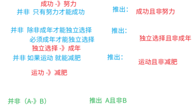
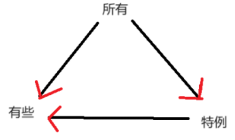

# 第7章 翻译推理

## 7.1 等价推出

`等价推出`指的是将题干逻辑关系和选项逻辑关系分别翻译后，二者完全一致。考察的是对翻译规则的掌握，常用知识点有命题的传递和原命题、逆否命题等价。

题干中无逻辑关联词的部分不需要关注，直接寻找带有逻辑关联词的语句即可。

`翻译规则如下`：

| 常见提示词                                                   | 翻译            |
| ------------------------------------------------------------ | --------------- |
| p 并且 q、p 和 q、p 同时 q、p 也 q、p 还 q、p，q             | p 且 q          |
| p 或 q、p q 至少一个、非 p 非 q 至多一个                     | p 或 q          |
| 如果 p 那么 q、若 p 则 q、只要 p 就 q、一 p 则 q、所有 p 都是 q | p→q             |
| 只有 p 才 q、必须 p 才 q、不 p 不 q                          | q→p             |
| 除非 p 否则 q、必须 p 否则 q、p 否则 q                       | 非 p→q（非q→p） |
| q 是 p 的基础/关键/前提、p 离不开/必须/需要 q、q 必不可少/不可或缺 | p→q             |

### **7.1.1 与题干等价**

`解题技巧`：

1. 若将题干翻译为 A→B，可以翻译为 A→B 或非 B→非 A 为正确选项。因此，以 B 或非A（肯后或否前）开头的选项可先排除。
2. 若题干有多个带有逻辑关联词的句子，先不需要联立，有时答案只和其中一句有关；

---

例题 1（2019 天津事业单位） 

只要今晚台风不登陆上海，轮船就按时开。 

以下哪项正确地表达了上述断定： 

（1）如果轮船按时起航，则今晚台风一定没有登陆上海 

（2）如果轮船不按时起航，则今晚台风登陆上海了 

（3）除非台风登陆上海，否则轮船按时起航 

A．只有（1） 

B．只有（2）和（3） 

C．只有（3） 

D．（1）、(2)和（3） 

:::note

只要…就…

翻译为台风不登录→按时开

始发站：不登录/不按时终点站：登录/按时

【答案】B 

【解析】根据分析发现：按时是终点 

①按时→…，根据批注分析，“按时”不能做始发站，直接排除； 

②不按时→登录，是题干的逆否，正确； 

③除非…否则…，按照否 A 则 B，翻译为不登录→按时，正确。 所以只有（2）和（3）正确。 

:::

---

例题 2（2019 江苏省考） 

没有人民支持和参与，任何改革都不可能取得成功。只有充分尊重人民意愿，形成广泛共识，人民才会积极支持改革、踊跃投身改革。要坚持人民主体地位，发挥群众首创精神，紧紧依靠人民推动改革开放。 

根据以上陈述，可以得出以下哪项： 

A．只有人民支持和参与，改革才可能取得成功 

B．只有坚持人民主体地位，才能发挥群众首创精神 

C．如果人民踊跃投身改革，则说明形成了广泛共识 

D．如果没有充分尊重人民意愿，人民就不会积极支持改革

:::note

“不…不…”，取得成功→人民支持和参与；逆否：没有人民支持和参与→改革不成功

【答案】A 

【解析】A 选项为“只有…才…”，翻译为改革成果→人民支持和参与，直接选出。

原文为并列关系，B 选项无中生有，排除

C选项、D 选项出自“有充分尊重人民意愿，形成广泛共识，人民才会积极支持改革、踊跃投身改革”，翻译为 积极支持改革且踊跃投身革命→充分尊重人民意愿且形成广泛共识，且关系需要同时满足才能推下去。 

而 C 选项只提及投身改革，不足以推出形成共识； 

D 选项为原文逆反，但是只提及没有尊重人民意愿，不足以推出不支持改革。 

:::

---

例题 3（2022 青海省考） 

在面向我国科技强国和现代化强国建设目标的背景下，要满足经济社会发展科技的要求，就要不断强化科技创新对经济社会发展的战略支撑。只有大力促进科技治理体系和治理能力现代化，才能充分发挥科技创新对经济社会发展的促进作用。 

由此可以推出： 

A．只要不断强化科技创新对经济社会发展的战略支撑，就能满足经济社会发展科技的要求 

B．如果不能满足经济社会发展科技的要求，就不能强化科技创新对经济社会发展的战略支撑 

C．如果不大力促进科技治理体系与治理能力现代化，就不能充分发挥科技创新对经济社会发展的促 

进作用 

D．除非充分发挥科技创新对经济社会发展的促进作用，否则不能大力促进科技治理体系与治理能力 

的现代化

:::note

满足发展要求→强化战略支撑发挥作用→促进现代化

始发站：满足发展要求，不强化支撑，发挥作用，不促进现代化

终点站：不满足发展要求，强化支撑，不发挥作用，不促进现代化终点不能在前。因此 AB 可以快速排除

【答案】C 

【解析】 

A 选项：翻译为“强化支撑→”，强化支撑属于终点站，不能放在前面，直接排除； 

B 选项：不…不…结构，翻译为“强化支撑→”，同 A，直接排除； 

C 选项：不…不…结构，翻译为“发挥作用→促进现代化”，符合题干，当选； 

D 选项：除非…否则…结构，否 A 推 B，翻译为“不发挥促进作用→不促进现代化”，不符合题干，排除。 

:::

---

例题 4（2023 国考） 

面对需求收缩、供给冲击、预期转弱三重压力，要想实现国内经济发展稳中求进，关键是要稳住市场主体。只有围绕市场主体需求实施更大力度减税降费，才能帮助其渡过资金难关。除了减税降费外，还需继续深化“放管服”改革，才能为市场主体营造更加市场化、法治化的营商环境。只有营商环境更加市场 

化、法治化，市场主体才会获得内生动力，从而进一步增强国内经济的吸引力、创造力、竞争力。 

由此可以推出： 

A．实施更大力度减税降费，是帮助市场主体渡过资金难关的必要举措 

B．只要稳住市场主体，就能实现国内经济发展稳中求进 

C．如果深化“放管服”改革，就能营造更加市场化、法治化的营商环境 

D．若市场主体不具有内生动力，国内经济就不会有吸引力、创造力、竞争力

:::note

恢复状态→提高科学性，看做 C→D

同时做到两方面→提高科学性，看做 A→B

AB 选项都是 D（提高科学性）开头，直接排除

B开头，直接排除

只有围绕市场主体需求实施更大力度减税降费，才能帮助其渡过资金难关：渡过难关→减税降费

必要举措：必要举措就是必要条件

【答案】A 

【解析】 

A 选项翻译为：帮助主体度过难关→更大力度减税降费，直接选出。 

D 选项：“从而进一步增强国内经济的吸引力、创造力、竞争力。”没有逻辑关联词，无中生有，排除。

:::

---

例题 5（2023 吉林省考） 

土地荒漠化是人为因素和自然因素综合作用的结果，想要在土地退化的地区恢复人与自然和谐共生的状态，必须提高土地荒漠化防治的科学性。一方面，把握积极作为和有所不为的平衡，即一手抓人工治理，一手抓自然修复；另一方面，提高防治精细化水平。如果同时做到上述两个方面，土地荒漠化防治的科学性自然得到了提高。 

由此可推出： 

A．只有在土地退化的地区恢复人与自然和谐共生的状态，才能提高土地荒漠化防治的科学性 

B．如果土地荒漠化防治的科学性得到了提高，则说明在土地退化的地区恢复了人与自然和谐共生的状态 

C．如果土地荒漠化防治的科学性没有得到提高，则说明或者没有把握积极作为和有所不为的平衡，或者没有提升防治精细化水平 

D．如果土地荒漠化防治的科学性得到了提高，则说明把握积极作为和有所不为的平衡，以及提升防治精细化水平一定同时得以实现

:::note

【答案】C 

【解析】A 选项翻译为“提高科学性→恢复状态”，和原文相反，排除。 B 选项：翻译为“提高科学性→恢复状态”，和原文相反，排除 

C 选项：原文“如果同时做到两个方面，土地荒漠化防治的科学性自然得到提高” 逆否翻译为“科学性没有提高→非（把握平衡且提高水平），即非把握平衡或未提高水平”，C 选项正确； 

D 选项：和原文相反，排除。

:::

---

例题 6（2018 事业单位联考） 

未来人工智能将取代旅游行业内 90%的服务类工作，带来巨大变革。人工智能不是要模仿人类，而是要超越人类。未来的十年一定是人工智能的时代，我们可以通过人工智能的技术解决旅游行业的很多问题。要促进人工智能在旅游行业的深入发展，技术变革和创新型人才必不可少，而高薪和福利将成为招纳人才的关键。 

由此可以推出： 

A．如果不实行技术变革，人工智能难以在旅游行业深入发展 

B．未来是人工智能的时代，人工智能的发展必会颠覆传统旅游行业 

C．若能招募到创新型人才，人工智能在旅游行业的变革将会成功实现 

D．高薪和福利是当前创新型人才在择业时首先考虑的问题

:::note

【答案】A 

【解析】题干中选中句可翻译为：深入发展→技术变革且创新型人才，逆否命题为：非技术变革 或 非创新型人才→不深入发展，“或”的关系一真则真，“非技术变革→不深入发展”成立，A 选项正确；B 选项“必会颠覆”无中生有；C 选项看标绿部分，二者之间不存在推出关系，并且“变革将会成功实现”为无中生有；D 选项“首先考虑的问题”题干中并未体现。

举例：花生十四小朋友吃完面条 或 吃完米饭→可以去看电视，吃完一种就可以去看电视了，一真则真。

等价推出类题目，题干中没有的信息一定不选。

此类题目只存在一个充分条件和一个必要条件，是不是首先考虑的问题并不知道。

:::

---

例题 7（2019 江苏） 

信仰、信念、信心，任何时候都至关重要。小到一个人、一个集体，大到一个政党、一个民族、一个国家。只要有信仰、信念、信心，就会愈挫愈奋、愈战愈勇，否则就会不战自败、不打自垮。 

根据以上陈述，可以得出以下哪项： 

A．没有信仰、信念、信心，我们就会不战自败、不打自垮 

B．没有信仰、信念、信心，我们就不会愈挫愈奋，愈战愈勇 

C．如果不战自败、不打自垮，就说明我们没有信仰、信念、信心 

D．如果愈挫愈奋、愈战愈勇，我们就不会不战自败、不打自垮

:::note

举例：只要努力，就有机会，否则不能成功。可以翻译为：①只要努力，就有机会。②要努力，否则不能成功。

【答案】A 

【解析】题干中选中句可翻译为：①只要有信仰、信念、信心，就会愈挫愈奋、愈战愈勇。②必须有信仰、信念、信心，否则就会不战自败、不打自垮。 

②可翻译为“没有信仰、信念、信心→不战自败、不打自垮”，A 选项当选；①可翻译

为“有信仰、信念、信心→愈挫愈奋、愈战愈勇”，②逆否后和①串联为：非（不战自败）

→信仰→愈战愈勇，D 选项从“终点站”出发，推不下去；C 选项“不战自败”相当于从“终点站”出发，推不下去。 

:::

---

例题 8（2013 国考） 

有人说，工作的时候，我们要将重要事务放在主要位置。重要事务是必要条件，关系着一件事情成功与否。重要的事务没做好，一定不成功。但是，细节也是很重要的，细节是成功的充分条件，同样也与一件事情成功与否相关。一个成功的人是能够协调好重要事务与细节的关系的。 

由此可以推出： 

A．成功并不代表着所有细节都处理好了 

B．如果不成功则说明重要事务没有做好 

C．成功的前提条件是既要做好重要事务，又要处理好细节 

D．虽然处理好了细节，但没做好重要事务，也不一定成功

:::note

【答案】A 

【解析】题干中标黄句可翻译为：①成功→重要事务（A→B），②非重要事务→不成功，③细节→成功，①③串联得：细节→成功→重要事务，A 选项可翻译为：成功推不出细节，当选；B 选项可翻译为：非成功→非重要事务（相当于①的非 A→非 B），推不出，排除；C 选项可翻译为：成功→重要事务且细节，成功推不出细节，排除；D 选项根据“①③串联”可知：处理好细节一定做好了重要事务，自身矛盾，排除。

:::

---

例题 9（2014 国考） 

一个人生活虽然很难，但也必须学会一个人，不要轻易依赖别人。这样以后身边的人都离开你的时候，你还可以好好活下去。 

如果以上为真，则以下哪项为真： 

A．不能独自生活的人，在身边的人都离开他的时候，就无法好好活下去 

B．一个人生活虽然很难，但也比身边的人都离开他的时候要来得容易些 

C．不要轻易依赖别人，因为一个人生活的时候会很艰难，无法好好活下去 

D．身边人都离开时还可以好好活，未必是因你以前学会如何一个人生活

:::note

【答案】A 

【解析】

法 1：题干中出现“必须”，很有可能是逻辑关联词表必要条件。B 选项的比较题干中未出现，排除；CD 选项的因果关系题干中未出现，排除；选 A。 

法 2 ：题干中标黄句可翻译为：以后身边人都离开你的时候，你想好好活下去，就必须学会一个人生活。即：一个人想好好活下去→学会一个人生活。A 选项可翻译为：没有学会一个人生活（不能独立生活的人），在身边人都离开时→无法好好活下去（题干的逆否命题），当选。其它翻译方式如下： 

必须学会一个人，在身边人都离开时，才能好好活下去！（必须p才q）

不会一个人生活(不能独自生活)在身边人都离开时，不能好好活下去（非p->非q）

必须学会一个人否则在身边人离开时无法好好活下（必须p否则q）

没学会一个人-》身边人离开时，无法好好活下去（非p->q）

:::

---

### 7.1.2 与题干不等价

`解题技巧`：若题干`只有一个`逻辑关系，可`直接翻译选项`，选项三个相同一个不同，直接`选不同`的选项即可。

---

例题 10（2017 江西省考） 

孔子说：“己所不欲，勿施于人。” 

以下哪项不是上面这句话的逻辑推理： 

A．若己所欲，则施于人 

B．只有己所欲，才能施于人 

C．除非己所欲，否则不施于人 

D．凡施于人的都应该是己所欲的

:::note

题干不需翻译。若翻译，则为：施于人→己所欲。

【答案】A 

【解析】A 选项可翻译为：己所欲→施于人；B 选项可翻译为：施于人→己所欲；D 选项可翻译为：施于人→己所欲；BD 选项相同，A 选项不同，A 选项当选。

此类题目一定为三个相同、一个不同的。

:::

---

例题 11（2020 广西事业单位） 

我国传统俗谚：“吃得苦中苦，方为人上人。”据此，不能推出： 

A．只有吃得苦中苦，才能成为人上人 

B．除非吃得苦中苦，否则成不了人上人 

C．若能吃得苦中苦，则能成为人上人 

D．凡成为人上人的都要吃得苦中苦

:::note

“方”是“才”的意思。

“除非否则”最难翻译，可以跳过先看其他选项。（除非A否则B，可以推得 非B->A）

【答案】C 

【解析】A 选项可翻译为：人上人→苦中苦；C 选项可翻译为：苦中苦→人上人；D 选项可翻译为：人上人→苦中苦，C 选项不同，当选。 

:::

---

例题 12（2023 湖北事业单位） 

隐蔽工程未经项目监理机构进行检查验收，不得进行工程隐蔽或下道工序的施工。 

下列选项无法由此推出的是： 

A．所有经过项目监理机构的检查验收的隐蔽工程都能进行工程隐蔽或下道工序的施工 

B．经过项目监理机构的检查验收是隐蔽工程进行工程隐蔽或下道工序的施工的必要条件 

C．经过项目监理机构检查验收是隐蔽工程进行工程隐蔽或下道工序的施工的前提 

D．隐蔽工程只有经过项目监理机构的检查验收，才能进行工程隐蔽或下道工序的施工

:::note

【答案】A 

【解析】A 选项可翻译为：经过验收→工程隐蔽 或 下道工序；BCD 选项均可翻译为：工程隐蔽 或 下道工序→经过验收；A 选项不同，当选。 

:::

---

例题 13（2022 北京市考） 

要稳定地提高在逻辑考试上的成绩，关键是要在基本概念上有真正的理解，如果没有真正的理解，即使投入再多的精力，做再多的练习，也不可能取得真正稳定的好成绩。 

以下各选项中，除了哪项外，都表达了与上述言论相同的意思： 

A．只有在基本概念上有真正的理解，才能取得真正稳定的好成绩 

B．除非在基本概念上有真正的理解，否则不能取得真正稳定的好成绩 

C．只要在基本概念上有真正的理解，即使没有花很多精力，也能取得真正稳定的好成绩 

D．如果取得了真正稳定的好成绩，说明一定在基本概念上有了真正的理解

:::note

【答案】C 

【解析】A 选项可翻译为：好成绩→理解；C 选项可翻译为：理解→好成绩；D 选项可翻译为：好成绩→理解，C 选项不同，当选。 

对于C：除非否则一般跳过，看其他三个选项。本题中 B选项可翻译为：不理解→非好成绩，逆否为：好成绩→理解。

:::

---

## 7.2 根据已知事实正推

`解题技巧`：无需将题干中的多个命题联立，根据已知事实，按照逻辑传递规则推出即可。

---

例题 14（2020 国考） 

小张这个夏天如果去新疆，就要游吐鲁番和喀纳斯，否则就不去；只有与小李同游，小张才会游吐鲁番或天池；如果与小李同游，小张一定要与小李做约定；如果小张与小李做约定，则小李这个夏天一定要有时间。遗憾的是，这个夏天小李单位来了一项紧急任务，相关人员一律不得请假，小李也不例外。 

由此可以推出： 

A．小张这个夏天去游天池 

B．小张这个夏天去游吐鲁番 

C．小张这个夏天未去新疆 

D．小张这个夏天去游喀纳斯

:::note

有否则翻译为：否 A 则 B。

【答案】C 

【解析】已知小李没时间，小李没时间→没做约定→不同游→非（吐鲁番或天池）＝非吐鲁番且非天池，题干标绿部分可以翻译为：非吐鲁番 或 喀纳斯→小张不去新疆，C 选项当选。

:::

---

例题 15（2020 上海市考） 

经过全力检测和排查，省重大动物疫情监测中心的专家确定了如下事实： 

（1）如果 S 村和 Q 乡出现了非洲猪瘟疫情，则 X 镇未出现； 

（2）X 镇出现了非洲猪瘟疫情，而且有关 W 村的疫情监测报告是准确的； 

（3）只有 W 村的监测报告不准确，Q 乡才未出现非洲猪瘟疫情。 

根据以上陈述，可以得出下列哪项： 

A．S 村没有出现非洲猪瘟疫情，Q 乡出现了 

B．S 村和 X 镇都出现了非洲猪瘟疫情 

C．S 村出现了非洲猪瘟疫情，Q 乡未出现 

D．X 镇和 W 村都出现了非洲猪瘟疫情

:::note

【答案】A 

【解析】根据（2）X 镇出现非洲猪瘟疫情，将（1）进行逆否可得：X 镇出现非洲猪瘟疫情→非（S 且 Q）＝非 S 或 非 Q；再根据（2）W 村报告准确，将（3）翻译为“不不”，即 W 村报告准确→Q 乡出现非洲猪瘟疫情，再根据“否一推一”可得“S 未出现猪瘟”，A 选项当选。 

:::

---

例题 16（2020 天津事业单位） 

小张、小李、小薛三名研究生在选择导师时有如下标准： 

小张：只要他是正教授，我就报考他的研究生 

小李：只有正教授才可以当我的研究生导师 

小薛：只要他有真才实学，我就报考他的研究生 

如果有一位有真才实学的副教授正招收研究生，不可能做他学生的是： 

A．小张 

B．小李 

C．小薛 

D．小张和小李

:::note

【答案】B 

【解析】翻译题干信息如下：①正教授→张报考②不是正教授→不是李的导师③真才实学→薛报考他的研究生。已知“真才实学 且 副教授”，根据③可知薛是他的学生；根据②可知李不是他的学生；根据①“否前”无法知道“张是否是他的学生”，B 选项当选。

:::

---

例题 17（2023 新疆区考） 

某医院刘佳、郑毅、郭斌、丁晓、吴芳、施文 6 位医生拟报名参加“一心向党健康为民”进社区义诊活动，已知下列情况为真： 

（1）要么刘佳参加，要么郑毅参加； 

（2）只有吴芳参加，刘佳才参加； 

（3）如果郭斌和吴芳都参加，那么施文也会参加； 

（4）或者丁晓不参加，或者郭斌参加； 

（5）施文、丁晓至少有 1 人参加。 

现施文确定无法参加，那么 6 位医生中最后参加义诊活动的是： 

A．刘佳、郭斌、丁晓 

B．郑毅、郭斌、丁晓 

C．郑毅、丁晓、吴芳 

D．刘佳、丁晓、吴芳

:::note

【答案】B 

【解析】已知非施文，根据（5）可知“丁晓参加”，根据（4）可知“郭斌参加”，根据（3）的逆否：非施文→非郭斌 或 非吴芳，所以郭斌参加可知“吴芳不参加”，根据（2）可知“刘佳不参加”，根据（1）可知“郑毅参加”，故丁晓、郭斌、郑毅参加，B 选项当选。

:::

---

例题 18（2019 广东事业单位） 

某地官员腐败成风，已知的情况有： 

（1）当且仅当丙不贪污，甲和乙贪污； 

（2）“丙不贪污或甲不贪污”是谎言。 

由此可知，下列说法一定错误的是： 

A．甲、乙、丙三人都贪污 

B．如果甲不贪污，那么乙不贪污 

C．如果乙不贪污，那么丙贪污 

D．如果丙贪污，那么甲贪污

:::note

【答案】A 

【解析】翻译题干信息如下：（1）非丙→甲且乙、甲且乙→非丙（逆否为：丙→非甲 或非乙），（2）非（非丙或非甲）=丙且甲。丙贪污为真，则“非甲 或 非乙”，又因为甲贪污为真，“否一推一”所以“非乙”成立，所以甲贪污、丙贪污、乙不贪污，A 选项一定为假，当选。

:::

---

## **7.3 根据所需结果逆推**

`解题思路`：要想得到 C，根据 B→C，需要 B 成立，要想得到 B，根据 A→B，需要 A 成立，一步一步逆推即可。此类题目最常考察考点是“p 或 q”的“否一推一”，即要想 p 成立，需要 q 不成立。

---

例题 19（2018 下重庆市考） 

如果甲和乙都没有考上研究生，那么丙就考上研究生。 

要得出甲考上研究生的结论，还需基于以下哪一前提为真： 

A．丙考上研究生 

B．丙没有考上研究生 

C．乙和丙都没有考上研究生 

D．乙和丙没有都考上研究生

:::note

【答案】C

【解析】 题干：非甲且非乙—》丙 。要想得到甲考上的结论需要将题干逆否一下：非丙—》甲或乙（A 或 B 命题，一真为真，全假为假；否一推一，一个不成立另一个一定成立。）。要让甲一定成立，那么非丙成立，甲或乙是否一推一关系，乙不成立则甲一定成立！所以选择 C. D 选项没有都=非所有=有些不。

:::

---

例题 20（2020 浙江选调） 

假设“如果甲爱看越剧或乙不爱看越剧，那么丙爱看越剧”为真。 

由下列哪项可推出“乙爱看越剧”的结论： 

A．丙不爱看越剧 

B．甲不爱看越剧 

C．甲和丙都爱看越剧 

D．甲和丙有一个不爱看越剧

:::note

【答案】A 

【解析】 题干：甲或非乙—》丙。要想得到乙，逆否题干：非丙—》非（甲或非乙）=非甲且乙。 所以要想乙成立，通过非丙就可以推出。选 A

:::

---

例题 21（2021 云南） 

吴老师、张老师、孙老师、苏老师都是某校教师，每位只教授语文、生物、物理、化学中的一门课程。 

已知： 

①如果吴老师教语文，那么张老师不教生物 

②或者孙老师教语文，或者吴老师教语文 

③如果张老师不教生物，那么苏老师也不教物理 

④或者吴老师不教化学，或者苏老师教物理 

下列哪项如果为真，可以推出孙老师教语文： 

A．吴老师教语文 

B．张老师不教生物 

C．吴老师教化学 

D．苏老师不教物理

:::note

【答案】C

【解析】想推出孙教语文②里边否一推一，吴不教语文可以推出； 想推出吴不教语文①的逆否命题张教生物可以推出； 想推出张教生物，③逆否命题，苏教物理可推出； 想推出苏教物理，④否一推一，吴教化学可推出。选 C

:::

---

例题 22（2019 联考） 

下列动物如果都只能归属一种门类，并且满足一下条件： 

（1）如果动物 B 不是鸟，那么动物 A 是哺乳动物 

（2）或者动物 C 是哺乳动物，或者动物 A 是哺乳动物 

（3）如果动物 B 不是鸟，那么动物 D 不是鱼 

（4）或者动物 D 是鱼，或者动物 E 不是昆虫 

（5）如果动物 E 不是昆虫，那么动物 B 不是鸟 

以下哪项如果为真，可以得出“动物 C 是哺乳动物”的结论： 

A．动物 D 不是鱼 

B．动物 E 是昆虫 

C．动物 B 不是鸟 

D．动物 A 是哺乳动物

:::note

【答案】B

【解析】想推出 C 是哺乳，2 否一推一，A 不是哺乳；想推出 A 不是哺乳，1 逆否，B 是鸟；想推出 B 是鸟，3 逆否，D 是鱼；想推出 D 是鱼，4 否一推一，E 是昆虫。选 B。

:::

---

## **7.4 两难推理**

由命题推事实

`解题方法`：A→B、非 A→B，可推出 B 成立（可翻译成无论是否 A，都会 B）；A→B、A→非 B，可推出非 A 成立。

---

例题 23（2019 河南事业单位） 

如果张生喜欢摄影，则他会喜欢旅游；如果他不喜欢摄影，则他会喜欢驾车；但是，如果张生不喜欢旅游，则他对驾车也就不感兴趣了。 

据此，可以推出张生： 

A．喜欢旅游 

B．喜欢驾车 

C．不喜欢驾车 

D．喜欢摄影

:::note

【答案】A

【解析】 题干：1.喜欢摄影—》喜欢旅游； 2.不喜欢摄影—》喜欢驾车；3.不喜欢旅游—》不喜欢驾车 。 将 3 逆否： 喜欢驾车—》喜欢旅游 。2 和 3联合，不喜欢摄影—》喜欢驾车—》喜欢旅游 。喜不喜欢摄影，都喜欢旅游，两难推理，选 A。

:::

---

例题 24（2024 河南事业单位） 

某高校需派 2 名左右的学生到乡村支教。众学子纷纷报名。学校经过综合考虑，将人选集中在甲、乙、 

丙三人身上，并达成一致意见: 

①如果甲去，那么乙也去； 

②只有丙去，甲才不会去； 

③如果乙去，那么丙就去； 

④甲和丙不可能都去。 

据此可知： 

A．甲会去，而丙不会去 

B．乙会去，而甲不会去 

C．丙会去，而甲不会去 

D．丙会去，而乙不会去

:::note

【答案】C

【解析】1 逆否与 2 连起来，非乙—》非甲—》丙；3 乙—》丙：两难推理，无论乙还是非乙，丙成立，丙为真。然后看 4，甲和丙不可能都去，所以甲不会去。选 C

:::

---

例题 25（2024 浙江事业单位） 

某大学有高等数学、线性代数选修。甲、乙、丙 3 个学生针对选择的情况有如下说法： 

甲:“如果乙选高等数学，那么我不选高等数学” 

乙:“如果丙选择线性代数，那么我不选高等数学” 

丙:“如果我不选线性代数，那么甲选高等数学” 

如果他们三个说的都是正确的，那么以下说法一定正确的是： 

A．甲选高等数学 

B．乙不选高等数学 

C．丙选线性代数 

D．丙不选高等数学

:::note

【答案】B

【解析】1 乙高—》甲非高 ；2 乙：丙线—》乙非高；3 丙：丙非线—》甲高.将 1 逆否与 3 连起来：丙非线—》甲高—》乙非高。不管丙线或非线，乙非高，两难推理，乙非高。选 B。

:::

---

例题 26（2023 辽宁事业单位） 

某象棋比赛前，甲、乙、丙三人对丁、戊两人能否进入决赛发表了自己的看法。 

甲:只有戊没有进入决赛，丁才会没有进入决赛； 

乙:或者丁没有进入决赛，或者戊进入决赛； 

丙:除非戊没有进入决赛，否则丁没有进入决赛； 

如果甲、乙、丙三人均未猜错，则以下哪项正确: 

A．戊进入了决赛，丁没有进入决赛 

B．丁、戊两人均进入了决赛 

C．丁进入了决赛，戊没有进入决赛 

D．丁、戊两人均没有进入决赛

:::note

【解析】甲：非丁—》非戊 ；丙：丁—》非戊 。两难推理，无论丁成不成立，非戊。乙：非丁或戊。否一推一，非丁为真。 所以 戊没进，丁没进。选 D

:::

---

## **7.5 推出信息**

`解题思路`：根据所给命题的真假，判定选项命题或事实的真假。

---

例题 27（2019 天津事业单位） 

“并非只有上大学才能成才。”与这一判断等值的是： 

A．不上大学就不能成才 

B．不上大学但也能成才 

C．如果上大学，就能成才 

D．并非如果不成才就是没上大学

:::note

【答案】B

【解析】非（只有上大学才能成才）=非（成才—》上大学）并非就是假 。成才—》上大学假命题是：成才且非大学 选 B .

:::

---

例题 28（2015 贵州事业单位） 

小李对小夏说：“你只有既加强锻炼又多吃保健产品，才能保持身体健康。”小夏说：“你这个观点我不同意。” 

下列哪项判断是小夏所同意的观点： 

A．能保持身体健康；但如果加强锻炼，就不多吃保健产品 

B．能保持身体健康；但如果不多吃保健产品，就加强锻炼 

C．能保持身体健康；但既不加强锻炼，又不多吃保健产品 

D．能保持身体健康；但既加强锻炼，又多吃保健产品

:::note

【答案】A

【解析】 小李：健康—》锻炼且保健食品 小夏：并非（健康—》锻炼且保健食品 ）=健康且 非锻炼或非保健 排除 CD AB 通过否 1 推 1，锻炼就一定非保健，可以推出。选择 A。

:::

---

例题 29（2015 贵州事业单位） 

根据对最新卫星云图的分析，早前预报的“梅花”台风下周将正面影响上海的情况不一定会发生。 

以下哪项最接近题干所表述的含义： 

A．“梅花”台风下周将正面影响上海一定不会发生 

B．“梅花”台风下周将正面影响上海可能会发生 

C．“梅花”台风下周将正面影响上海可能不会发生 

D．“梅花”台风下周将正面影响上海的可能性并不比不影响的可能性大

:::note

【答案】C

【解析】 非必然=可能不 不一定=可能不 梅花不一定发生=没话可能不发生 选 C

:::

---

例题 30（2022 广东省考） 

某高校调查本校学生的兴趣爱好后发现，喜欢打羽毛球的学生中，来自体育学院的学生一定喜欢登山。 

根据以上条件，下列情况必定属实的是： 

A．甲喜欢打羽毛球和登山，则甲是体育学院的学生 

B．乙是体育学院的学生，且喜欢登山，则乙喜欢打羽毛球 

C．丁不喜欢打羽毛球和登山，则丁不是体育学院的学生 

D．丙喜欢打羽毛球，不喜欢登山，则丙不是体育学院的学生

:::note

【答案】D

【解析】 喜欢打羽毛球是大前提 必须在这里边讨论 .来自体育学院—》喜欢登山 逆否命题:不喜欢登山—》不是体育学院的学生, 选 D.

:::

---

例题 31（2019 北京事业单位） 

在 A 市的 B 区有多家茶馆，这些茶馆要么会有评书表演，要么会有弹唱表演。 

如果上述论断为真，则以下哪项一定为真? 

①如果 A 市的一家茶馆没有任何文艺表演，那么它一定不在 B 区。 

②如果 A 市的一家茶馆有文艺表演，那么它一定在 B 区。 

③A 市 B 区的一些茶馆有评书表演。 

A．仅① 

B．仅② 

C．仅③ 

D．①②③

:::note

【答案】A

【解析】A 市的 B 区茶馆—》要么有评书表演要么有弹唱表演（要么…… 要么…… ： 只有一真为真，全真全假都为假）；逆否命题为：没有评书且没有弹唱 或 有评书且有弹唱—》非 A 市的 B 区茶馆。 1 真，2 假，3 极端情况可能都是弹唱。所以仅 1 真，选 A.

:::

---

例题 32（2021 北京市考） 

H 市在公共场所中的每一块绿地都配备了垃圾桶。这些垃圾桶或者标有“可回收垃圾”或者标有“不可回收垃圾”。 

如果上述陈述为真，则下列哪项一定为真： 

Ⅰ.H 市配备的垃圾桶上有的标有“可回收垃圾” 

Ⅱ.如果 H 市有一块绿地没有配备垃圾桶，那么该绿地不属于公共场所 

Ⅲ.如果 H 市有块绿地配备了标有“不可回收垃圾”的垃圾桶，那么它属于公共场所 

A．只有Ⅰ 

B．只有Ⅱ 

C．只有Ⅲ 

D．Ⅰ和Ⅱ

:::note

题干的第一句话：所有...都....（前推后）H 市公共场所的绿地→垃圾箱；或者标有“可回收垃圾”或者标有“不可回收垃圾”

【答案】B

【解析】第一句话：H 市公共场所的绿地→垃圾箱

第二句话：或者标有“可回收垃圾”或者标有“不可回收垃圾”

Ⅰ.H 市配备的垃圾桶上有的标有“可回收垃圾”——不一定，说不定全是不可回收垃圾（左侧批注里的第二种），排除；

Ⅱ.如果 H 市有一块绿地没有配备垃圾桶，那么该绿地不属于公共场所——是文段第一句话的逆否，为真；

Ⅲ.如果 H 市有块绿地配备了标有“不可回收垃圾”的垃圾桶，那么它属于公共场所——“垃圾桶”在箭头之后（终点站），推不出，排除。综上，选 B。

在逻辑里“有些”可能是所有人都是（1 到所有）或者是一部分所以文段说：或者标有“可回收垃圾”或者标有“不可回收垃圾”，可能是一种很极端的情况，只标有其中的一种

:::

---

## 7.6 题型分类梳理

| 题型分类                                        | 题干形式                                                     | 解题思路                                                     | 选项形式   |
| ----------------------------------------------- | ------------------------------------------------------------ | ------------------------------------------------------------ | ---------- |
| 等价推出                                        | 单个或多个命题（命题之间有关系也可能没什么关系做题只需要把带逻辑关联词的画出来，然后看选项，从选项入手，看对应的是哪句话（选项命题和题干命题）是等价的) | 翻译后找等价                                                 | 命题       |
| 正推                                            | 命题+已知事实                                                | 命题联立和逻辑传递（题干：A→B→C→D选型告诉 A 成立，能推出 D 是一个事实） | 事实       |
| 逆推（题干：A→B→C→D想让 D 成立，就需要 A 成立） | 命题+需要结果                                                | 命题联立和逻辑传递                                           | 事实       |
| 两难推理                                        | 多个命题（两难推理：没有事实，多个命题记住;无论 A 不 A，都 B） | 两难推理规则                                                 | 事实       |
| 推出信息                                        | 命题                                                         | 根据命题真假判定信息                                         | 命题或事实 |

## 7.7 范畴推理

`范畴推理`指的是根据直言命题（所有、有些、特指）之间关系和性质进行推理的题目，也包括判定各集合之间包含、交叉等关系的题目。

`相关知识点如下`：

### 7.7.1 直言命题考察

例题 33（2023 湖北事业单位） 

年末，研究院发现有新员工没有登记自己的紧急联系人。若该命题为真，则下列陈述不确定真假的是： 

①所有新员工都没有登记自己的紧急联系人 

②所有新员工都登记了自己的紧急联系人 

③有的新员工登记了自己的紧急联系人 

④新员工小红登记了自己的紧急联系人 

A．①②③④ 

B．仅②③④ 

C．仅①②③ 

D．仅①③④

:::note

陈述不确定真假＝推不出真假

【答案】D

【解析】题干：有些员工没有登记＝有些不

①所有新员工都没有登记自己的紧急联系人（＝所有不） 有些不推不出所有不，①推不出；

②所有新员工都登记了自己的紧急联系人（＝所有都） 有些不和所有都矛盾关系，题干说了有些不为真，所以所有都为假，能推出为假，排除；

③有的新员工登记了自己的紧急联系人（＝有些是） 有些不推不出有些是，③推不出；

④新员工小红登记了自己的紧急联系人（特例）有些不推不出特例，④推不出；本题为选非题，综上，选 D。

:::

---

例题 34（2019 福建选调） 

品学兼优的学生不都读研究生。如果以上论述为真，则下列命题能判断真假的有几个： 

Ⅰ.有些品学兼优的学生读研究生 

Ⅱ.有些品学兼优的学生不读研究生 

Ⅲ.所有品学兼优的学生都读研究生 

Ⅳ.所有品学兼优的学生都不读研究生

A．1 

B．2 

C．3 

D．4

:::note

【答案】B

【解析】题干：“不都”＝不所有（所有的否定）＝有些不（两次互换，后面加不）

Ⅰ.有些品学兼优的学生读研究生（＝有些） 有些不推不出有些，推不出真假；

Ⅱ.有些品学兼优的学生不读研究生（＝有些不） 和题干一样，能推出为真；

Ⅲ.所有品学兼优的学生都读研究生（＝所有） 有些不和所有是矛盾，题干有些不为真，所以所有为假，能推出为假；

Ⅳ.所有品学兼优的学生都不读研究生（=所有不）有些不与不出所有不，推不出真假；综上，2、3 能判断出真假，选 B.

:::

---

例题 35（2017 四川事业单位） 

这个班级已发现有学生考试作弊，如果上述断定是真的，则在下述三个断定中： 

①这个班级没有学生考试不作弊 

②这个班级有的学生考试没有作弊 

③这个班级所有学生考试都没有作弊 

不能确定真假的只有： 

A．① 

B．② 

C．②③ 

D．①②

:::note

【答案】D

【解析】题干：有些为真

①这个班级没有学生考试不作弊（=没有...不=所有都作弊）有些推不出所有，①推不出；

②这个班级有的学生考试没有作弊（=有些不） 有些推不出有些不，②推不出；

③这个班级所有学生考试都没有作弊（所有不）有些和所有不矛盾，能推出

为假；综上，推不出的是①、②，选 D。

:::

---

例题 36（2020 广东事业单位） 

小吴家有人参与了义务植树活动。除非家里有人参与了义务植树活动，否则该家庭不可能领取到“义务植树参与证”。小李家领取了“义务植树参与证”。 

如果以上描述为真，则下列选项中，无法判断真伪的是： 

①小吴家可以领取“义务植树参与证” 

②小李家有人参与了义务植树活动 

③小吴家里有人未参加义务植树活动 

A．仅② 

B．仅③ 

C．①和③ 

D．①②③

:::note

否 A 则 B题干是除非有些人参与，除非否则＝否 A 则 B否（有些人）=所有不=没人参与

【答案】C

【解析】题干：家里没人参与义务植树活动→家庭不可能领到“义务植树参

与证”小吴家有人参与了义务植树活动；小李家领取了“义务植树参与证”；

①小吴家可以领取“义务植树参与证”（=否 A）第一句话逆否：植树参与证→参与义务植树活动 否 A 在箭头后面，推不下去；

②小李家有人参与了义务植树活动题干说了小李家领取了“义务植树参与证”能推出小李家有人参与了义务植树活动，能推出为真；

③小吴家里有人未参加义务植树活动（=有些不）题干说的是小吴家有人参与了义务植树活动，有些推不出有些不；综上，推不出的是①③，选 C。

:::

---

例题 37（2021 四川省考） 

中国共产党党章是对每一位共产党员的基本要求。党员领导干部要做学习党章、遵守党章的模范。凡是党章规定党员必须做到的，领导干部要首先做到；凡是党章规定党员一定不能做的，领导干部要带头不 

做。 

根据以上信息，可以得出以下哪项： 

A．凡是党章规定领导干部首先做到的，党员必须做到 

B．凡是党章规定领导干部带头不做的，党员一定不能做 

C．有些党章规定领导干部要首先做到的，党员必须做到 

D．有些党章没有规定党员必须做的，领导干部要首先去做

:::note

【答案】C

【解析】题干：1.所有党章规定党员必须做到的→领导干部要首先做到；

2.所有党章规定党员一定不能做的→领导干部要带头不做。

A 选型“领导干部首先做的”是题干第一句 A→B 的 B，推不出，排除；

B 选项“领导干部带头不做的”是题干第二句 A→B 的 B，推不出，排除；

C 选项“有些党章规定领导干部要首先做到的，党员必须做到”

根据题干第一句话“所有党章规定党员必须做到的→领导干部要首先做到”，

可知所有可以推出有些，即有些党章规定党员必须做到的→领导干部要首先做

到当选；再运用知识点有些 A 是 B 能推出有些 B 是 A,可以推出“有些党章规定领导干部要首先做到的，党员必须做到”，当选。

D 选型“有些党章没有规定党员必须做的”是第一句的非 A,第一句逆否应该是非 B→非 A，非 A 在箭头后面，推不出。

:::

---

例题 38（2023 山东省考） 

有如下两句话，“我从来没有对她说过谎”，“我曾多次对她说谎”。 

下列选项中与这两句话真假情况相同的是： 

A．“有的同学上课很认真”，“有的同学上课不认真” 

B．“所有工作人员都到达了现场”，“有的工作人员没有到达现场” 

C．“该科室所有人都放假了”，“该科室所有人都没有放假” 

D．“他从未成功过”，“他将来会成功”

:::note

【答案】C

【解析】

题干：“我从来没有对她说过谎” =说谎=0 “我曾多次对她说谎” =说谎＞2但是还有一种情况，就是只说过一次谎话题干真假情况：一真一假，也可以同时为假

 

A 选项：一真一假也可以同时为真，与题干真假情况不一致，排除；有的认真 有的不认真

 

B 选项：所有和有些不是矛盾，必须一真一假，与题干真假情况不一致，排除；

C 选项：可以一真一假，也可以同时为假，与题干真假情况一致，当选；都放假 都没放假

 

 

D 选项，过去和将来无关，排除；

:::

### **7.7.2 集合关系考察**

题干有所有 A 都是 B;所有 C 都是非 B，用 B 和非 B 一分为二

---

例题 39（2013 上海市考） 

某中学的教师都很有爱心。有些经常志愿献血的教师免费为学习困难的学生补课，凡是资助了贫困生的教师都和困难家庭结成了帮困对子，但所有免费为学习困难的学生补课的教师都没有人和困难家庭结成帮困对子。 

根据以上前提，下列哪项一定为真： 

A．有些经常志愿献血的教师没有资助贫困生 

B．有些资助了贫困生的教师没有志愿献血 

C．有些资助了贫困生的教师经常献血 

D．有些经常志愿献血的教师跟困难家庭结成了帮困对子

:::note

根据画图法，A 选项有些经常志愿献血的教师和资助贫困生的教师没有交集，当选；B、C 不知道，推不出，排除；D 选项经常志愿献血的教师跟困难家庭结成了帮困对子，根据画出的图，看不到有交集，排除，综上选 A。

:::

---

例题 40（2018 北京） 

有些参加语言学暑期高级讲习班的学生获得过青年语言学奖。所有中文专业的三年级硕士生都参加了语言学暑期高级讲习班。所有中文专业的一年级硕士生都没有参加语言学暑期高级讲习班。 

如果以上陈述为真，可以推出： 

A．有些获得过青年语言学奖的学生是中文专业的三年级硕士生 

B．有些中文专业的三年级硕士生获得过青年语言学奖 

C．有些获得过青年语言学奖的学生不是中文专业的一年级硕士生 

D．有些中文专业的一年级硕士生获得过青年语言学奖

:::note

答案】C

【解析】

 

A 选项无法确定，获奖的学生有可能在三年级里面，也有可能在三年级外面;B 选项，同样也是确定不了，而且 A 选项和 B 选项是同质选项;D 选项一年级圈里面没有获奖学生，推不出来。C 选项，获奖的学生确实不在一年级的圈里，没有交集，综上选 C 选项。

:::

---

例题 41（2019 天津事业单位） 

所有来自外省市的学生，都需要住校；所有住校的同学，都必须参加晨练；有些来自外省市的学生参加了社团；有些计算机专业的学生也加入了社团；所有计算机专业的学生都没有参加晨练。 

由此不能推出以下哪项结论： 

A．有些社团成员没有参加晨练 

B．有些外省市的学生是计算机专业的 

C．所有外省市的学生都参加了晨练 

D．计算机专业的学生都不住校

:::note

【答案】B

【解析】

 

A 选项根据图案右侧小绿可以推出，有些社团成员没有参加晨练，可以推出；B 项外省和住校没有交集，选非题，当选；C 项外省市都在左侧晨练的一侧，可以推出；D 计算机和住校没有交集，可以推出，综上选非题，选 B。

:::

---

例题 42（2024 江苏省考） 

某学校举办田径运动会，所有参加 800 米跑的运动员都参加了 100 米跑，所有参加 100 米跑的运动员都参加了跳高，有些参加跳远的运动员参加了投掷链球，所有参加跳远的运动员都没有参加跳高。 

根据以上陈述，不能推出以下哪项： 

A．所有参加 800 米跑的运动员都参加了跳高 

B．有些参加投掷链球的运动员没有参加跳高 

C．所有参加跳远的运动员都没有参加 100 米跑 

D．有些参加 800 米跑的运动员参加了跳远

:::note

【答案】D

【解析】

 

A 项 800 米都在挑高的里面，正确；B 项右侧小绿投掷铅球没有参加跳高，正确；C 项跳远和 100 米是没有交集的两个圆，正确；D 项 800 米和跳远是没有交集的两个圆，错误，选非题，当选。

:::

---

例题 43（2023 山东省考） 

所有法学专业的学生，都获得了法律职业资格证书；所有获得法律职业资格证书的学生，都获得了教师资格证书；有些法学专业的学生成为了公务员；有些逻辑学专业的学生也成为了公务员；所有逻辑学专业的学生都未获得教师资格证。 

如果以上判定为真，以下哪种说法一定为假： 

A．一个人获得了教师资格证书，但并非是逻辑学专业的学生 

B．一个公务员，既没有获得法律职业资格证书，又不是逻辑学专业的学生 

C．一个人获得了法律职业资格证书，但并非是法学专业的学生 

D．一个人是逻辑学专业的学生，并且获得了法律职业资格证书

:::note

【答案】D

【解析】

 

A 项逻辑学和教师资格证无交集，正确；B 项公务员可以在中间，和两侧都没有交集，通过实际生活也可以理解，B 一定对；

C 项，这个人可以在法学之外，但是在法律教师资格证以内，正确；D 项逻辑学和法律资格证无交集，错误，选非题，当选 D。

:::

---

例题 44（2021 新疆） 

某兴趣小组成员都是艺术特长生，有的艺术特长生体育很好，小明体育很好。 

由此可以推出： 

A．小明是艺术特长生 

B．小明不是艺术特长生 

C．该兴趣小组成员体育都很好 

D．该兴趣小组成员可能体育都不好

:::note

【答案】D

【解析】

体育很好没有外延，所以小明可以在任何位置。所以 A 项、B 项都推不出来。

C 项，如果兴趣小组和体育很好只是部分有交集，推不出兴趣小组体育都很好，排除；

D 项说的是“可能”，当兴趣小组和体育很好没交集时，该兴趣小组成员可能体育都不好是能实现的，当选。

:::

---

例题 45（2023 上海） 

某单位购买了一批影像资料，有科幻片、故事片、战争片等；有国内的、欧美的、印度的；有中文的，也有英文原版的。其中，所有的科幻片都不是英文原版的，所有的故事片都是英文原版的，所有的故事片都是印度的。战争片既有印度的，也有欧美的；既有中文的，也有英文原版的。 

根据以上陈述，关于这批影像资料可以得出哪项： 

A．有些印度片不是科幻片 

B．有些战争片也是故事片 

C．有些科幻片不是欧美的 

D．有些故事片是中文的

:::note

根据画图，A 项印度片（小绿）和科幻片无交集，当选。

:::

---

