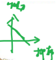

# 第一章 定义判断

方法技巧性弱，考察能力。要站在一定的高度上去审视题目，不要连连看。

## 1.1 整体概述 

**总体做题思想**

定义判断更重理解，要站在一定高度上把握，可联系生活中的人或事或某种现象，试着猜测其现实所指；

> 定义也考察现实生活经验，关注新鲜事物，时政，有工作经验的考生可能更容易上手，但是刚出校门的同学仍然可以通过题干给出的解释进行判断。

切记定义判断不是“连连看”，找出一堆关键要素一一对应，这样做的结果就是“只见树木不见森林”；`（切忌“按图索骥”）` 

**那到底什么是关键信息？**

好多同学容易忽略的`“被定义词”，才是最关键信息`，试想，此定义有好多特征和要素，为什么选取其中一或两词作为其“名”，无其他原因，只因“名”里有最重要特征！

后续解释，是为了让我们更好理解被定义词，读题的过程，可看作是寻找被定义词中特征对应的过程，`需特别关注的有主体、对象、特殊要求、中心语（此类信息在被定义词中往往无法包含）。`

**什么是定义题目最大的坑？**

`属于、不属于一定分清`，养成良好读题习惯，不属于题目的错误选项都是“例子”，可以借用例子理解定义；其他需注意的点：

**其他需注意的点**

多定义或多情况定义要注意找一一对应，正确选项有时会完美对应定义结构。

## 1.2 单定义

### 1.2.1 偏正短语式 

---

例题 1（2023 国考） 

`体验式采访`^1^是指直接投入到所要报道的新闻事件中去体验生活，以获得新闻报道所需要的素材，以及对新闻事件的认识。

根据上述定义，下列不属于体验式采访的是：

A．某报社要求年轻记者沉入生活，了解基层，以改变写官话、说套话的文风 

B．某作家为了解包身工的悲惨遭遇，深入到工厂（体验）中，写出报告文学（采访）《包身工》

C．某记者为了解传销组织的真面目，打入到传销组织内部，揭示传销组织的骗局

D．某电视台推出专栏《体验三百六十行》，派记者体验各职业一周并进行系列报道

:::details{title=解析}

1. 偏正短语，前后各有一个关键词：体验式、采访

【参考答案】A 

【解析】本题需要同学关注关键词，A 选项“沉入生活、改变文风”不属于采访，直接选出。B 选项有一定专业性，但是 A 选项错误明显，因此考试时同学避免纠结在专业性选项上。

:::

---

例题 2（2019 国考） 

`诉前财产保全`是指利害关系人因情况紧急，若不立即申请财产保全将会使其合法权益受到难以弥补的损害，起诉前向人民法院申请，由`人民法院（主体）`采取的一种财产保全措施。

根据上述定义，下列不属于诉前财产保全的是：

A．工厂甲向信用社乙贷款 500 万元，甲无法按期归还。`乙随即起诉，审理期间`得知甲已将设备转卖，遂请求法院查封甲正在出售的大楼 

B．甲与乙签订购销合同，甲给乙 200 万元预付款后，发现乙有欺诈行为，无力履行合同，遂请求人民法院冻结 200 万元预付款

C．银行甲与公司乙签订协议，甲向乙提供 5000 万元贷款，分 3 期还清，第一笔到期时乙无力归还，甲向法院申请查封乙的财产

D．甲欠乙 10 万元，乙多次找甲还钱未果，得知甲有一辆轿车，乙向法院申请将甲的轿车予以查封，再将甲告上法庭

:::details{title=解析}

【参考答案】A 
【解析】把握关键信息：诉前；主体是人民法院。

 A 选项明确指出：起诉后，审理期间，不符合关键信息，直接选出。 

:::

---

例题 3（2021 北京） 

无感审批是指通过智能技术强化身份认证、智能授权、自动填表等功能，企业群众无需出示证件、无需填写表单，“不知不觉”就拿到审批文件，实现“无感”审批、“省心”办事。

根据上述定义，以下属于无感审批的是：

A．某市旅游管理部门通过人脸识别等网络技术，实现了网上实名制购买全市公园门票。游客无需出示证件，可以直接出示购票二维码入园

B．某建设单位登录省投资在线监管平台，`填写单位代码后`^1^，系统自动生成企业基本信息和申请表格，随后完成在线审核，获得建筑许可 

C．某市提高政府办事效率，对企业或个人办理业务，只需要到综合服务大厅询问工作人员，工作人员会帮忙核对材料，帮助他们方便快捷地完成相关手续

D．某保险公司提供网上业务办理和查询功能，客户登录公众号并通过人脸识别后，可完成查询、续费、转款等功能，无需出示证件、无需填写表单

:::details{title=解析}

1. 不是填表格，只是确认是哪个单位

【参考答案】B 

【解析】本题抓住关键信息“审批”。 

A 选项行为属于“验票”，而非“审批”；C 选项还是需要填表，只是工作人员提供帮助，而非“无需填写”；D 选项行为“查询、续费、转款等功能”和“审批”无关。 

B 选项符合定义，选出。 

:::

---

例题 4（2017 河南选调） 

`隐性饥饿`，是指机体由于营养不平衡或者缺乏某种维生素及人体必需矿物质，同时又存在其他营养成分过度摄入，从而产生`隐蔽性营养需求的饥饿症状`^1^。

根据上述定义，下列属于隐性饥饿的是：

A．陈大爷下定决心节食，他最近以青菜和苹果代替主食，不沾油荤，终于有一天因饥饿难耐晕倒在地

B．小白为了获得健美身材，坚持每日六餐，每餐分量很少，分别含有主食、蔬果、蛋奶等，但同时高强度的健身训练还是让他浑身酸痛、疲惫不堪

C．王大爷因为肠胃虚弱，以清粥热汤作为主要饮食养生，不常吃大鱼大肉和生冷瓜果，后来`因饮食缺少蛋白质和维他命而导致记忆力减退` 

D．小李喜欢高盐、高糖分、高热量的垃圾食品，对医生的劝说无动于衷，在数年后的体检中发现自己存在高血糖、高血脂、高血压等问题

:::details{title=解析}

1. 肚子不饿，但缺营养

【参考答案】C 

【解析】A 选项，都饿晕了，是真饿；B 选项，没饿到，只是锻炼过度；D 选项，不仅没饿，还营养过剩。 

C 选项：王大爷肚子不饿，但是缺少营养导致不良影响，当选。

:::

---

例题 5（2022 安徽事业单位） 

`营销外包`^1^是企业将营销活动，尤其是营销渠道的开发与管理全权委托给某个拥有专门技能和网络的外部机构，//企业只是在战略上进行全程监控和规定收益回报的下限，其他的营销风险全部由外包机构承担；加之将生产、人力资源管理、财务管理等价值链环节也外包给了专业的外部机构，企业可以将核心能力集中于“产品研发品牌经营”的关键性领域，以获取巨额净值回报。

根据上述定义，下列不属于营销外包的是：

A．某公司准备增发股票，将增发事项委托给了某知名的证券交易公司

B．某企业为集中精力，将附属产品的渠道和销售等委托给其他营销公司

C．某部门为提升营销效率，委托软件公司为其研发出专门的销售服务软件 

D．某单位业务规模不断发展壮大，开始委托专业公司进一步开拓国际市场

:::details{title=解析}

1. 关键信息：营销、外包

【参考答案】C 

【解析】A 选项专业性强，一般会有更差的选项，可以先放置往下看；B、D 选项明显正确。 

C 选项，“委托其他企业研发专业软件”和营销有关，和外包无关，直接选出。 

:::

---

例题 6（2017 河南选调） 

拟态，是指某些生物在进化过程中具有与另一种生物或周围自然界物体的相似的`形态`^1^，这种相似性很高，几乎难以分辨，可以保护某一物种或两个物种。

根据上述定义，下列选项属于拟态的是：

A．海豚、企鹅和带鱼虽然分别属于鲸类、鸟类和鱼类，但为了适应海洋生活，都进化出了流线形的身体

B．北极熊生活在白雪皑皑的北极，为了掩护自己捕食时不被猎物过早发现，皮毛逐渐变成与周围环境相似的白色

C．大鲵，俗名娃娃鱼，已在地球上生活了数亿年，其受到刺激时的叫声酷似人类婴儿哭声，让人听到不忍心伤害，对一些猎食动物也有威慑作用

D．杜鹃会将与宿主卵酷似的卵产在宿主巢内，其雏鸟在孵出后不久就会将宿主雏鸟挤出巢外，独享体型只有自己一半大小的宿主父母的喂食 

:::details{title=解析}

1. 中心语，拟态，指模拟形态。举例：站在白墙边涂白漆，属于掩蔽色，但不是“形”“态”。枯叶螳螂属于形态上的模拟。

【参考答案】D 

【解析】A 选项，指进化出适合生存的形体，没有“模拟”，排除；B 选项属于掩蔽色，没有“形态”，排除；C 选项只有声音上的模仿，没有“形态”，排除。

 D 选项属于对“形象”的模仿，当选。 

:::

---

例题 7（2015 联考） 

贫困的要素不仅包括物质和收入水平指标，还包括能力指标，即人类基本能力和权利的剥夺。`权利贫困就是缺乏政治、经济、文化和社会基本人权的一种贫困状态（缺少人权）`。权利贫困是贫困的核心，物质贫困是贫困的具体表现，权利贫困是造成物质贫困的根本原因。

根据上述定义，下列选项不属于权利贫困的是：

A．张某大学毕业在京成为“蚁族”一员，收入低下，蜗居城乡结合部多年 

B．王某好心救人却被讹诈，因无证据证明无辜，被判令承担全部医疗费用

C．李某在深圳私企打工多年，因工伤丧失劳动能力，却得不到任何赔偿

D．辛某房屋被强拆，致使一家人居无定所，其申诉上访过程中多次被拘留

:::details{title=解析}

【参考答案】A 

【解析】本题关键信息在：缺少相应人权 B 选项，原本应该让被救助者提供证据，却让施救者提供证据，C 选项，丧失劳动却没有赔偿；D 选项，被强拆，上访被拘留，三个选项都突出【冤】，即缺少人权。

 A 选项，看不出缺少人权，只是缺钱，选非题，当选。 

:::

---

例题 8（2023 国考行政执法） 

`预判设计`^1^是一种能够引导用户、缩短用户行为路径的有效设计手段。它可以根据用户的行为或用户所在的场景，让功能“主动找到”用户，并让用户与之产生自然的交互，为用户提供更好的使用体验，本质就是为用户多想一步，让用户使用起来尽量简单。

根据上述定义，下列不属于预判设计的是：

A．某购物软件，根据用户输入的搜索关键词，将商品按与关键词的相关性排列（老）

B．某翻译软件，用户第一次点击播放，语音速度正常；再次点击，语音速度变慢（新）

C．某外卖软件，当用户对店家给出差评，系统自动勾选“将评价设为匿名评价”（新） 

D．某购物软件，所选商品缺货时，出现“找相似”按钮，点击可看到同款、相似商品（新） 

:::details{title=解析}

1. 实战技巧：看预判设计的定义，预判设计应该是一个新思路，因此选择时倾向于新内容新技术。只有A选项属于老技术，直接选出。

【参考答案】A 

【解析】A 选项，“将商品按与关键词的相关性排列”没有考虑用户，而是用户给什么就用什么，因此不属于预判设计，当选。 

B 选项，照顾到第二次点击的用户可能因为没听清，进行预判；C 选项，预判给差评的用户不想被商户联系，自动勾选匿名；D 选项，预判用户想要的商品没有，还要再去找其他类似商品，提供“找相似”服务。 

:::

---

### 1.2.2 主体、对象、特殊要求 

---

例题 9（2024 江苏） 
`代际责任`：指在不超出自身能力的前提下，相邻两代人的一方向另一方主动提供经济帮扶、生活照顾、健康保障、精神抚慰等各种支持的行为。

下列不属于代际责任的是：

A．`苏女士把父母接到身边后`，忙乎了一个多月，带着父母熟悉小区健身器材，到社区老年活动中心打牌下棋，在公园找人聊天，终于帮他们重新找到了“组织”

B．`邵先生和妻子`一直在城里忙于打拼，`女儿`正在读小学。每到寒暑假，`邵先生的父母`都会专程赶到城里，把孙女接回农村老家痛痛快快地玩上整个假期

C．罗奶奶像无数为孩子婚事发愁的长辈一样，每到周末就去附近公园的相亲角浏览展板上的照片、简历，觉得合适的就记下基本情况、电话号码。虽然快三十岁的孙女根本不着急，她却一直乐此不疲 

D．`毛先生`喜欢第一时间把遇到的趣事分享到家族微信群，却很少得到期待的回应，一怒之下退了群。后来，`儿子`又把他请回，还邀约了几位有同样爱好的长辈，群里逐渐热闹起来，他也时不时点赞或评论几句

:::details{title=解析}

【参考答案】C 

【解析】本题关键词“相邻两代”，AD 都符合定义，B 选项，爷爷奶奶帮忙照顾孩子，本质上还是帮儿子儿媳分担家务，是相邻两代之间的帮助，符合定义。 

C 选项，属于奶奶和孙女，不符合“相邻两代”，当选。 

:::

---

例题 10（2016 事业单位联考） 

`医疗法律关系`是指医务人员受`患者`委托或其他原因，对患者实施诊断、治疗等医疗行为所形成的法律关系。

根据上述定义，下列不属于医疗法律关系的是：

A．小明患感冒到某医院挂号就诊，`医生经诊断后`给小明`开处方`，小明取药后按医嘱在医院输液

B．老张过马路时被一辆飞驰而来的汽车撞成重伤，路边的群众将昏迷的老张送到市医院，`医院立刻对其进行抢救`

C．非典时期，小王在火车上恰巧与一位非典疑似病人有过接触，回京后，小王因患感冒到某医院就诊，`被该医院强行留在医院进行治疗和观察`

D．小肖带着女儿到区卫生防疫站后，防疫站的工作人员按照规定给小肖的女儿打了一针百白破疫苗，并留下观察了半小时 

:::details{title=解析}

【参考答案】D 

【解析】本题关键信息：医务人员、患者

 D 选项，防疫站的工作人员不属于“医务人员”，直接选出。 

:::

---

例题 11（2022 江苏） 

田保姆：指在不改变土地承包关系的前提下，农户将耕、种、管、收等部分或全部作业环节委托给社会化组织完成，成为规模经营的参与者和受益者的新型农业经营方式。

下列不属于田保姆的是：

A．晚稻收割接近尾声，泥瓦匠老李仍然不慌不忙，在周边市区接了好几单活，他家的10 亩稻田三年前已经以每年 5000 元的价格租给了在家务农的邻居，连收带运，啥都不用他操心 

B．老刘夫妇近年来一直跟着亲戚在外地打工，每到收割季节都得回家忙乎一阵子。去年，村里的几个年轻人合伙买了大型收割机，成立了生产合作社，老刘全家商量把田里的农活全部包给了他们

C．每年收获季，处置成堆的秸秆都让种植户非常头疼，为了解决这个问题，大王庄村委会先后购置了 10 套秸秆打捆、粉碎机械，及时推出了秸秆回收加工服务项目。周围村子的农民再也不为这个事情发愁了

D．某农业科技服务公司在各个村镇建立了所管地块的示范田，定期召开现场会，展示播种方式、田间管理等，当地不少农民变成了“甩手掌柜”，随时可以通过扫描公司的二维码了解托管服务的进程

:::details{title=解析}

【参考答案】A 

【解析】本题关键信息：农户、社会化组织、新型农业经营方式。 A 选项，把农田出租给农户，赚了赔了都不管，不符合“社会化组织”和“新型农业经营方式”，直接选出。

:::

---

例题 12（2023.8.26 事业单位） 

暗示性商标由常用词构成，它以隐喻、暗示的手法提示商品的属性或某一特点。该商标的组成要素不直接涉及商品种类、成分、功能等，但是却旨在创造出一种能与该商品发生联系的想象空间。

根据上述定义，下列不属于暗示性商标的是：

A．野豹（汽车） 

B．美木（家具） 

C．白兔（洗衣粉） 

D．万年新（电器）

:::details{title=解析}

【参考答案】B 

【解析】本题关键信息：不直接涉及商品种类、成分、功能等 

A 选项，通过野豹暗示汽车的速度快；C 选项，通过白兔暗示洗得干净；D 选项，通过“万年新”暗示电器耐用，都没有种类、成分、功能的涉及。 

B 选项，“美木”包含成分，不属于暗示性商标，当选。 

:::

---

例题 13（2018 国考） 

符号现象是指表意上没有相关性的甲乙两事物，当我们用甲事物代表乙事物时，甲事物就可以视为乙事物的符号。

根据上述定义，下列`不属于`符号现象的是：

A．消防车的警笛声 

B．医疗机构使用的十字标记

C．法院大门上雕刻的天平图案 

D．体育比赛裁判员的哨声

:::details{title=解析}

A、D为同质选项。

B不太确定但C一定对，直接选C走人。

【参考答案】C 

【解析】题干问：不属于的，根据定义优先想到“表意上有相关性的”即为不属于的。A 选项是人为建立的联系；选项 B 十字标记与医疗机构是否有关不太清楚，先放着；D 选项裁判员的哨声与犯规表意上并没有相关性，是人为建立的联系；C 选项天平特点为公平，法院要求也为公平，二者存在表意上的相关性，当选。 

:::

---

例题 14（2020 湖南） 辟谣有时会使受众将谣言错记为“事实”，其中原因之一是受众遗忘了谣言的反驳信息，即事实幻觉效应。为了避免这一认知错觉，可以采用“反驳改述谣言”的方法，即辟谣者可以将谣言改述为否定句式，再进行反驳。

根据上述定义，下列属于“反驳改述谣言”的是：

A．食用野兔等野生动物安全，这不是谣言

B．即便少量饮酒也不利于健康，这是谣言

C．有节制的吸烟不易致癌，这不是谣言

D．药品 X 是危险的，这是谣言

:::details{title=解析}

【参考答案】B 

【解析】本题别理解选项句意更容易做。 

A、C 选项“这不是谣言”不是在进行反驳，是在进行支持，故 A、C 排除；D 选项“药品 X 是危险的”不是否定句式，是肯定句式，故 D 排除，B 选项“少量饮酒不利于健康”是否定句式，“这是谣言”是在进行反驳，故 B 选项当选。 

:::

---

## 1.3 多定义 

---

例题 15（2022 事业单位联考） 

单播是单点对单点数据传输；组播是单点对特定多点数据传输，发出一份数据包，特定的多点同时接收；广播是单点对非特定多点传输，发出一份数据包，非特定多点同时接收。

根据以上定义，下列选项中利用了`组播技术`^1^的是：

A．观看付费电视频道节目 

B．双人视频通话

C．收听电台节目 

D．通过视频 APP 点播电视剧

:::details{title=解析}

1. 例：花生老师给大家上网课。

【参考答案】A 

【解析】A 选项为组播；B 选项为单播；C 选项为广播；D 选项既不是单点对单点，也不是同时接收，哪个都不属于。 

:::

---

例题 16（2021 国考） 

统计数据分为定性数据与定量数据。定性数据包括分类数据和顺序数据。分类数据是指只能归于某一类别的非数字型数据，它是对事物进行分类的结果，用文字表述；顺序数据是指归于某一有序类别的非数字型数据。定量数据是指表现为具体数字观测值的数据。

①按城市规模可将城市分为特大城市、大城市、中等城市和小城市；

②婚姻状况：1-未婚，2-已婚，3-离异，4-丧偶；

③A 地到 B 地的距离为 200 公里，到 C 地为 320 公里，到 D 地为 100 公里；

④某医院建筑面积 37.5 万平方米，开放床位 3182 个，临床医生 687 人。

根据上述定义，关于以上 4 组数据的说法正确的是：

:::details{title=解析}

【参考答案】D 

【解析】①②属于定性分析；③④属于定量分析。①有顺序，属于顺序数据；②无顺序，只进行分类，属于分类数据，观察选项，只有 D 选项符合题意，当选。 

:::

---

例题 17（2023 湖北事业） 

悲观是对人、事、物产生消极的看法。悲观可以分成以下几类：气质性悲观，是指人们在对未来的看法上，长期倾向于期待坏的结果；归因性悲观，是指在一件事情发生后对它进行解释时，总会采取内在的、稳定的负面归因；防御性悲观，是指人们会在事件发生前，将期待降到比较低的水平，想象出最坏的可能。

根据上述定义，下列体现了防御性悲观的是：

A．小李天生就是个多愁善感的人，无论是工作还是生活，他都觉得一切总是会向不好的方向发展

B．领导任命小张为部门负责人，小张认为自己能力尚不足，对自己能否胜任这一岗位表示担忧 

C．单位年度评优中没有被评为先进，他认为是自己的一个重大工作失误导致的

D．销售人员小陈业绩特别好，在讲述工作经验时，他表示无论如何都要做好本职工作，不要太在意客户的态度，这样的想法支持他勇敢向前

:::details{title=解析}

【参考答案】B 

【解析】A 选项小李在对未来的看法上，长期倾向于期待坏的结果，为气质性悲观；B选项小张在未胜任之前，将期待降到比较低的水平，为防御性悲观；C 选项存在既成事实，为归因性悲观；D 选项并未体现悲观，故 B 选项当选。 

:::

---

例题 18（2022 国考） 
总量指标动态数列是将反映某种社会经济现象的一系列总量指标按时间先后顺序形成的数列，可分为两类：

（1）时期数列：每个指标都表示社会经济现象在一定时期内发展过程的总量，各指标值可以相加，指标数值的大小与时期长短有直接关系；

（2）时点数列：每个指标都表示社会经济现象在某一时点（时刻）上的数量，各指标值不能相加，指标数值大小和“时点间隔”长短没有直接关系，每个指标通常都是定期（间断）登记取得的。根据上述定义，下列属于时点数列的是：

根据上述定义，下列属于时点数列的是：

A. 2016~2020 年某市税收情况

| 年份        | 2016 年 | 2017 年 | 2018 年 | 2019 年 | 2020 年 |
| ----------- | ------- | ------- | ------- | ------- | ------- |
| 税收 (亿元) | 1530    | 1950    | 2390    | 3025    | 3650    |

B. 2017~2020 年某公司员工人数情况

| 年份              | 2017 年 | 2018 年 | 2019 年 | 2020 年 |
| ----------------- | ------- | ------- | ------- | ------- |
| 年末员工人数 (人) | 4459    | 4925    | 5012    | 5347    |

C. 2021 年 1~5 月某地区城镇私营单位就业人员月均工资

| 月份          | 1 月 | 2 月 | 3 月 | 4 月 | 5 月 |
| ------------- | ---- | ---- | ---- | ---- | ---- |
| 平均工资 (元) | 3530 | 3600 | 4150 | 3920 | 4300 |

D. 2020 年某地区各季度电动汽车生产产量

| 季度        | 第一季度 | 第二季度 | 第三季度 | 第四季度 |
| ----------- | -------- | -------- | -------- | -------- |
| 产量 (万辆) | 160      | 182      | 205      | 217      |

:::details{title=解析}

【参考答案】B 

【解析】A 选项各指标值可以相加，相加后为十三五时期的税收总值；B 选项各指标值不能相加，年末员工人数是累计计算值，属于时点数列，当选；A 选项各指标值可以相加，相加后为 1-5 月的平均工资（平均工资的人数变化可能有小瑕疵，但是可以相加）；D 选项各指标值可以相加，相加后为全年产量，故 B 选项当选。 

:::

---

## 1.4 专业性定义题 
### 1.4.1 法律相关 

专业人员（例：警察、律师、法官）犯罪有专业的法律罪名；不能比题干里面说的有多余的举动，可能罪名会产生变化；做专业性的定义题把自己当做相关的从业人员代入做题。

---

例题 19（2021 甘肃） 

软暴力是指行为人`为谋取不法利益或形成非法影响`（目的），`对他人或者在有关场所进行滋扰、纠缠、哄闹、聚众造势等`（方式手段），`足以使他人产生恐惧、恐慌进而形成心理强制，或者足以影响、限制人身自由、危及人身财产安全，影响正常生活、工作、生产、经营的违法犯罪手段`（结果和影响）。

根据上述定义，下列属于软暴力的是：

A．张某威胁王法官，如不秉公判案就举报其贪污的事实

B．甲公司为了在竞标中获胜，私下散布关于竞争对手的不利信息

C．某恶势力团伙为了向王某讨要赌债将其堵在酒店房间，24 小时看守并不让其睡觉

D．网贷公司催收员长期使用群呼、群发短信、揭发隐私等手段滋扰欠款人及其紧急联系人、通讯录联系人

:::details{title=解析}

【参考答案】D 

【解析】A 选项与暴力无关，不存在什么违法行为；B 选项属于恶意竞争，与暴力无关；C 选项属于非法拘禁，构成犯罪，且 C 选项手段不对，不属于软暴力；D 选项属于软暴力，当选。 

:::

---

例题 20（2017 上事业单位） 

包庇罪是指明知是犯罪的人而为其提供隐藏处所、财物，或者帮助其逃匿，或者作假证明包庇的行为。但事前通谋的，以共同犯罪论处。

根据上述定义，下列可能构成包庇罪的是：

A．李某与黄某等人商定，由黄某等人抢劫金店，由李某负责藏匿抢劫所得赃物，黄某等人抢劫得手后，李某将赃物藏于自家的仓库内

B．张某盗窃了博物馆的一幅名画，将其藏于床下，被母亲发现，母亲询问张某，得知为盗窃所得，遂将该幅名画烧毁

C．赵某被王某绑架，公安机关迅速侦破此案并成功解救赵某。后赵某收受王某亲属20 万元，推翻了之前对王某不利的陈述，谎称是自愿和王某走的

D．侯某是涉嫌杀人罪的犯罪嫌疑人于某的辩护律师，为获得高额的代理费用，侯某伪造大量证据，成功帮助于某脱罪

:::details{title=解析}

【参考答案】C 

【解析】A 选项属于共同犯罪，事先二人同谋；B 选项张某母亲将该幅名画烧毁属于销毁证据，出现多余举动，与定义中行为不符；D 选项主体为辩护律师，属于专业人员，犯的罪为：诉讼代理人伪造证据罪；C 选项赵某作假证明包庇，符合定义，当选。 

:::

---

例题 21（2022 国考） 

刑事科学技术是公安、司法机关依照刑事诉讼法的规定，应用现代科学技术的成果，收集、检验和鉴定与犯罪活动有关的物证，为侦查、起诉、审判工作提供线索和证据的专门技术。

根据上述定义，下列没有体现刑事科学技术的是：

A．通过核对公司台账、采购合同等文件资料，确定犯罪嫌疑人行贿的具体数额 

B．交通肇事伤亡案件中，根据车辆损毁情况推断车辆的接触点、行驶方向及事故成因

C．应用声谱仪对手机录音与犯罪嫌疑人的语音进行声学特征分析，作出是否为同一人的判断

D．对警犬识别出来的可疑物进行成分鉴定，判断嫌疑人所携带的物品是否为违禁品

:::details{title=解析}

【参考答案】A 

【解析】A 选项直接相加即可，并未应用现代科学技术；B 选项属于痕迹检验学，应用了现代科学技术，符合定义；C 选项声谱仪，应用了现代科学技术，符合定义；D 选项进行成分鉴定应用了现代科学技术，符合定义，故 A 选项当选。 

:::

---

例题 22（2021 下四川） 

共同犯罪是指二人以上共同故意犯罪，共同故意犯罪要求共犯人知道共犯的内容及社会意义，并希望结果的发生，并且共犯人主观上要有共同犯罪意思联络，知道自己不是孤立的在犯罪，而是和他人一起共同犯罪。

根据上述定义，下列案件不属于共同犯罪的是：

A．李某和杨某系夫妻，与邻居黄某因为排水问题发生纠纷，继而发生口角，黄某被李某殴打。黄某受伤倒地后杨某未实施救助，与李某快速离开了现场。经鉴定，黄某受重伤 

B．周某和陈某对刘某怀恨在心，二人商议杀死刘某，于是二人非法购买了枪支，准备第二天杀死刘某。但是陈某感到害怕，于当天晚上告知刘某杀人计划，并和刘某一起到公安机关报案

C．张某和王某两人互不认识。一天深夜，张某进入一家超市偷东西时，碰到王某也在该超市偷东西，两人相视而笑。之后，张某和王某一起将偷取的东西变卖，分别获利 2.2 万元和 1.3 万元

D．谢某和丁某共谋盗窃汽车，谢某将开车所需的钥匙交给丁某。后来，谢某后悔，让丁某归还钥匙。丁某请求谢某让他配置—把钥匙之后再归还，谢某同意。随后丁某利用自己配置的钥匙盗窃了汽车

:::details{title=解析}

【参考答案】A 

【解析】A 选项违法行为为黄某被李某殴打，杨某并没有事先知道李某（即共犯）的违法行为，不符合定义，当选；B 选项两人非法购买枪支已经构成共同犯罪，符合定义，排除；C 选项张某和王某一起将偷取的东西变卖，属于共同犯罪，符合定义，排除；D 选项丁某用自己配置的钥匙盗窃了汽车，谢某也有责任，属于共同犯罪，符合定义，排除。 

:::

---

### 1.4.2 医学相关 

---

例题 23（2017 辽宁公安） 

焦虑性神经官能症是以广泛性焦虑症（慢性焦虑症）和发作性惊恐状态（急性焦虑症）表现，是一种无根据的惊慌和紧张或其紧张惊恐程度与现实情况很不相称，心理上体验为泛化的、无固定目标的担心惊恐，生理上伴有警觉增高的躯体症状。

根据上述定义，下列属于焦虑性神经官能症的是：

A．上高三的小李平时上课表现得非常正常，但是遇到老师提问他时就紧张的说不出话来，即使自己会的问题也回答不出来 

B．老李被查出来患有肿瘤，一想到自己可能不久于人世，老李就非常的惊恐

C．最近某市发生了几起入室盗窃杀人案，一天晚上小丽老公加班没有回来，小丽整晚都非常担心，几乎没睡觉

D．小孙最近刚失恋，她每天把自己关在家里，伤心欲绝，痛苦不已

:::details{title=解析}

【参考答案】A 

【解析】B 选项老李患有肿瘤，惊恐是有依据的，不符合定义，排除；D 选项小孙属于伤心过度，与焦虑无关，不符合定义，排除；C 选项小丽仅一天晚上担心，并且是由于发生了几起入室盗窃杀人案，担心是有依据的，不符合定义，排除；A 选项小李有一种无根据的紧张，符合定义，当选。 

:::

---

例题 24（2022 国考） 

在卫生经济学评价中，直接成本是指与疾病有关的预防、诊断、治疗和康复等所支出的费用，包括直接医疗成本和直接非医疗成本。直接医疗成本是指与医疗服务的提供直接相关的医疗成本，包括一切必要的医学检验和检查的成本，以及卫生服务管理成本和所有后续治疗成本；直接非医疗成本是指与医疗服务的提供直接相关的非医疗成本。

根据上述定义，下列没有体现上述成本的是：

A．患者李某前往医院看夜间急诊的出租车费

B．患者赵某因右臂受伤停工造成的工资损失 

C．在口腔科拔取智齿前，患者于某支付的血常规化验费

D．在陪同女儿去外地做手术期间，何某住宾馆支付的住宿费

:::tip

没有体现上述成本：选项中找不同

:::

:::details{title=解析}

【参考答案】B 

【解析】A、C、D 选项均为支出的费用，B 选项为没挣到的钱，直接选 B。 

:::

---

### 1.4.3 经济、科学等 

---

例题 25（2021 江苏） 

科学预测：指基于已掌握的规律，通过科学分析和预测，对未来可能发生的现象，作出允许质疑及检测的推测。

下列属于科学预测的是：

A．旅行团导游提醒大巴司机：明天是周末，出城的车子太多，路上很可能出现严重的拥堵现象，要想按时到达目的地，至少得提前半小时出发

B．某地发生了一起刑事案件，警察迅速对犯罪现场进行仔细勘查，根据收集到的信息材料，很快确定并抓获了犯罪嫌疑人，仅用了 3 小时就破了案

C．电视台的天气预报节目中，播报员都会例行性地对未来十天的天气变化情况进行简要预报，有时还会请气象专家对天气变化原因作出分析 

D．老胡刚拿到体检报告，发现有几个指标不正常，极为紧张，忙去找医生，医生看过体检报告后告诉他：“超标情况不严重，注意休息，很快就会恢复正常”

:::details{title=解析}

【参考答案】C 

【解析】A 选项是预测，但是不是科学的分析和预测，只是凭借经验进行预测，排除；B 选项是破案，是已经发生的既成事实，不是预测，排除；D 选项不是科学预测，是针对体检报告进行的判断，排除；C 选项是基于现在掌握的规律，并进行科学观察、进行一系列的科学分析对未来的天气进行预测，符合定义，当选。 

:::

---

例题 26（2019 国考） 
定律假说是对一类事物或现象的性质或发生原因作出推测性解释,得出一个可能具有普遍性意义的规律性命题,从而试图建立、发展或补充科学理论。

根据上述定义,下列属于定律假说的是：

A．老师向学生们解释潮汐现象产生的原因是海水在引力作用下出现的周期性运动

B．某单位仓库被盗,由于未发现破坏性进入的痕迹,侦查人员认为内部人员作案的可能性极大

C．牛顿根据苹果掉落现象发现了万有引力定律 

D．有研究人员提出,由基因导致的疾病可能都是由于基因突变引起的

:::details{title=解析}

【参考答案】C 

【解析】A 选项不是假说，是大家所公认的，排除；B 选项不是假说，属于经验判断，排除；D 选项的“研究人员”不一定够格，有可能只是个人判断，排除；C 选项牛顿做出假说：万物都有重力，发现了万有引力定律，符合定义，当选。 

:::

---

例题 27（2022 事业单位联考） 

滞后现象指的是解释变量对被解释变量的影响不可能即时完成，在这一过程中通常存在时间滞后，也就是说，解释变量需要通过一段时间才能完全作用于被解释变量。

根据上述定义，以下选项属于滞后现象的是：

A．稀软的混凝土均匀地铺设到公路路面之后，经过一夜时间，第二天早晨就基本凝固了

B．在一盆干燥的葛根中倒入一杯水，开始时，盆中有很多水，一段时间后，盆中的水就被葛根吸收了

C．某国为了刺激经济，为小微企业发放了无息贷款，6 个月后，该国物价出现了一定程度的上涨 

D．某地发生洪灾，由于次生灾害、交通损毁、通讯不畅等因素的影响，救援物资未能及时发放到灾民手中

:::details{title=解析}

【参考答案】C 

【解析】A 选项只存在一种事物，即混凝土，不存在谁影响谁的情况，排除；B 选项中水一直在被吸收，只是水被吸收需要一段时间，不存在“通过一段时间才能完全作用”的情况，排除；D 选项是因为各种因素耽误了时间，与定义不符，排除；C 选项流通资金多了，可能引起通货膨胀，存在“a 影响 b”的情况，且这种情况不会立即体现出来，需要通过一段时间才能完全体现出来，符合定义，当选。 

:::

---

## 1.5 根据选项异同确定答案 
### 1.5.1 “与众不同” 

---

例题 28（2023 江西） 

商业效用原则是商事实践中发展出来的一项交易惯例，市场主体提供的商品、服务以及其他标的物应当能够发挥基本的功能作用，如果欠缺必要的使用条件或者辅助设施导致其交易目的落空的，应当予以补足。最佳效用原则是指通过配置组合，使得资源能够最大程度地发挥效能，提高利用效率。

根据上述定义，下列选项最能体现商业效用原则的是：

A．开发商销售商品房赠送车位

B．商家促销“买桌子送椅子”

C．出售的地下酒窖附带出入通道 

D．购买家电享受“三包服务”

:::details{title=解析}

【参考答案】C 

【解析】A 选项：卖房子赠车位；B 选项：卖桌子赠椅子；D 选项：卖家电赠三包服务；C选项：卖地下室赠送通道，其中：车位、椅子和三包服务都是可有可无的，只有通道是必须要有的，C 选项特殊，当选。且题干中“能够发挥基本的功能作用”表意为：必须的东西，只有C选项符合

:::

---

例题 29（2022.5.21 事业单位联考 D 类） 

决定性证据指的是依据法律不允许否认这种证据，或者是因为这种证据的强度和可信度足以压倒一切相反的证据并毫无疑问地证实主张。确证性证据亦称“累积性证据”“追加性证据”，指的是对以不同的方式支持同一事实或命题的证据具有强化或确证作用的证据。

根据上述定义，关于以下事实哪项说法是正确的：

在某案件中，被告甲坚称自己在案发当日并不在 A 市。调查中，乙证明自己当日未在 A市遇到甲，丙证明在案发当日看见甲在无法到达现场的其他城市参加学术会议，随后，丁证明在该学术会议上，他看到甲、丙在进行学术讨论。

A．甲的陈述是确证性证据 

B．乙的陈述是决定性证据

C．丙的陈述是决定性证据 

D．丁的陈述是确证性证据 

:::details{title=解析}

决定性证据：例如，物证

【参考答案】D 

【解析】甲自己说的话不算证据，A 选项排除；乙、丙、丁均为人证，把自己的所见所闻当做证据，所以 B、C、D 三个选项中应该一真两假，D 选项特殊，故 D 选项当选。且 D 说的话的确只能起到强化作用。 

:::

---

例题 30（2021 联考）

色素色是指有机色素通过选择性地吸收、反射和投射特定频率的光线后直观呈现出的颜色。结构色又称物理色，是指通过可见光与物质物理上的微观结构（如物体表面或表层的纹、刻点、沟缝或颗粒等）发生相互作用，这些大量的微观有序结构对不同波长的光散射、衍射或干涉后产生的各种颜色。

根据上述定义，下列颜色属于色素色的是：

A．用激光束刻录的光盘上的彩色花纹

B．蝴蝶翅膀上的鳞片呈现出五颜六色

C．阳光下肥皂泡泡呈现缤纷的虹彩色

D．用乌饭树叶捣汁煮出的糯米饭呈现黑色

:::details{title=解析}

【参考答案】D

【解析】找不同，D选项

:::

---

例题 31（2020 山东）

功能是事物内部固有的效能，它是由事物内部要素结构所决定的，是一种内在与事物内部相对稳定独立的机制。作用是事物与外部环境发生关系时所产生的外部效应。

根据上述定义，下列说法正确的是：

A．汽车具有运输的功能

B．脾具有造血、滤血、清除衰老血细胞等作用

C．法具有促进科技文化事业进步的功能

D．手机具有通讯的作用

:::details{title=解析}

【参考答案】A 

【解析】A 选项：汽车能运输；D 选项：手机能通讯；B 选项：脾能造血、滤血、清除衰老血细胞；C 选项：法能促进（科技事业进步），法最特殊，其他三个相似的：A 为功能；B、D 为作用（B、D 应改为功能，C 应改为作用。），A 特殊，故 A 选项当选。

:::

---

例题 32（2022 辽宁事业单位） 

教育调查是指在没有预定因子、不施行控制的条件下，对现有教育方面的有关客观事实所进行的观察和分析。其目的在于了解教育已有成果，总结经验，发现问题；研究教育理论，探索教育规律；预测教育发展趋向，为制定教育方针、政策提供事实依据。

根据上述定义，下列不属于教育调查的是：

A．使用问卷了解某市所有中学高三学生的学习心理现状

B．分析近三年某地区职业教育经费投入与职业教育发展趋势

C．摸底测验后，统计本校九年级有望升入重点高中的学生人数 

D．根据某农村地区基础教育的相关案例，探究存在的问题及解决途径

:::details{title=解析}

【参考答案】C 

【解析】A 选项是全市做的；B 选项和 D 选项都是全地区做的；C 选项与“研究教育理论，探索教育规律；预测教育发展趋向”无关，只是了解升学情况，无法改善教育现状，当选。 

:::

---

例题 33（2022 湖北） 

薄膜干涉，指的是不同颜色的光波有不同的波长，当一束光波照射于薄膜，由于折射率不同，光波会被薄膜的上界面与下界面分别反射后再相遇，发生相互干涉而形成新的光波。对这一现象的研究可以用于计算薄膜的厚度、折射率等。

根据上述定义，下列不属于薄膜干涉的是：

A．一片普通薄玻璃镶嵌在窗框里，屋外灿烂的阳光穿透玻璃，照在屋内镜子上也能产生强烈反光 

B．汽车玻璃上的贴膜会改变折射光线和反射光线的能量分配比例，增加对某一光波的反射光强度

C．汽车在有积水的柏油路上驶过时，积水面会形成一层油膜，这层油膜在阳光下呈现出美丽的色彩

D．自然环境中，两块干净平整的玻璃片紧紧压叠形成极薄空间，出现一些平行条纹，手指用力压紧玻璃时，条纹随之发生改变

:::details{title=解析}

【参考答案】A 

【解析】A 选项直接穿透，不存在薄膜，当选；B 选项薄膜为贴膜，存在反射，排除；C 选项薄膜为油膜，排除；D 选项极薄空间为空气薄膜，排除。且 B、C、D 选项均为五颜六色的。 

:::

---

例题 34（2022 天津） 

无方向性假设指变量间有一定的关系但不能预测关系的性质。如果没有理论依据，或者在文献资料和实践观察中没有证据来推测变量关系，研究者只能形成无方向性的假设。方向性假设预测了两个或两个以上变量间的关系及关系的性质。

根据上述定义，下列属于方向性假设的是：

A．在空间思维能力上男女生有差异

B．学龄儿童的低社会交往能力与母亲高的抑郁分值有关 

C．老人自我评价的自理能力与性别、社会文化背景有关系

D．大学教师的职业发展机会与成就感降低之间呈现显著相关关系

:::details{title=解析}

【参考答案】B 

【解析】A 选项：性别和空间思维有关；C 选项：老人自理能力和性别、社会文化背景有关；D 选项：职业发展机会和成就感降低有关；B 选项：学龄儿童社会交往能力和母亲抑郁分值关，并且母亲抑郁高，孩子能力低（即呈负相关），如图： ，故 B 选项当选。 

:::

---

例题 35（2022 天津）

分系式是指在一个句法结构里至少有两个联合词组，这些联合词组的组成成分分别搭配，构成两套或两套以上平行的语法关系，表示两个或两个以上不同的意思。分别搭配是前一个联合结构里的并列成分依次分别跟后一个联合结构里的并列成分搭配，形成一种分系式的句法结构。

根据上述定义，下列不属于分别搭配的是：

A．裘马轻肥 

B．卖官鬻爵

C．吾盗天地之时利 

D．井灶，人所饮食

:::details{title=解析}

【参考答案】B 

【解析】分别搭配可翻译为：abcd 中，a 和 c 搭配，b 和 d 搭配。 A 选项中：裘指衣服，搭配为：裘轻、马肥；C 选项中搭配为：天时、地利；D 选项中搭配为：井饮、灶食；B 选项中：鬻爵的意思为卖官，卖官和鬻爵为两个动宾结构，B 选项特殊，当选，与B选项类似的成语`沽名钓誉`。

:::

---

### 1.5.2 “不确定与一定对/错” 

---

例题 36（2020 事业单位联考） 

容错性是产品对错误操作的承载性能，即一个产品操作时出现错误的概率和错误出现后得到解决的概率和效率。容错性最初应用于计算机领域，它的存在能保证系统在故障存在的情况下不失效，仍然正常工作。产品容错性设计能使产品与人的交流或人与人借助产品的交流更加流畅。

根据上述定义，下列不符合容错性概念的设计是：

A．在某网站注册界面输入身份证位数不符时弹出报错框

B．定期进行软硬件系统的检测、升级以降低设备故障率 

C．城市交通管理部门在某些需要限速的路段设计减速带

D．银行转账设置中的延时到账选项给客户保留纠错机会

:::details{title=解析}

【参考答案】B 

【解析】容错性应该发生在错误之后。A 选项不太确定，先放着；C 选项；“设计减速带”是为了提醒未减速的车主减速，而不是直接处罚，符合定义，排除；D 选项给予后悔的机会，符合定义，排除；B 选项是不让它犯错，并非在错误出现之后，不符合定义，当选。再回头看 A，发现 A、C、D 选项相似，都是在错误发生之后给予反悔的机会。

:::

---

例题 37（2020 四川） 

亲社会侵犯行为是指为了达到为社会团体的准则所能接受的目的，以一种社会认可的方式所做出的侵犯行为。

根据上述定义，下列属于亲社会侵犯行为的是：

A．老张和老王因纠纷而打架斗殴 

B．家长用罚站教育不听话的孩子

C．李女士将企图侮辱她的坏人打伤 

D．张某在街上抓住小偷扭送至派出所

:::details{title=解析}

【参考答案】D 

【解析】A 选项社会不接受，排除；B 选项不是整体社会都认可也不是社会所提倡的，排除；C 选项“企图”可能是李女士的主观判断，“侮辱她”也不知道行为是否严重，所以 C 选项也不是整体社会都认可的，排除；D 选项是社会都认可的，当选。

 (B、C 有人认可有人不认可，但 D 大家都认可)

:::

---

例题 38（2023.8.26 事业单位）

反正语是汉语中具有的一种特殊的语言现象，即一个词与其否定表达是同一个意思，只是语感上稍有差别。

根据上述定义，下列选项中不包含反正语的是：

A．他们好不容易说服了她 

B．中国队昨天大胜越南队

C．这个人实在是聪明得过了头 

D．做成了这件事，他真了不得

:::details{title=解析}

【参考答案】C 

【解析】A 选项：“他们好不容易说服了她”和“他们好容易说服了她”一个意思；B 选项：“中国队大胜越南队”和“中国队大败越南队”一个意思；D 选项：“他真了不得”和“他真了得”一个意思；C 选项：“这个人实在是聪明得过了头”和“这个人实在是聪明得没过头”不是一个意思，和“这个人实在是愚蠢得过了头”也不是一个意思，当选。 

:::

---

例题 39（2017 国考地市） 

参照依赖是指个体基于某个参照点对得失价值进行判断，参照点之上，个体感受是收益，反之感受为损失。损失和收益的感知取决于参照点的选择。

根据上述定义，下列不属于参照依赖的是：

A．张女士因为生育和哺乳不得不暂停工作半年，失去了很多客户，心里很苦恼，但看到自己健康活泼的儿子，又变得高兴起来 

B．小张原本对收入很满意，他听说跟自己同时进公司、现在同是项目经理的小李收入比自己高 10%后，对收入没有那么满意了

C．研究者设计了一项实验：告知被试者他们邻居的月水电支出比他们低，结果发现被试者下个月的家庭能耗显著降低了

D．姐姐期中考试得了 99 分，期末考试得了 95 分，妈妈批评了她；弟弟期中考试得了75 分，期末考试得了 85 分，妈妈奖励了他

:::details{title=解析}

【参考答案】A 

【解析】BCD 项分别是收入、水电支出、分数，都是数字，是可量化的，B 项的参照点是同是经理的小李的收入，C 项的参照点是邻居的水电支出，D 项的参照点是期中考试的成绩，而 A 项是看到自己的儿子，儿子作为参照点不合乎逻辑，无法确定参照点之上和参照点之下，A 更像情绪转移而不是参照依赖。对应选项 A。A 项可以改为，因为生育哺乳暂停工作失去了 100 个客户，而另一个暂停工作的人失去了 200 个客户，他感觉还可以，这样可以作为参照依赖。 

:::

---

例题 40（2023 内蒙古事业单位） 

蜈蚣平均多达 40 只脚，但却能够步履协调、正常行走。当别的小动物问蜈蚣是怎么做到用这么多脚走路时，蜈蚣也开始好奇地观察起自己平时怎么走路，结果它的脚反而开始纠缠在一起。这便是蜈蚣效应，即对事物有超过平常的关心，反而导致在处理问题时方寸大乱。

根据上述定义，下列没有体现蜈蚣效应的是：

A．把不成问题的事当作问题就会酿成大问题

B．无欲则刚，关心则乱

C．排除干扰，把精力放到正事和要事上，做到“抓大放小”

D．只有当你认定消极事件为“不幸”时，该事件才真正成为“不幸事件” 

:::details{title=解析}

【参考答案】D 

【解析】题干的蜈蚣效应形容的就是对一件事过度关心，关心则乱，是关心、关注、重视程度的问题。A 项体现了过分关注；B 项关心则乱，关心过多就会乱，就是说不要在小事上投入过多精力。体现了过分关注；C 项是说不要在小事上投入过多精力，应该根据事情的大小来决定重视的程度，也体现了蜈蚣效应；D 项的意思是如果你不认为这件事是坏事，这件事有可能就变为好事，讲的是如何看待一件事，并不是蜈蚣效应，对应选项 D。 

:::

---

