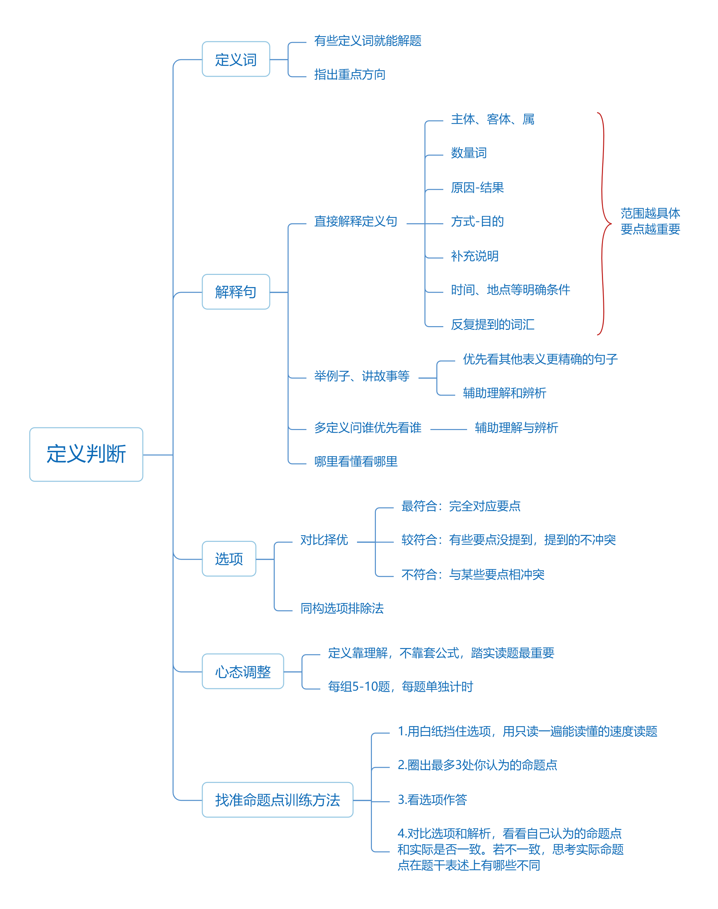

# 定义判断

## 解题思路

:::tip

【注意】定义判断：

1. 图形推理是给出一组图找规律；类比推理是一个词一个词地找规律（字数较图形推理多）；定义判断是给出几句话作为题干，要求根据句子本身选出正确选项（句子较类比推理更长）。
2. 定义判断本身的难度以及知识点没有前边讲解的图形推理和类比推理多。定义判断是整个判断推理中考点最少的一个模块，知识点虽然不多，但并不简单。

:::

每道题先给出一个概念的定义，然后分别列出四种情况，要求报考者严格依据定义选出一个最符合或最不符合该定义的答案。

:::tip

【注意】

1. 大纲：每道题先给出一个概念的定义，然后分别列出四种情况，要求报考者严格依据定义选出一个最符合或最不符合该定义的答案。
2. 根据大纲中的“严格依据定义”可知，定义判断不像类比推理，涉及到很多小常识需要积累。定义本身可以是法律概念、心理学概念、经济学概念等，此时无需纠结是否学习的是对应专业，因为题干已经给出了定义所有需要用到的信息，只是可能学习法律专业的同学遇到考查法律概念的题目，会比其他同学做的更快。同时，没有学习法律专业的同学也不要紧，因为根据题干信息也能选出答案。所以，定义判断无需过多的常识性积累，严格依据定义做题即
3. 此外，大纲还要求“选择最符合或最不符合该定义的答案”，说明定义判断与类比推理类似，同样需要“比较择优”。做定义判断题目不能只根据一个选项就判断其正确与否，一定要与其他选项做对比。
4. 之所以大家觉得定义判断题目比较难，是因为：（1）定义判断的题干越来越长，阅读量越来越大；（2）部分定义本身比较晦涩，读不懂（完全读不懂定义的情况并不多）。更常见的是：大家觉得哪个选项都不完美，往往会纠结、抠字眼，所以在考场上若想选出答案，只能比较择优。

:::

解题思维：

1. 看提问：“属于/符合”，“不属于/不符合”定义等

2. 看题干：识别有效信息——找准关键词、关键句

3. 看选项：当纠结时采用对比的思维进行排除，最终选择更符合题干要求的选项

学会接受不完美！！！

:::info

解题思路：

1. 看提问：题干可能问“属于/不属于”“符合/不符合”，所以一定要看清是“选是题”，还是“选非题”。假如某道题是选非题，有同学会纠结 A、B 两个选项，但这两个选项均符合定义，此时不仅会做错题目，而且还会浪费时间。

2. 看题干：
    - 部分定义题目文段较长，不是每一个字或每一句话都是有用信息，常
        掺杂“废话”或者是文段根本读不明白，此时要识别有效信息，找准关键词、关
        键句。

    - 学习关键词之后，部分同学遇到关键词就画出来，最后发现整个定义都被画为重点。所以当关键词比较多时，需要辨别哪个关键词更容易成为考点（如果句子比较多，需要辨别哪句话需要重点看）。

3. 看选项：

    - 对比的思维，选择更符合题干要求的选项，即“学会接受不完美”。不在一个选项上纠结，要在两个选项中比较择优。
    - 对比思维不仅适用于定义判断，在后边逻辑判断部分同样适用。纠结某一个选项没有任何价值，选项的对错是与其他选项比较出来的。

:::

**对比思维，择优选择**

---

夫妻关系：男女二人结成的合法婚姻关系。

下列最可能属于夫妻关系的是（ ）

A. 女神赵丽颖和大叔冯绍峰官宣晒结婚证

B. 娇羞的龙龙和威猛的东东经常秀恩爱

C. 中年妇女佳佳和她的儿子臭小子非常相爱

`学会接受不完美！！`

:::tip

【注意】对比思维，择优选择：

1. 如例题，假设只有 A、B 项。题干“夫妻关系”的定义为：男女二人结成的合法婚姻关系。问“下列最可能属于夫妻关系的是”。A 项中“女神”和“大叔”说明是“男女二人”。同时，“晒结婚证”对应“合法婚姻关系”，选项完美匹配定义；B 项虽然提到“娇羞”和“威猛”，但未明确提及是“男”还是“女”，且“秀恩爱”不确定是否为“合法婚姻关系”。所以，A 项很明确，符合定义；B项不明确（但未必有错），对比择优，A 项当选。

2. 如例题，假设只有 B、C 项。已知 B 项为不明确选项，C 项为“中年妇女佳佳和她的儿子臭小子非常相爱”，此时 B 项当选。因为 B 项虽然不明确，但没有明显错误；C 项的“中年妇女和她的儿子”虽然对应“男女二人”，但出现“儿子”，说明一定不是“合法的婚姻关系”，而是母子关系，C 项明确错误，择优选择 B 项。同样的选项选择与否，要看其“队友”，所以需要有对比择优的思维，
    接受不完美。

3. 将三个选项放在一起，A 项为明确符合的选项；B 项为不明确的选项；C项为一定不符合的选项，此时 A 项当选。若只有 B、C 项，则 B 项当选。4.学会接受不完美。

:::

## 考点一、快速识别有效信息

### 方法一：关键词——主体、客体

主体——行为、活动的发出者

客体——行为、活动作用的对象

---

我爱你

例：贷款替代：企业从银行或海外取得外汇借款后并不是直接使用外汇资金，而是将外汇结汇给银行，取得人民币资金加以使用。

王明申请美元贷款，然后将外汇结汇给银行，从而获得人民币资金

:::tip

【注意】关键词：主体、客体（常考）。

1. 主体：动作、行为的发出者。客体：活动、行为作用的对象（行为的接受者）。例如“我爱你”，“爱”是动作；“我”是“爱”这个行为的发出者，即行为的主体；“你”是“爱”的接受者，即行为的客体。
2. 并不是所有定义都包含主体和客体，但一旦出现，主体和客体往往就非常重要（命题点）。所以当题干出现主体、客体时，可以先到选项做对应，主体或客体不符合定义本身的选项可以直接排除（有助于提高做题速度）。
3. 如例题，“贷款替代”关键词：企业（主体）、银行或海外（客体）。选项为“王明申请贷款„„”，此时“王明”是个人，不是“企业”，可以直接排除。

:::

---

例 1（2016 江苏）

路怒症：指机动车驾驶者在行车过程中因焦躁、愤怒情绪
而产生的攻击性行为。

下列不属于路怒症的是（ ）。

A. 在路口等红灯时，小张感觉汽车被碰了一下，下车一看，果然是后车刹车不及时追尾了。小张猛踢后车车轮，大声责怪其司机并且索要赔偿

B. 妻子开车送老陈去上班，一辆小汽车突然窜到了面前，险些撞到他的车，老陈下车拦住那辆车，把司机痛斥一顿

C. 小李开了 8 年车，技术高超，每次被人超车，都忍不住狂踩油门飙上一把，直到反超并羞辱对方一番才罢休

D.小王正在赶路，旁边车子中飞出一个纸团突然落在他的挡风玻璃上，小王十分生气，他猛按喇叭，嘴里骂个不停

:::details{title=解析}

【解析】1.定义关键信息：机动车驾驶者（主体）。本题问的是“不属于”，选非题。

A 项：“小张下车大声责怪”没有明确提到“小张”是否为“司机”，不明确项，保留。

B 项：为“妻子开车，老陈骂人”，说明“老陈”不是“机动车驾驶者”。与A 项相比，A 项未提及“小张是否开车”，而 B 项明确提到是“妻子开车，老陈发怒”。所以 A 项不明确，B 项一定不符合，B 项当选。

C、D 项：“小李开车骂人”和“小王开车骂人”均符合“机动车驾驶者”，
均排除。

有同学纠结：题干要求为“行车过程中”，A 项的“在路口等红灯时”不是“行车过程中”。例如开车去公司上班时，一路上会遇到红灯，走走停停，所以在没有到公司的过程中都是属于“行车过程”，所以 A 项符合定义。【选 B】

【注意】当定义中出现非常明确的主体、客体时，一定要优先满足主体、客体。

:::

---

例 2（2015 江苏）

协同治理：指政府部门为了达成公共利益的目标，通过与非政府的、非盈利的社会组织和普通公众合作开展社会管理活动的工作模式。

下列属于协同治理的是（ ）。

A. 某市辖区内有多个街道办，每个街道办管辖一片区域，有的街道服务中心专门设立了为老年人和残疾人提供公益服务的绿色通道

B.某高校学生会多次组织大学生深入社区，开展心理咨询、消防安全讲座、帮助孤寡老人等公益活动

C.为创建卫生城市，某市卫生局、环保局、城管局通力合作，卫生防疫人员、环境监测人员、环卫工人和城管人员各司其职，积极工作

D.某市为确保城市公交畅通安全，每个公交站台都配有治安巡查员，这些人员中既有各职能部门人员，也有志愿者协会成员，还有退休者

:::details{title=解析}

【解析】2.问的是“属于协同治理”，选是题。定义关键信息：政府部门，说明需要是政府部门完成一件事；与非政府的、非盈利的社会组织和普通公众一起合作，说明不是“政府部门”自己干，还需要与“非盈利的社会组织”和“普通公众”合作（三个主体）。

题干给定三个主体，所以同时满足三个主体的选项才能选择。因为本题为选是题，所以本题的选项可能会缺少以上三个主体之一。

A 项：选项为“街道办”完成一件事，虽然有同学不知道“街道办”是“政府部门”还是“社会组织”，但选项一定缺少主体，题干要求为“三拨人”，选项只提到“一拨人”。“街道办”属于“政府部门”（行政机关），排除。

B 项：“高校学生会”属于“社会组织”或“普通公众”，但选项只有一个主体，排除。

C 项：虽然“卫生局、环保局、城管局”对应“三拨人”，但均出现“„.....局„”，说明都属于“政府部门”。同时，后边的“卫生防疫人员”对应“卫生局”、“环境监测人员”对应“环保局”、“城管人员”对应“城管局”，所以选项未提及“普通公众”和“社会组织”，排除。

D 项：“职能部门”往往指“政府部门”；“志愿者协会成员”对应“非盈利的社会组织”；“退休者”对应“普通公众”，符合题干主体，当选。【选 D】

`【注意】一旦出现主体，一定要重点关注主体。`

:::

---

#### 常考特定主体——国家机关

权力机关：全国人民代表大会、地方各级人民代表大会

司法机关：法院、检察院

行政机关：国务院、地方各级人民政府、各种局（公安局、税务局、交通局等）、街道办等

:::tip

【注意】国家机关：

1. 权力机关：全国人民代表大会、地方各级人民代表大会。

2. 司法机关：例如题干主体为“司法机关„„”，此时很多同学会有误区。需要注意，严格规定司法机关只有法院和检察院。公安局、监狱等往往是行政机关。

3. 行政机关：国务院（下设有人社部、公安部、民政部、健康委等）、地方各级人民政府、各种局（如公安局、税务局、交通局）、街道办（最基层的行政机关）。居委会和村委会不属于行政机关，而是群众自治组织。

4. 补充：
    - 常见的“坑”：题干为“企业„„”，选项为“个人„„”。
    - 课上不可能穷尽所有的主体，所以只列出了常考、容易犯错的主体。
    - 若主体范围越小、越明确，则越可能成为考点。如例 2 的主体为“政府部门”，称作“部门”的可以有很多，所以“政府部门”就很具体；如果主体为“人们/个人/组织”，此主体范围比较宽泛（除非选项的主体为“狗”等），考查的可能性较小。
    - 属（考查较少）：
        - 有时定义会以“„„的„„”结束。例如“人是有两条腿，浑身没毛的一种动物”，此定义即以“„„的„„”形式结束，此时“的”前边为限定词，“的”后面的称作“属”（类似类比中的“种属”，例如“苹果是符合„„条件的一种水果”，“水果”即为“苹果”的“属”），所以人首先需要是“动物”，其次才符合
            “两条腿”。
        - 当定义以“„„的„„”结尾时，如果“的”后面的内容很具体，是明确的范围，则考查的可能性很大。若“的”后面为“事情”，则范围比较宽泛；若“的”后边为“动物”，选项讨论的是“桌子、蘑菇”，则不符合定义。

:::

### 方法二：句式之“条件+结果”

方式：通过/利用„„

原因：因为/由于„„

时间：当„„时、在„„阶段

目的：以/达到„„

结果：导致/从而„„

例：微博营销是指以微博为营销平台，企业利用更新微博向网友传播企业、产品信息，树立企业形象和产品形象。节假日期间，某电商企业通过电子邮件将优惠信息发送至老顾客

:::info

句式之“条件+结果”：

1. 条件：
    - 方式：通过„„、利用„„、以„„的方式。遇到类似词语，则其后
        边（如“通过„„、利用„„”），或中间的内容（如“以„„的方式”）引导的
        是条件，常作为考点。
    - 原因：因为、由于。以上词语引导的是原因，往往是考点。
    - 时间：当„„时、在„„阶段。例如歌词“当太阳不再上升的时候”，
        只有当“太阳不再上升的时候”，才会发生后边的事情。

2. 结果：

    - 目的：以„„、达到„„。

    - 结果：导致„„、从而„„。

3. 以上关键词常结合起来考查：例如“通过„„以达到„„的目的”“因为„„从而导致„„”“当„„时，就会达到„„的结果”。无论怎么结合，只要遇到上述关键词，那么其引导的信息就很重要。

4. 如例题，“以„„”和“利用„„”都引导方式，即“微博”，所以题干的重点是“微博”。选项的方式为“电子邮件”，不属于“微博”，不符合定义。

:::

---

例 3（2018 山东）

化感作用是指一种植物通过向环境释放化学物质而对该种植物或周围植物（包括微生物）所产生的直接或间接的作用。

根据上述定义，下列不属于化感作用的是（ ）。

A. 在人参上喷洒的农药被土壤吸收后，会杀死土壤中的硝化细菌和氨化细菌

B. 胡桃树的叶、皮会释放葡萄糖代胡桃醌从而杀死胡桃树下的植物

C. 桉树叶中分泌出来的酚类物质被雨水冲刷下来后对附近亚麻的生长有抑制作用

D. 黑麦残株经微生物分解后产生羟基肟酸，影响自身的生长发育

:::details{title=解析}

【解析】3.问的是“不属于化感作用”，选非题。定义关键信息：植物（主体）向环境释放化学物质；对该种植物或周围植物（包括微生物）产生的直接或间接的作用（比较宽泛）。

A 项：“植物”不可能自己给自己喷农药，所以不符合“植物向环境释放化学物质”（人为的），不符合题干主体，本题为选非题，当选。

B、C 项：“胡桃叶、皮释放”和“桉树分泌”，以及“杀死胡桃树下的植物”和“对附近亚麻的生长有抑制作用”均符合定义，均排除。

D 项：有同学纠结选项为“微生物分解”，最后的“羟基肟酸”不明确是因为“微生物”产生的，还是因为“黑麦残株”产生的。即使认为 D 项不明确，但与 A 项相比，A 项一定不是“人参”自己向外“喷洒农药”，D 项排除。【选 A】

`【注意】纠结选项时，要做对比。`

:::

---

例 4（2018 北京）

电信诈骗，是指犯罪分子通过电话、网络和短信方式，发布虚假信息，设置骗局，对受害人实施远程、非接触式诈骗，诱使受害人给犯罪分子打款或转账，进行非法侵占他人财物的犯罪行为。

根据上述定义，以下不属于电信诈骗的是（ ）。

A.王某在网上发起新房团购，承诺一千元定金可抵五万元房款，顾客缴纳定金之后才发现该楼盘已售罄，王某也消失了

B.李某盗用正在出差的张先生的微信头像，冒充张先生给张太太发微信说遇到事故，骗走两万元

C.张某谎称自己患上不治之症，伪造诊断书、编造假故事放在网上，通过众筹募集到三万元医药费

D.李老太太打电话找保洁，家政公司派来的保洁员王某忽悠李老太太从王某丈夫的店里购买了数千元保健品

:::details{title=解析}

【解析】4.问的是“不属于电信诈骗”。主体：犯罪分子（范围比较宽泛），此时 A 项为“王某消失”、B 项为“李某盗用”、C 项为“张某诈骗”、D 项为“王某忽悠”，均为“犯罪分子”，所以此主体用不上。“通过”引导方式：使用电话、网络和短信进行诈骗。

A 项：“在网上发起”符合“通过网络诈骗”，符合定义，排除。

B 项：“微信”属于“网络”，且“骗走两万元”说明是“诈骗”，符合定义，排除。

C 项：“放在网上”对应“网络”，且“通过众筹募集到三万元医药费”属于“诈骗”，符合定义，排除。

D 项：虽然提到“打电话请保洁员到家”，但此处并不是“李老太太骗人”，而是“家政公司派来的保洁员忽悠李老太太买东西”，此时并不是通过“电话、网络和短信”的方式骗人，本题为选非题，当选。【选 D】

【注意】例 4 的 D 项之所以设置了“打电话”一词，是因为出题人猜测大家在考试的紧张状态下，可能只看到“电话”就排除了选项。所以，做题时一定要认真读完选项，这样才能避免掉“坑”。

:::

---

例 5（2016 山东）互助游是指有旅游意向的双方利用互联网等媒介中的人脉关系交换旅游资源，相互提供帮助而实现旅游的方式，达到双方都能降低旅游成本、实现深入体验旅游的目的。

根据上述定义，下列涉及互助游的是（ ）。

A.小张在北京读书，利用暑假时间到同学所在的城市旅游，期间住在同学的宿舍

B.小王家住南京，准备到西藏旅游，邀请家住西安的网友同行，分摊支出，旅途中互相帮助

C.小刘住在北京，在桂林旅游期间住在网友家里，对方到北京旅游时，自己也向对方提供住宿

D.小赵住在上海，到海南旅行，食宿与行程均由朋友安排负责，小赵返沪后邀请朋友到上海玩

:::details{title=解析}

【解析】5.本题正确率较低，问的是“互助游”。主体：有旅游意向的双方。“利用”引导方式：互联网等媒介交换旅游资源，相互提供帮助而实现旅游。“达到”引导目的：降低旅游成本、实现深入体验旅游。

A 项：只提及“小张”一方“有旅游意向”，而“同学”并没有“旅游意向”，排除。

B 项：“小王”和“西安的网友”都想旅游，属于“有旅游意向的双方”。虽然“互相帮助”对应题干“相互提供帮助”，但“分摊支出”不确定是否符合“交换旅游资源”，此时考场上可以继续看后边的选项作比较，保留。

C 项：“小刘”和“网友”属于“有旅游意向的双方”。同时，“互相到对方家里住”属于“交换住宿的旅游资源”，此时与 B 项的“AA 制”（分摊支出）相比，C 项更符合“交换旅游资源”，C 项当选。

D 项：“邀请朋友”不确定朋友是否“到上海玩”，不明确是否为“有旅游意向的双方”，而 C 项更明确，D 项排除。【选 C】

:::

---

例 6（2018 吉林甲）

人为环境异常，是指一定地域范围内，因人类行为造成自然环境的某个或多个环境要素发生显著变化，破坏生态系统的相对平衡关系的现象。

根据上述定义，下列属于人为环境异常的是（ ）。

A. 某地地下贮藏着丰富的石油资源，近日附近村庄的井水变得浑浊，并伴有刺鼻气味，经检测含有大量重金属，不宜饮用

B. 某地因地震出现地表下陷，暴雨过后，部分区域严重积水，致使这些区域农田里的农作物、果园里的果树发生烂根枯萎

C. 某地沿河工业园区近来订单大量增加，废水排放量也随之激增，结果造成河流下游的鱼虾大量死亡，沿岸庄稼成片枯死

D. 某地火山爆发喷出的有毒元素散落到地表，改变了土壤中原有化学成分，形成了高氟、高汞的土壤，影响了作物的生长

:::details{title=解析}

【解析】6.问的是“属于人为环境异常”。定义关键信息：一定地域范围内（比较宽泛），考查的可能性较小；“因”引导原因，即“人类行为”（比较明确）；结果即“破坏生态系统的相对平衡”。

A 项：没有明确提及是“人类开采”，还是“石油自己外溢”，保留。

B 项：“地震”说明一定不是“人类行为”，排除。

C 项：“工业园的订单”一定属于“人类行为”，此时 A 项不明确，未提及是否“有人开采石油”，C 项明确符合定义，当选。

D 项：与 B 项类似，“火山爆发”不是“人类行为”，排除。【选 C】

:::

---

例 7（2018 陕西）

惭愧是指一个人在日常生活中，由于对好的行为和圣贤的深入了解，内心产生一种以圣贤为榜样，以好的行为为准绳，并且拒绝不符合圣贤和好的言行的心理品格；当这种心理品格植根后，个人如果出现行为上的背离，内心就会产生一种良心自责感。
根据以上定义，下列属于惭愧的一项是（ ）。

A.甲在寒冬季节将水洒在楼道，后来担心水冻成冰后给他人带来伤害，内心非常歉疚

B.乙考试作弊，一直担心事情暴露后会遭到大家的谴责和批评，内心忐忑不安

C.丙在背后说同学坏话，事后想起书中关于“真、善、美”的种种阐释，内心觉得很不安

D.丁偶然听了某道德楷模的讲座，内心对该道德楷模产生一种敬佩的感觉

:::details{title=解析}

【解析】7.问的是“属于惭愧”。定义关键信息：日常生活中（范围比较宽泛）；“由于”引导原因（条件），即“内心产生一种以圣贤为榜样，以好的行为为准绳，如果出现行为上的背离”；结果即“良心自责感”。

A 项：“内心非常歉疚”对应“良心自责感”。有同学认为“担心水冻成冰后给他人带来伤害”说明不应该这么做，而题干要求为“先认为什么是好的，接着做了坏事后良心自责”。选项只提及“做了不好的事”，未提及“什么是好的”，此时不能盲目选择，需对比后边选项，保留。

B 项：“内心觉得很不安”的原因是“自己做了一件不好的事”，但未提及“原来认为什么是好的”，A、B 项类似，均为“干了一件坏事，然后感到忐忑”，保留。

C 项：与 A、B 项相比，C 项除了“说同学坏话”之外，还明确提到“书中有真、善、美”（以前知道什么是好的），与题干的对应比 A、B 项更好，更符合定义，当选。

D 项：“敬佩”不是“自责”，排除。

A、B 项类似，均为“做了一件事，自己感觉不好，然后良心自责”，所以二者为同构选项（在选项的设置上结构相似）。同构选项若对则全对，若错则全错，而本题为单选题，所以 A、B 项可以直接排除。【选 C】

`【注意】比较才是硬道理，原因和结果都是常考的关键词。`

:::

---

例 8（2012 国考）

根据我国有关规定，职工遇有下列情形之一的，可以认定为工伤：（一）在工作时间和工作场所内，因工作原因受到事故伤害的；（二）在工作时间和工作场所内，因履行工作职责受到暴力等意外伤害的；（三）因工外出期间，由于工作原因受到伤害或者发生事故下落不明的；（四）在上下班途中，受到非本人负主要责任的交通事故或者城市轨道交通、客运轮渡、火车事故伤害的。

根据上述规定，下列情形中可以认定为工伤的是（ ）。

A. 周某开车在下班途中违章驾驶，与前车发生追尾事故，导致颅骨骨折

B. 交警小李因纠正王某的违章行为引起王某不满，在上班途中遭到王某的殴打

C.赵某在车间加班时因操作不当，手指被绞进机器中，事后被鉴定为二级伤残

D.张经理为加深与同事的感情，在工作日邀请同事共进午餐，结果同事在用餐后不慎摔伤

:::details{title=解析}

【解析】8.问的是“可以认定为工伤的是”，题干给出四种情形，考试中无需读完所有情形再看选项。此时可以简单分类：情形（一）（二）均为“在工作时间和工作场所内”（明确的时间和地点）；情形（三）是“因工外出期间”；情形（四）是“在上下班途中”。当题干条件较多时，可以从选项入手。

A 项：“在开车下班途中”对应情形（四），但题干要求为“非本人负主要责
任的交通事故”，选项为“违章驾驶”，说明是“周某”的主要责任，不符合定义，
排除。

B 项：提到“上班途中”，可以对应情形（四），但“被人打”不属于“交通事故”，也不符合“城市轨道交通、客运轮渡、火车事故伤害”。所以选项虽然提到“上班途中”，但仍然不属于“工伤”。有同学认为小李很惨，需要注意，做题时不要带有情感，虽然不符合“工伤”的定义，但可能会按照其他法律条文处理（如“刑事犯罪”），排除。

C 项：“在车间”对应“工作场所”；“加班”对应“工作时间”，选项对应情形（一）和（二）。选项为“因操作不当，手指被绞进机器中，事后被鉴定为二级伤残”，而情形（二）要求为“受到暴力等意外伤害”，所以不能对应情形（二）。“因操作不当”符合“因工作原因”，有同学认为“因操作不当”是自己的原因，需要注意，情形（一）并没有提及“因非本人主要责任受到事故伤害”（情形（四）才有涉及），所以情形（一）中，无论做法对错，只要在工作中受到伤害，均符合定义，当选。同学们之所以会纠结 C 项，是因为 A 项先入为主，同学们有了“在上下班途中，受到非本人主要责任„„”的概念，看到 C 项时会自然联想到“非本人主要责任”，而情形（一）中并未涉及“非本人主要责任”。所以一定要严格按照定义本身做题。

D 项：“邀请同事共进午餐”不符合“上下班途中”和“因公外出”。有同学纠结“工作日共进午餐”是否为“工作时间”，正常情况下，“工作时间”为上午9:00-12:00；下午 13:00-18:00，中间的午餐不是“工作时间”，即使认为上午9:00 到下午 18:00 都是“工作时间”，但受伤的原因也不是“工作”，而是“吃饭”（与“操作机器”相比不符合定义）。此外，该项未提及“意外伤害”，排除。【选 C】

:::

:::tip

【注意】

1. 当题干很长、条件很多的时候，要进行简单梳理，然后再根据选项对应题干。

2. 一定要严格遵守条件，不能有先入为主的概念。

:::

### 关键词该如何更准的识别有效性？

:::tip

【注意】快速识别有效信息：

1. 常考关键词：主体、客体、属、原因、方式、时间、地点、结果、目的，可能会交叉考查。关键词经常用来命制考点和错误选项，一定抓住关键词作对应。

2. 有的定义中会同时出现多个关键词（如同时存在主体、原因和结果等内容）或某个关键词的内容多，导致画出关键词比较多，但越细化、越小、越明确范围的词语更加容易成为考点。

    - 如“在一定的地域范围内”的范围广，不容易成为考点；“政府”为明确的主体，容易成为考点。

    - 如“以„„等方式”中给出多个方式，方式较多，若此时给出一个结果，结果可能为考点。如果结果是“间接或直接的作用”，范围较广，则不容易考查，此时的方式为“植物发出的物质”，方式明确，可以优先考虑方式。

3. 小技巧：
    - 辨识关键词：阅读定义时有聚焦点，提前进行预判，虽然不能保证每次的预判都准确，可以先根据预判找到最重要的关键词，用最重要的词语先判断选项。若无法选出唯一答案，可以通过其他的关键词判断。如拓展 1 和拓展 2 所示。
    - “越详细、越小、越符合概念本身”的词语更容易成为要观察的关键词。
    - 定义判断在总结时，要分析每个选项错误的原因，且找到题干中对应的关键词，注意考查的关键词的形式，及没有成为考点的关键词的特征。

:::

---

拓展 1

斜杠青年：指不满足于从事单一职业，追求拥有多重职业身份及多元生活方式的年轻人。他们在自我介绍时往往喜欢用斜杠来区分自己的不同身份，如：张三，金牌律师/企划师/专栏作家。

下列属于斜杠青年的是：

A. 最近两三年，八零后导演黄某某先后出演了 10 多次男配角，去年在一个著名的国际电影节上斩获了最佳男配角奖

B. 小丁在国外获得博士学位后，任职于国内一所著名高校，因科研成就突出，被破格聘为教授，并入选省“双百”人才计划

C. 某公司程序员小陈爱好广泛，性格温和，人际关系融洽，节假日常邀上三五个好友一起登山、打球、游泳

D. 李总做过保安，送过快递，当过安装工，开过小杂货店，他经常自豪地向员工讲述自己 30 多年来丰富的职业经历

:::details{title=解析}

【解析】拓展 1.题干给出“斜杠青年”的定义，“青年”这个词容易理解，但“斜杠”的含义可能不太清楚，即定义本身给出聚焦的范围，找到“斜杠”的说明，可知道定义的含义，故要有明确的目标去找关键词。尾句“如”之后为例子，平时一般不读，但其中出现明显的斜杠，可以优先看。例子的多个身份中间出现斜杠，即斜杠意为有多个身份，此时再去看定义时更加容易找到题目的关键点。

A 项：黄某某既是“导演”，又是“男配角”，具有多重身份，名片上可以写为“导演/演员”，为多重身份，符合定义。

B 项：“博士”是学历，“教授”是职称，只有一个职业是“高校的老师”，故排除。

C 项：只是说明有多个爱好，未提及是否有多个职业，不如 A 项，排除。

D 项：“三十多年来的职业经历”说明李总是通过不同的工作得到了今天的成绩，比如李总的名片上不会写“总裁/保安/快递员”，不符合“斜杠”的定义，不如 A 项，排除。有同学做题时会纠结 D 项，认为其工作比较多，但若看到“斜杠”这词语，并且通过例子理解“斜杠”的含义，则不会选错。【选 A】

:::

---

拓展 2

临时救助：指家庭或个人遭遇突发事件、意外伤害、重大疾病等变故，基本生活陷入困境时，政府有关部门提供的应急性、过渡性救助。

下列属于临时救助的是：

A.80 岁的李大爷无儿无女，独自生活，社区工作人员定期到他家中探望，把每月的养老金交到他手上，还时不时地送来一些生活用品

B.老张患上了强直性脊柱炎，巨额医疗费花光了积蓄，夫妻名下的房子也变卖了，一家三口只得暂住在街道办为他们租来的小房子里

C.地震发生后，社会各界积极响应市政府号召，通过多种渠道捐款捐物，很快就筹集了大批物资并分发到了灾民手中

D.老赵在几年前的一次车祸中失去了左腿，从那以后再也不能外出工作，每月数百元的低保金就成了家里主要的经济来源

:::details{title=解析}

【解析】拓展 2.定义为“临时救助”，“救助”容易理解，即有困难时给予帮助，可以重点关注“临时”的解释。“家庭或个人”比较宽泛，不考虑；“突发事件、意外伤害、重大疾病等变故”中存在多个变故，不优先考虑。“基本生活陷入困境，政府提供应急性、过渡性救助”中说明“临时”指应急性、过渡性，且主体是“政府”，比较明确。即定义关键是“政府提供的，短的、应急性的救助”。

A 项：“定期探望，每月给养老金”说明是长期的行为，不是应急性的、过渡性的行为，排除。

B 项：“患病”属于重点疾病的变故，“暂住”说明是临时性、暂时性的救助，且“街道办”是政府部门，符合定义，保留。

C 项：“地震”属于突发事件，“地震救助”是短期救助行为，但不是政府提供捐款、救助，而是社会各界人士提供的捐款，主体不符合，排除。

D 项：“每月”说明不是临时性、过渡性救助，而是长期救助，排除。虽然定义中存在主体（家庭或个人；政府）、条件（遭遇„„变故）、属（应急性、过渡性救助）等关键词，但不需要每个都重点阅读。“救助”容易理解，重点关注“临时”的含义，且“政府”这个主体非常聚焦，要关注，而“家庭或个人”的范围比较宽，不优先考虑。【选 B】

:::

---

### 方法三：句号与补充说明少读，优先看概念所在的那句话

少读：优先看概念所在的那句话

---

运动参与是指主动参与体育活动的态度和行为表现。经常参与体育活动的人，可以培养和发展对运动的兴趣和爱好。养成体育锻炼的习惯，使体育活动成为生活中的重要组成部分。作为学校领域的运动参与，要求学生具有积极参与体育活动的态度和行为，掌握科学健身的知识和方法，养成坚持体育锻炼的习惯。

根据上述定义，下列属于运动参与的是：

A. 为了培养孩子的兴趣，小生的父亲经常带他去游泳

B. 小李热爱跑步，只要有时间，他就会参加马拉松比赛

:::tip

【注意】

1. 少读：优先看到概念所在那句话的句号。若定义所在句已经很完整描述出定义的内容，可以优先看定义所在那句话，后面的内容先不看。若通过此内容排除 2 个选项，再比较余下 2 个选项的区别，将其代入题干中验证。若定义所在句看不懂，可以继续向后阅读。

2. 例子：题干要求选择“属于运动参与”的选项。题干较长，但第一句说明运动参与的含义，即“主动参与体育活动的态度和行为表现”，后面的内容可以先不看。A 项是“小生的父亲带他去游泳”，B 项是“小李热爱跑步，只要有时间，就会参加马拉松比赛”，相比较而言，B 项更加主动，故根据定义所在句可以直接排除 A 项。

:::

---

例 9（2018 黑龙江）

情感广告是诉诸于消费者的情绪或情感反应，传达商品带给他们的附加值或情绪满足的一种广告策略。这种情绪在消费者心目中的价值可能远远超出商品本身，从而使消费者形成积极的品牌态度。

根据上述定义，下列广告语不属于情感广告的是（ ）。

A.某品牌饮料广告语：“××可乐，中国人自己的可乐！”

B.某品牌啤酒进入东南亚市场的广告语：“好不好，家乡水。”

C.某品牌纸尿裤广告语：“宝宝天天好心情，妈妈一定更美丽。”

D.某品牌润肤露广告语：“为了肌肤柔美润舒，请使用××润肤露。”

:::details{title=解析}

【解析】9.题干要求选择“不属于情感广告”的选项。“广告”比较容易理解，一般是说明某个产品有多好；“情感”不太容易理解，可以聚焦此词语。通过定义所在句可知“情感”指的是调动消费者的情绪，买了商品之后有附加值，且得到情绪上的满足。定义所在句的内容比较完整，后面的内容先不看。

A 项：不仅宣传可乐，“中国人自己”说明用祖国吸引人，产生民族自豪感，排除。

B 项：“家乡”类似于 A 项的“中国人”，加上了所在地，属于情绪；有同学认为“啤酒进入东南亚市场”，不是家乡水，如啤酒为中国品牌，东南亚有中国人，“家乡水”可能是针对华裔，可以认为不太明确，与其他选项比较后确定，先保留。

C 项：“妈妈更美丽”说明带着情感，排除。

D 项：只是正常的广告，没有涉及“情感”，比较选项，A、B、C 项均提及广告之外的内容，D 项只是单纯的广告，选非题，选择 D 项。【选 D】

:::

:::tip

【注意】1.解题时要比较择优后选择，2.解题时先阅读定义所在句。

:::

---

拓展（2018 陕西）

近因效应是指在总体印象形成过程中，新近获得的信息对人们认知的影响，远远大于以往所获得的信息。这是因为，在印象形成过程中，人们对原来的印象逐渐淡忘，当有新信息进入视野时，容易对人们的感官产生新的刺激，从而形成最新的印象，直接影响人们的认知和判断。

根据以上定义，下列不属于近因效应的一项是：

A.某社会名流声名卓著，到了晚年却因为一桩丑闻而臭名昭著

B.面试时衣冠整洁，给人以良好的印象，被录取的几率也较大

C.夫妻本来感情很好，因为一件小事吵架，闹嚷着要离婚

D.小玲和小菲多年好友，因小玲最近“得罪”了小菲，两人形同陌路

:::details{title=解析}

【解析】拓展.题干要求选择“不属于近因效应”的选项。第一句话为定义所在句，其后出现句号，可以理解近因效应，即“离我越近越重要”。“是因为”说明后面是解释，可以先不看。

A 项：“晚年因为一桩丑闻而臭名昭著”说明发生时间较近的事情的影响大，符合定义，排除。

B 项：未提及时间的远和近，先保留。

C 项：小事偏后发生，之前感情很好，相比较于 B 项，存在时间先后，更符合定义，排除。

D 项：最近得罪说明存在时间先后，排除。阅读完所有的题干内容也可以选出正确答案，但只阅读定义所在句可以帮助节省时间。【选 B】

:::

---

例 10（2018 山东）认知失调是一个人在做出决定、采取行动或者接触到一些有违原先信念，情感或价值的信念后所体验到的冲突状态。当人们感到认知失调时，不协调的存在感将推动人们去努力减少不协调，除设法调整自身的行为或改变自己的态度外，人们还可以主动避开那些很可能使不协调增加的情境内外因素和信息因素。

根据上述定义，下列反映认知失调的是（ ）。

A.小明参与了一个很无聊的活动，从中得到了很少的报酬

B.推销员说服小红用相对高的价格买了自己不是很需要的厨具，几天后小红觉得自己非常喜欢这套厨具

C.小王因为考试没考好被爸爸批评了，他回到自己房间后认真思考了原因，决定以后更加努力学习

D.勤奋的小宇参加了很多课外班，这导致每次练习钢琴都会迟到，他对钢琴老师表示非常抱歉

:::details{title=解析}

【解析】10.题干要求选择“反映认知失调”的选项。第一句为定义所在句，其后出现句号。“体验到的冲突状态”比较容易理解，前面的条件比较长可能不太容易看懂，但前半句中出现顿号，说明是不同的情况，即做出决定后体验到冲突，或采取行动后体验到冲突，或接触到与认知不同的事情后体验到冲突。

A 项：参与无聊活动后得到很少报酬，说明认知一致，排除。

B 项：“小红认为不需要”是原来的认知，“推销员说服她的内容”属于与原来认知不同的事情，“用相对高的价格购买”说明存在冲突，保留。

C 项：“因为考试没考好被批评”中没有提及原来自己的认知是与爸爸的冲突，没有与自己冲突，且若要存在冲突，应说明原来认为“不应该努力学习”，现在认为“应该努力学习”，但没有提及原来的情况，未体现冲突，而 B 项明显说明有冲突，排除。

D 项：若认为没有存在冲突，可以直接排除。若认为 D 项存在冲突，可以比较 B、D 项，但通过定义所在句无法排除某个选项，需要继续阅读。题干说明“感觉认知失调后改变自己”，B 项“自己觉得非常喜欢”是改变
了自己的态度，D 项只是感觉抱歉，但是没有调整时间或少报学习班，不明确，B 项当选。【选 B】

:::

---

### 注意阅读补充说明——即、也就是说

:::tip

【注意】

1. 题干比较长时，优先看定义所在的句子。

2. 若根据定义所在句无法选出唯一答案或前面的内容看不懂，但后面的内容可以看懂，可以继续阅读其后的内容。

3. 阅读补充说明：“解释说明”指定义后出现“即、也就是说”引导的对定义解释的内容，前后的内容一致，但后半句比较好理解，可以优先阅读后半句的内容。

:::

---

例 11（2015 国考）

疑罪是指司法机关对被告人是否犯罪或罪行轻重难以确证的情况。疑罪从无原则是现代刑法“有利被告”思想的体现，是无罪推定原则的具体内容之一，即在既不能证明被告人有罪又不能证明被告人无罪的情况下，推定被告人无罪。

根据上述定义，下列采用了疑罪从无原则的是（ ）。

A.赵六因盗窃他人网络密码被起诉，但由于赵六被证明从来不使用网络，法院判其无罪

B.史某和汤某打架，两人都受了伤，因无法确定谁先动手，法庭建议庭外和解

C.钱某因涉嫌投毒被起诉，后因证据不足，法院判决钱某无罪

D.张三起诉李四侵权，但因拿不出任何证据，结果败诉

:::details{title=解析}

【解析】11.题干要求选择“采用疑罪从无原则”的选项。题干中先给出“疑罪”的定义，问的是“疑罪从无”，问谁先看谁，先看“疑罪从无”的定义。“疑罪从无”的适用范围是“刑法”，“有利被告”和“无罪推定”对于学习法律的同学可能很好理解，若无法看懂，可以继续阅读。尾句出现“即”，后面为解释的内容，说明“不能证明有罪，且不能证明无罪，推定无罪”。

A 项：“从来不使用网络”可以证明无罪，排除。

B 项：不清楚谁是被告，且“庭外和解”不是法庭判定，排除。

C 项：“证据不足”说明不能证明有罪，又不能证明无罪，且“投毒”是刑法的范畴，当选。

D 项：“侵权”属于民法的范畴，若朴素理解刑法和民法，“民法”中的 2 个主体之间权利是对等的，如“合同”“婚姻”“知识产权”等；“刑法”中涉及的行为一般比较严重，如杀人、放火、盗窃、贩毒等属于刑法的范畴。且“民法”是如果自己不主张自己的权利，相关机关不会介入；“刑法”是就算没有人举报，相关机关也会介入，排除。【选 C】

:::

---

例 12（2017 山东）

睡眠者效应指的是信源可信性的传播效果会随时间推移而发生改变的现象。也就是说，传播结束一段时间后，高可信性信源带来的正效果在下降，而低可信性信源带来的负效果却朝向正效果转化。

根据上述定义，以下哪项属于睡眠者效应？（ ）

A.名人广告只能带来短期内销售额的增加，时间一长，产品的销售额就迅速下降了

B.某产品由于名称容易使人产生不好的联想，尽管质量上乘，但是一直打不开市场

C.小李前一天晚上看中的一件非常满意的商品，第二天早上一看，觉得不过如此，她迅速取消了订单

D.爱看武侠小说的李某年轻时常常有打抱不平的冲动，40 岁之后的他变得谨慎持重了

:::details{title=解析}

【解析】12.题干要求选择“属于睡眠者效应”的选项。定义所在第一句话读完后可能无法理解，“也就是说”相当于“即”，其后为解释说明的内容，即原来大家相信的效果，随着时间推移后，没有那么好；原来不太好的效果向好转变。

A 项：“名人广告”是高可信源，应带来正向效果，即“短期内销售额增加”，“时间一长，产品销售额迅速下降”说明一段时间过去后，由好变坏，没有问题，保留。

B 项：“由于名称容易使人产生不好的联想”属于低可信源带来的负效果，但“一直打不开市场”说明没有向正向转化，排除。

C 项：若认为选项是“小李原来认为好，现在认为不好”，可以比较 A、C 项。C 项中没有信源，只是产品本身，而 A 项通过名人广告的信源传播；且前一天晚上看完后第二天早上变卦，不是“传播结束一段时间后”，A 项“时间一长”可以更好对应此关键词；同时 C 项只是自己看，不属于传播，排除。

D 项：“武侠小说”对于“武侠小说爱好者”来说是高可信源，高可信源带来的效果应由好变坏，但“打抱不平的冲动”不应该是好效果；有人认为“打抱不平”不如“谨慎持重”好，此时与文段不符，高可信性信源没有带来好效果；有人认为“打抱不平”和“谨慎持重”之间没有绝对的好坏之分，与 A 项“销售
额由增加到下降”比较，更加不符合定义，排除。【选 A】

`【注意】如果不确定选项是否符合定义，需要将两个选项进行比较。`

:::

---

### 原理效应类——常见典型句式：条件/方式+结果，故事不优先读

故事不优先读

:::tip

【注意】

1. 定义所在的句子优先阅读，后面的内容能不看尽量不看，若前面的内容无法选出唯一答案，可以阅读后面的内容。

2. 定义中如果出现解释的内容，解释部分可能更加容易读懂，可以优先阅读。
3. 原理效应类：效应类题的经典句式是“条件/方式+结果”，且很多题目的“废话”较多，如 2018 年陕西“近因效应”题。原料效应类题可能是增加了解释或故事的内容，若题目中给出故事和由其得出的结论，优先阅读结论的内容。

:::

---

拓展

宇宙中一些大质量的物体在发生坍塌之后，会形成一个致密的宇宙奇点，由于它的质量非常大，从而产生的引力也非常大，大到光线进去都出不来，形成“黑洞”。而被吞噬进去的物质和能量又进一步增强了黑洞的吸引力。经济学上把这种非常强的吞噬和复制能力称为“黑洞效应”。

根据上述定义，下列不属于黑洞效应的一项是：

A.全球连锁企业沃尔玛销售能力特别强，供应商要在全球市场上扩大销量，就必须成为沃尔玛供应商，而随着供应商的增加，沃尔玛对零售终端的影响就更强，就会有更多的供应商进入沃尔玛体系

B.某企业几个员工做了个性工牌，引起其他员工跟风，争相在网上晒个性工牌，继而收到很多网友“也想要一个”的反馈。企业为网友特制一批工牌，欢迎网友到企业刷卡参观。网友参观后将更多照片晒在网上，让企业品牌得到充分传播

C.汽车驶近较长隧道洞口时，驾驶员视野中天空、露天路面等处亮度远高于洞口亮度。此时，驾驶员会因为光照突然变化而一时感受不到洞口亮度，觉得像个“黑洞”，以致产生车祸

D.“私募一哥”徐翔被查后，与其相关的某家上市公司高管失联，而与其相关的其他几家上市公司也都开始了一连串的高管失联

:::details{title=解析}

【解析】拓展.题干要求选择“不属于黑洞效应”的选项。“宇宙中„„黑洞的吸引力”说明如何形成“黑洞”，是无关内容，不用阅读，直接看尾句即可。尾句说明“存在非常强的吞噬和复制能力”。

A 项：有了一个供应商之后，有了更多的供应商，符合“复制的能力”，选非题，排除。

B 项：“越来越多的人做个性工牌”属于“复制”，符合定义，排除。D 项：一个高管失联后，很多高管都失联，属于“复制”，符合定义，排除。

D 项：一个高管失联后，很多高管都失联，属于“复制”，符合定义，排除。

C 项：虽然存在“黑洞”这个词，但是没有体现“吞噬和复制”，当选。【选C】

【注意】原理效应类题：例子和故事的内容不是一定不阅读，关键是看是否可以读懂总结的内容。

:::

---

例 13（2017 吉林甲）

白熊效应，源于美国哈佛大学社会心理学家丹尼尔·魏格纳的一个实验。他要求参与者尝试不要想象一只白色的熊，结果参与者的思维出现强烈反弹，很快就在脑海中浮现出一只白熊的形象。实验结果证实，当我们刻意转移注意力时，思维也开始出现无意识的“自主监视”行为——监视自己是否还在想不应该想的事情，使我们无法从根本上放弃对事情的关注。

根据上述定义，下列现象最符合白熊效应的是（ ）。

A.一般情况下，人们对自己喜欢的事物，总会不自觉地给予更多的关注

B.很多正处于青春期的孩子，家长越是不让他做什么，他就偏偏要去做

C.失恋的人努力想忘记昔日的恋人，却发现对方的形象在脑中愈加清晰

D.人们往往对已完成的工作很快遗忘，对未完成的工作却更加念念不忘

:::details{title=解析}

【解析】13.题干要求选择“最符合白熊效应”的选项。“白熊效应„„的形象”不用阅读，“实验结果证实”后为总结的内容，“使”后为结果，“思维也开始„„想不应该想的事情”虽然不太容易读懂，但通过前后的内容可知定义说明“想刻意转移注意力时，无法忘记原来的事情”，即“想忘，忘不了”。

A 项：没有说明刻意不喜欢，即没有刻意转移注意力，排除。

B 项：主体是“孩子”和“家长”，定义的主体是同一个人，应说明孩子不想干，但是孩子无法忘记，且选项说明“做什么”，定义的“注意力”是想，排除。

C 项：想忘记恋人，但是更加清晰，说明想忘记，但是忘记不了，当选。

D 项：没有刻意的转移，排除。若考试时确实无法理解总结句的含义，可以通过阅读例子的内容帮助理解。【选 C】

【注意】1.原理效应类题优先看总结句，定义的每个字不是都要读懂。2.若总结句如果无法看懂，可以通过阅读例子的内容帮助理解。

:::

---

例 14（2014 山东）

布利丹效应源于法国哲学家布利丹讲述的一个寓言故事：一头驴子外出觅食，发现两堆相距不远的草料。东边是一大堆干草料，西边是一小堆新鲜的嫩草。驴子很高兴，跑到大堆的干草料处，刚要吃，突然想到西边草料那么新鲜，肯定好吃，不去可能会被别的驴子吃掉。于是它就跑到嫩草堆前，刚要吃又想，这堆草虽然很嫩，可别的驴子把那一大堆干草料吃光的话自己就要饿肚子了，还是回去吃干草吧！就这样来来回回，这只可怜的驴子，最后饿死在草堆旁。

根据上述定义，下列不符合布利丹效应的是（ ）。

A.弈者举棋不定，终之败矣

B.一山望着一山高

C.凡事预则立，不预则废

D.鱼，我所欲也；熊掌，亦我所欲也

:::details{title=解析}

【解析】14.题干要求选择“不符合布利丹效应”的选项，但题干中只讲了驴子的故事，没有总结句，需要阅读前面故事的内容。考试时如果没有时间可以不做，但一般这类题的难度不大。故事说明“有两堆草，驴子一会儿想吃干草，一会儿想吃湿草，来来回回，最终饿死”。

A 项：“举棋不定，终之败矣”说明一直犹豫，不能决定，最终失败了，符合定义，排除。

B 项：对应题干中“在干草的位置觉得新鲜的草好，在新鲜草的位置觉得干草好”，排除。

C 项：“预”指计划、规划，选项意为“事前做了计划才能成功，不做计划就会失败”，但题干未提及“提前做计划”，当选。

D 项：选项说明“鱼和熊掌都想要”，可以推出，排除。【选 C】

`【注意】凡事预则立，不预则废：不论做什么时，事前有准备，就能得到成功，不然就会失败。`

:::

---

### 多定义

1. 问啥看啥
    - 看清题干问的是哪个定义，重点看目标定义
2. 比较定义
    - 纠结两个选项时，再与其他定义比较

:::tip

【注意】

1. 单定义：
    - 看清楚提问。
    - 常考关键词：若有多个关键词，需要自己作预判。范围越小、越明确的词语更加容易考查；单看定义本身时，聚焦定义中不容易理解的词语，更容易找到关键词。
    - 关键句：先看定义所在的句子，例子和解释内容不优先看。遇到“即、也就是说”等解释说明的内容要重点看。

2. 多定义：最终还是问某一个定义，单定义的解题方法仍然适用。
    - 问谁先看谁：看清楚题干问的是哪一个定义，重点看目标定义，一般只看目标定义即可解题。
    - 若通过目标定义，排除两个选项，纠结剩下两个选项时，带着选项的不同，对应其他的定义。
3. 解题时能少阅读就少阅读。非要多读时最好有“明确的目标”。

:::

---

例 15（2018 国考）

系统脱敏法是一种心理治疗法，当患者面前出现引起焦虑和恐惧的刺激物时，引导患者放松，使患者逐渐消除焦虑与恐惧，不再对该刺激物产生病理性反应。它包括快速脱敏法和接触脱敏法等。前者是治疗者陪伴病人置身于令病人感到恐惧的情景，直到病人不再紧张为止。后者是通过示范，让病人逐渐与所惧怕的对象接触，最终达到克服恐惧的目的。

根据上述定义，如果要治疗一名特别害怕蛇的孩子，下列治疗方法中属于接触脱敏法的是（ ）。

A. 让孩子旁观别人触摸、拿起和放下蛇的过程后，再慢慢让孩子逐渐接近和触摸蛇

B. 带孩子去室内蛇类养殖场，看各种不同种类的蛇，看多了自然就不再害怕了

C. 给孩子讲有关蛇的有趣的童话故事，引发孩子开心的情绪，逐渐减少对蛇的恐惧

D. 录下孩子看见蛇后恐惧害怕的表情和动作，然后一遍又一遍地把这些视频放给孩子看

:::details{title=解析}

【解析】

15.题干要求选择“属于接触脱敏法”的选项，多定义题，优先看所问的定义。题干中首先给出“系统脱敏法”的定义，不用看，“后者”之后为“接触脱敏法”的定义，即先示范，示范之后接触，通过接触不再害怕。

A 项：“让孩子旁观”是示范，“让孩子逐渐接近和触摸”是病人接触，但没有提及最后的结果，不够明确，与其他选项比较，先保留。

B 项：只是让孩子看，没有示范，且没有接触，与 A 项比较，A 项更加符合定义，排除。

C 项：只是给孩子讲故事，没有示范，且没有接触，不是非常符合定义，先保留。

D 项：录制的是孩子的表情和动作，一定不符合定义，排除。比较 A、B、C 项，A 项说明通过示范后让孩子自己接触，接触之后会慢慢不再害怕，比 B、C 项更优，当选。【选 A】

:::

:::tip

【注意】多定义题，问谁先看谁。

:::

---

例 16（2016 北京）

兼并，指的是一个企业收购另一个企业的行为，通常以一个企业收购另一企业股票的形式产生。主要形式包括：（1）纵向兼并，发生在两个企业处在生产过程的不同阶段的时候；（2）横向兼并，发生在两个企业处在同一市场中的情况下；（3）混合兼并，发生在两个企业在两个没有关联的市场中各自经营的场合。

根据上述定义，下列选项正确的是（ ）。

A.甲果汁公司收购乙可乐公司，属于横向兼并

B.甲手机公司收购乙电脑公司，属于纵向兼并

C.甲面粉厂被乙面包厂收购，属于混合兼并

D.甲商品房开发公司收购乙物业管理公司，属于混合兼并

:::details{title=解析}

【解析】16.题干给出三种情况，问“正确的是”，与“工伤”的题目类似，解题思路一致。解题时不需要阅读每个定义的内容，从选项入手，问到哪个定义看哪个定义。

A 项：问的是“横向兼并”，定义说明“两个企业处在同一市场”，“果汁公司”和“可乐公司”属于同一市场，先保留。

B 项：问的是“纵向兼并”，定义说明“两个企业处在生产过程的不同阶段”，但“手机公司”和“电脑公司”不是生产过程的不同阶段，排除。

C 项：问的是“混合兼并”，定义说明“两个企业在两个没有关联的市场”，“面粉厂”和“面包厂”之间一定有关联，排除。

D 项：“商品房开发公司”和“物业管理公司”，二者之间有关联，不属于“混合兼并”，排除。【选 A】

:::

:::tip

【注意】多定义题，如果问法明确，问哪个定义优先看哪个定义。如果问法是“正确/错误”，考虑逐个对应，但不用优先阅读定义。

:::

---

## 考点二小技巧——同构选项排除法

同构选项——结构相似的选项

解题思维：同构选项如果出现，直接排除

:::tip

【注意】

1. 定义判断的正向解题技巧：怎么预判考点和非考点、阅读时如何确定是否为重点阅读的内容、能读懂定义所在句时如何解题、无法读懂定义所在句时阅读后面的内容、选项比较等，做题时应用老师讲解的如何看定义，如何看选项，如何回到文段作对应的方式掌握会考查的词语及容易成为考点的词语特征。
2. 小技巧：同构选项排除法。此技巧不是所有的题目都可以用到，但有的题目中可以帮助解题，如例 7“惭愧”和例 9“情感广告”中出现同构选项。
3. 同构选项：
    - 关键是“结构相似”，即选项设置方式相似。
    - 适用范围：
        - 题干问法是“不属于”时用的多。选非题中，有三个选项都符合定义，故结构会非常相似。
        - 题干读不懂时，可以从选项入手解题，选择与其他选项不同的选项即可。如例 7 要求选择“属于惭愧”的选项，为“选是题”，但 A、B 项比较类似，不选择。

:::

---

例 1（2015 联考）

沉锚效应，指的是人们在对某事作出判断时，易受第一印象或第一信息支配，就像沉入海底的锚一样把人们的思想固定在某处。第一印象和先入为主是其在社会生活中的表现形式。

根据上述定义，下列选项没有应用到沉锚效应的是（ ）。

A.一家粥店服务员为客人盛粥后总问：“加一个鸡蛋还是两个？”另一家服务员总问：“加不加鸡蛋？”头一家店日销售额总高于后一家

B.男孩邀请心仪女生说：“出去玩好吗？”女孩觉得拒绝好像很自然，答应显得太主动，所以就说：“下次吧。”男孩认为女孩无意与他交往

C.邻居偷走华盛顿的马被发现拒不承认，华盛顿捂住马的双眼问邻居：“马哪只眼是瞎的？”邻居说：“右眼。”事实上，马的两只眼睛都没毛病

D.你去商场闲逛，导购小姐诱导说：“反正今天是出来买鞋的，甲或者乙都很适合你的气质，请选一双吧。”然后你就挑选了其中一双

:::details{title=解析}

【解析】1.题干要求选择“没有应用到沉锚效应”的选项，为选非题。定义不太容易理解，可以从选项入手解题。

A 项：两个服务员的问法有区别，一个是“加与不加”，即“是与不是”；一个是“加一个还是两个”，其中暗含了“一定要加鸡蛋”。

B 项：“出去玩好吗”类似于 A 项中“加不加鸡蛋”的问法，但 A 项明确说明“加一个还是两个鸡蛋”的问法更好，若不能判断，继续观察。

C 项：“哪只眼睛瞎”类似于 A 项中“加一个还是两个鸡蛋”，一定要回答“左眼”或“有眼”，而非“马的眼睛是瞎的吗”。

D 项：“甲和乙请选一双”类似于 A 项中“加一个还是两个鸡蛋”，隐含了“一定要买一双”的含义。

A、C、D 项为同构选项，均排除。B 项：男孩的问法改为“二选一”，应说“看电影还是吃饭”。虽然定义无法看懂，但 C、D 项与 A 项的前一个问法类似，B 项比较独特，故选择 B 项。【选 B】

:::

---

例 2（2014 河南）

二难推理是由两个假言判断和一个选言判断作前提构成的推理。假言判断是断定一个事物情况的存在（称为前件）是另一个事物情况存在（称为后件）的条件判断。选言判断是断定在几种可能情况下，至少有一种情况存在的判断。二难推理是通过运用选言判断来肯定或否定假言判断，从而来肯定或否定假言判断的后件或前件存在或不存在的一种推理形式。

根据上述定义，下列不属于二难推理的是（ ）。

A.如果刺激老虎，它是要吃人的；如果不刺激它，它也是要吃人的；或是刺激它，或是不刺激它，所以老虎总是要吃人的

B.如果张三是杀人犯，那么他有作案时间；如果张三是杀人犯，那么他有作案动机；张三或者没有作案时间，或者没有作案动机，所以他不是杀人犯

C.如果今天下午下大雨，那么操场就要积水；如果操场积水，那么球赛就要延期；所以，如果今天球赛不延期，那么今天下午没有下大雨

D.如果打人的行为触犯了法律，那么要受到法律处罚；如果打人的行为没有触犯法律，也要受到社会舆论的谴责；打人的行为或是触犯了法律，或者没有触犯法律，所以或是要受到法律处罚，或者要受到社会舆论的谴责

:::details{title=解析}

【解析】2.题干要求选择“不属于二难推理”的选项。逻辑类定义不容易理解，下节课中会讲解翻译推理的内容。“假言判断”即如果„„那么„„、只有„„才„„，“选言判断”即或者„„或者„„，题干无法读懂，可以先看选项。

A、B、D 项：结构为“如果„„如果„„或者„„或者„„所以„„”，均排除。

C 项：结构为“如果„„如果„„如果”，没有“或者”，与其他选项不同，当选。【选 C】

`【注意】定义比较晦涩时，可以从选项入手解题。`

:::

---

## 总结

（1）看清提问——别做小迷糊

（2）抓准信息——少当回头族

（3）选项比较——告别死心眼

:::tip

【注意】定义判断：

1. 一定要看清楚提问方式：
    - 看清楚是“属于”还是“不属于”。
    - 多定义题中看清楚问的是哪一个定义。

2. 抓准信息：清楚哪一类的关键词常考，且要掌握哪些句子应优先阅读。

3. 选项比较：定义判断的很多选项都不完美，需要对选项进行比较，不要纠结某一个选项，而是与其他选项进行比较，择优选择。

4. 同构选项：虽然不是所有题都能用到，但是用到时可以帮助节省时间。

5. 虽然定义判断的知识点和方法技巧比类比推理和图形推理少，但是题目并不是非常好做，需要通过平时的练习掌握抓重点和抓关键信息的能力。不论题目正确与否，在练习之后要将选项与题干对应，找到选项对应关键词的位置，从而掌握有效信息和命题点的特征。

:::
