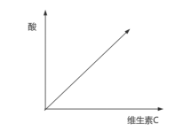

# 第5章 逻辑论证之一般质疑

## 5.1 无论据有结论的一般质疑

`无论据有结论`：此类问题较简单，题干常由“背景、分析和结论”，常用提出反向论据的方式反驳论点。 

此类题目较简单，要注意话题一致，主体正确，贴合题干。

有理由的质疑结论就好了！！！（A，去找非A）

---

例题 1（2022 四川事业单位） 

最近的寒冷天气让人烦恼，不过天冷对健康也是有好处的，有研究表明，寒冷天气有利于减轻过敏症状。 

下列最能削弱上述结论是： 

A．人体免疫系统在冷天更活跃，因而抵御疾病的能力也更强 

B．冬天空气中传播的花粉较少，因而部分过敏患者在冬天症状会减轻 

C．获得性寒冷性荨麻疹患者冬季皮肤暴露于寒冷下，会出现瘙痒性水肿等过敏症状 

D．寒冷会刺激人体血管收缩，导致血压升高进而增加脑出血和心肌梗塞发作的机会

:::details{title=解析}

A：说明寒冷天气对身体好，有点支持

B：寒冷天气花粉少，的确减轻过敏症状，支持。有同学会认为 B 为他因，但是题干中无既成事实，不属于归因类题目。

C：患者症状严重了，有理由地说明寒冷天气不一定减轻过敏症状，可以削弱。举个例一般是举个体，此处不算举个例。

D：话题不一致

【答案】C 

【解析】结论：寒冷天气有利于减轻过敏症状。削弱时有理由地说明寒冷天气不利于减轻过敏症状即可。

:::

---

例题 2（2023 浙江事业单位） 

小张说：“现在是流感高发季，我们要每天多吃些维生素 C 含量高的水果，提高免疫力。”小刘说：“那我去买点柠檬吃，听说越酸的水果维生素 C 含量就越高。” 

以下各项如果为真，能够质疑小刘说法有几项： 

①小白菜的维生素 C 含量约为柠檬的三倍 

②猕猴桃和山楂口感较酸，其维生素 C 含量非常高 

③柠檬比荔枝酸，但维生素 C 含量却低于荔枝 

④维生素 C 具有较强的还原性，其水溶液呈酸性 

⑤水果的酸味取决于有机酸含量而非维生素 C 含量 

⑥酒石酸含量高的水果，吃起来比较酸涩 

A．1 

B．2 

C．3 

D．4

:::details{title=解析}

主体不一致，小白菜不是水果，不能质疑

支持

举反例质疑

无关项

说明酸味和维生素 C 含量基本无关，可以质疑

话题不一致，不能质疑

【答案】B 

【解析】质疑小刘说法：越酸的水果维生素 C 含量就越高（正相关）。如图：

举一个反例就能进行质疑。③⑤可以质疑，B 选项当选。

:::

---

例题 3（2013 广州市考） 

购买了商业医疗保险的人，因为可以报销医疗费，就会放任那些可能导致疾病发生的不良行为和嗜好，比如酗酒、不运动等。 

以下哪项最能构成对于上述结论的质疑： 

A．人们普遍认为，疾病所造成的损失远非报销医疗费所能弥补 

B．从保险公司报销的金额不足以支付全部的医疗费 

C．商业医疗保险的报销范围包括因不良行为和嗜好导致的疾病 

D．有不良行为和嗜好的人群几乎不会购买商业医疗保险

:::details{title=解析}

A：购买了商业医疗保险的人因为疾病所造成的损失远非报销医疗费所能弥补，所以不会放任不良行为。极端举例：不良行为看为“从二楼跳下去”， 哪怕都报销，但是要在床上躺很久并且忍受疼痛，所以没人那么傻为了报销费用伤害自己的健康，故不会放任自己的不良行为。即：与报销费用相比，健康更重要啊！

B：不是因为报销金额不够，而是因为更在意自己的健康

D：讨论的是什么样的人不会购买商业医疗保险；题干讨论的是买完商业医疗保险的人会有什么行为改变，无法质疑。（例：结论：住了院的人，会更注意自己的健康。D.注意健康的人，不太会住院 

这两句话之间逻辑上无关，无法质疑；而且时态不一样。）

【答案】A 

【解析】结论：购买了商业医疗保险的人会放任那些不良行为。

:::

---

例题 4（2018 新疆） 

英国伦敦大学的研究发现，过分依赖 GPS 导航，会阻断脑部海马回形成新的记忆；用惯电子产品会导致很多人只会用零散的语言交流；用游戏和电视节目取代传统阅读会造成人的阅读能力和思考能力下降。于是，研究者认为，高科技会使人变笨。 

以下哪项如果为真，最能削弱上述研究者的观点： 

A．人类借助高科技设备，可以更精确地认识自然界，从而提高人类对世界的认知水平 

B．随着神经成像技术和信息处理手段的不断丰富，脑研究逐步转向更为深入的神经功能 

C．有一项实验将一种阻止蛋白合成的药物注射于大鼠海马内，但大鼠的学习能力并未明显受损 

D．有研究发现，人类的大脑可以随着由高科技带来的生活方式的改变而做出相应的调整和变化

:::details{title=解析}

A：无关项，更了解世界≠更聪明。对世界的认知指的是“人类更了解这个世界了”

B：无关项

C：无关项

D：人类会根据环境的改变，大脑做出相应的调整和适应，所以大脑不一定会随着高科技的发展而变笨，可以质疑

【答案】D 

【解析】结论：高科技会使人变笨。质疑时有理由地说明“高科技不一定会使人变笨”即可。

:::

---

## 5.2 有论据有结论的一般质疑

### 5.2.1 质疑论据

在论据存在错误时，可通过指出论据问题质疑，论据有误，自然推不出题干结论。论据是个人观点、个人判断`（论据是个人观点就可能出错）`时，可能存在论据有误的错误。 另，对比实验归因题目可看作是特殊的“质疑论据”。

---

例题 5（2020 事业单位联考） 

有人认为人类不应该开发 AI，因为它有可能会摧毁我们，而在科幻电影中，已经一再展示了这种恶果，霍金、马斯克等都曾表示过对未来人类世界可能会被 AI 支配的深深忧虑。 

以下哪项如果为真，最能使人们对 AI 发展前景感到乐观： 

A．仅 15%的研究者认为 AI 会对人类造成不良或极端恶劣的影响 

B．AI 正在帮助人类拯救珊瑚礁、发现新药物和新的癌症治疗手法 

C．人机共生关系明确，AI 提供信息和方案，人类进行评估和决策 

D．AI 数据收集和运算能力都远超人类，所以预测能力也远超人类

:::details{title=解析}

A：人类是否应该继续开发 AI 不是由研究者支持/反对数量决定的，与题干无关

B： AI 的确有有益的地方，但是不知道 AI 会不会摧毁/支配人类（BD 都在说 AI 的好，但是不知道 AI 会不会摧毁/支配人类）

C：AI 提供方案，人类来决策，说明人类不会被支配，AI 可以继续被开发

D：AI 的确有有益的地方，但是不知道 AI 会不会摧毁/支配人类

【答案】C 

【解析】论据：AI 可能会摧毁人类，AI 支配人类。结论：人类不应该再开发 AI。

:::

---

例题 6（2023 深圳） 

有人认为，人们购买电动汽车的目的是为了省钱，因为给车辆充电的成本低于加燃油的成本。然而，考虑到电动汽车使用多年后必须更换电池，以及为了安装家用充电桩必须购买固定停车位，实际上的总支出成本要远高于传统燃油汽车，因此，人们购买电动汽车的目的并非是为了省钱。 

如果下列陈述为真，最能削弱上述推论的是： 

A．如今多数电动汽车车主使用公共充电桩充电，并没有购买固定停车位 

B．更换电池的价格比购置一辆新电动汽车要便宜很多 

C．电动汽车更符合节能环保的现代生活理念 

D．国际油价已经见顶，国内油价开始持续下降

:::details{title=解析}

注：论据为“有人认为”时，论据就可能出错。

A：质疑论据：买电动汽车不一定购买固定停车位，花费不一定高于油车，那么买电动汽车有可能是为了省钱

B：题干中未比较电池和新电车的价格区别，无法削弱

C：题干讨论成本，选项讨论是否节能，无法削弱

D：油便宜了，买电车确实更贵，买电车可能不是为了省钱，有点儿支持

【答案】A 

【解析】论据：电动汽车必须更换电池，必须安装家用充电桩，必须购买固定停车位。结论：人们购买电动汽车的目的并非是为了省钱。

:::

---

例题 7（2017 江苏省考） 

某高速路段管理处决定招聘 10 名道路辅助管理人员，以解决正式管理人员不足的问题，但这一建议招致某人士的反对，该人士认为，增加这 10 名道路辅助管理人员后，将会有更多道路违规违纪行为被发现，而后期处理这些问题需占用更多的正式管理人员，这将导致本已紧张的正式管理人员更加不足。 

以下哪项如果为真，最能削弱该人士观点： 

A．新招聘的道路辅助管理人员工作起来，未必能尽心尽职 

B．有许多道路违纪违法行为，当场就可以解决，不需要拖到后期处理 

C．道路辅助管理人员也可以对道路违规违纪行为进行后期处理 

D．增加道路辅助管理人员将有效减少该路段道路违规违纪行为发生

:::details{title=解析}

B：有许多当场可以解决，可能会有些当场解决不了的需要正式管理人员后期解决

C：道路辅助管理人员进行后期处理，不需要正式管理人员处理，正式人员不会不足，从根本上进行削弱

D：即使减少了违规违纪行为，但是可能辅助管理人员还会发现新问题，可能仍需要正式管理人员处理

【答案】C 

【解析】论据：10 个新人发现更多违规违纪行为，后续处理需要更多正式管理人员，让正式管理人员更忙不过来。所以：不招了。（举例：某地现在免试招 10 个公务员上岗，但是现在某位领导有一个顾虑，即招录新人后可能会发现更多违法违纪行为，后续处理需要其他老员工帮忙，老员工忙不过来，所以不想招人了。打消领导顾虑：前期后期新人都干，不需要其他老员工帮忙。）

看首句某高速路段管理处决定招聘 1 0 名道路辅助管理人员，以解决正式管理人员不足的问题，所以我们可以从正式员工不会增加更多的工作，甚至有可能一些工作被辅助人员分担这个角度进行质疑。 

D 选项，只是说减少该路段道路违规违纪行为发生，并没有从正式管理人员 

工作的角度进行质疑。

:::

---

### 5.2.2 增加反向论据

很多时候，题干可能通过一些有利因素得出积极结论或通过一些不利因素得出消极结论，犯了考虑不全面的错误；有些时候，因少数样本得出普遍结论，犯了以偏概全的错误；针对上述问题，可通过增加反向论据来进行质疑。 

【例】某位讲师的行测成绩很好，所以能考上公务员。某种新材料有很多优点，所以能替代老材料。

---

例题 8（2022 国考） 

聚苯乙烯泡沫塑料广泛用于制造一次性咖啡杯等用品，但其原料来自石油等不可再生能源，生成的聚苯乙烯高温条件下可能产生对人体有害组分，且无法自然降解，燃烧时还会造成环境污染。研究人员开发出一种源自特定植物的环保材料，这种环保材料质量较轻，可支撑自身重量 200 倍的物体而不变形，还可自然降解，燃烧不会产生污染性烟尘。研究人员认为，这种环保材料有望成为制造一次性咖啡杯等用品的重要材料。 

以下哪项如果为真，最能削弱上述结论： 

A．这种环保材料不具有一次性咖啡杯所需的良好隔热性能，盛装液体后也很难具有聚苯乙烯泡沫塑料的耐久性 

B．这种环保材料大规模投入生产后，会挤垮生产聚苯乙烯泡沫塑料的厂家，减少市场上一次性咖啡杯等用品的供应量 

C．对该植物有过敏反应的人群使用这种环保材料会产生过敏反应，该环保材料不适用于这类过敏人群 

D．这种环保材料还不能完全替代聚苯乙烯泡沫材料，还有很多用品仍然需要使用聚苯乙烯泡沫材料生产

:::details{title=解析}

A：指出新材料的问题，说新材料又不隔热又不耐久，但是这两点又是一次性咖啡杯所需要的，致命问题 

B：无法适应时代发展的厂家被替换掉是正常的，无法质疑 

C：这类过敏人群不使用即可，属于特殊人群，题干中也并没说是唯一材料，无法质疑

D：题干中并未说现在就要替代，只是说有望替代，讲的是未来的事，无法质疑

【答案】A 

【解析】题干从优势的角度进行分析，我们想质疑可以找问题。 

:::

---

例题 9（2020 联考） 

二氧化碳的排放量剧增导致全球气候变暖，使珠穆朗玛峰所在的喜马拉雅地区冰川正面临急剧缩小的危险。研究显示，珠峰海拔在 5000 米到 6000 米的冰川集中区域出现冰川快速融化的现象，这些地方将只在冬季而不是在温暖的季节时看到结冰。专家推论说，根据未来的气候变化趋势，喜马拉雅地区的冰川减少的速度还有可能加快，如果本世纪内气温如预测的一样继续升高，该地区的冰川最终将消失殆尽。 

如果以下各项为真，最能削弱上述论证的是： 

A．喜马拉雅山冰川面积每年缩小约 0.1%到 0.6% 

B．喜马拉雅山其他地方的冰川对气温变化不敏感 

C．过去 50 年珠峰周边冰川覆盖面积减少了 33.3% 

D．珠峰海拔 7000 米以上的冰川没有快速融化迹象

:::details{title=解析}

A：确实冰川面积在缩小，有点支持

B：珠峰冰川融化了，其他地方的冰川对气温变化不敏感，那就不能从论据得出结论用虽然但是所以不造句：虽然珠峰冰川快速融化，但是喜马拉雅地区其他地方的冰川对气温变化不敏感，所以喜马拉雅地区的冰川不一定有危险 

C：冰川真的危险，有点支持

D：冰川是从下向上融化，7000 米以上的冰川没有快速融化是正常现象，什么也说明不了

【答案】B 

【解析】题干说珠峰 5000-6000 米出现快速融化，那其他喜马拉雅地区呢？ 

以偏概全。 

:::

---

例题 10（2020 河北事业单位） 

粮食可以在收割前在期货市场进行交易。如果预测水稻产量不足，水稻期货价格就会上升；如果预测水稻丰收，水稻期货价格就会下降。假设今天早上，气象学家们预测从明天开始水稻产区会有适量降雨。因为充分的潮湿对目前水稻的生长非常重要，所以今天的水稻期货价格会大幅下降。 

下面哪项如果正确，最严重地削弱以上的观点： 

A．农业专家们今天宣布，一种水稻病菌正在传播 

B．本季度水稻期货价格的波动比上季度更加剧烈 

C．气象学家们预测的明天的降雨估计很可能会延伸到谷物产区以外 

D．在关键的授粉阶段没有接受足够潮湿的谷物不会取得丰收

:::details{title=解析}

A：水稻病菌正在传播，所以水稻产量不一定会高，价格不一定会大幅下降用虽然但是所以不造句：虽然最近在下雨有利于水稻生长，但是水稻病菌正在传播，所以水稻不一定丰收、价格不一定大幅下降

B：比的是剧烈程度的问题，但没说今年会不会丰收，价格会不会大幅下降 

C：降雨下到其他地区与水稻无关

D：如果在关键的授粉阶段没有接受足够潮湿的谷物，那么不会取得丰收，题干中并未提及这些粮食在关键的授粉阶段是否接受足够潮湿，不知道以前的情况

【答案】A 

【解析】题干找到一个对水稻产量有利的条件，质疑：找一个不利的条件，让水稻不丰收。

:::

---

例题 11（2021 广东选调） 

2020 年上半年，某国政府声称，“今年上半年，本国 GDP 增长率超过了全球 70%的国家。由此可见，今年上半年政府的施政纲领是正确的。”下列选项如果为真，最能有力地削弱以上论断的是： 

A．该国政府不重视疫情防控，使该国成为全球疫情最严重的国家之一 

B．去年同期，该国 GDP 增长率位于全球前十 

C．该国的 GDP 低于三分之二的国家 

D．该国政府的施政纲领连续几年并未发生变化

:::details{title=解析}

A：有好有坏 

B：从前 10 变成前 60，不仅不好，还变差了

C：GDP 大小各个国家都不一样，看增长率和自己比

D：连续几年未发生变化，不能说纲领是正确的，也不能说纲领是错误的

【答案】B 

【解析】论据给的有利条件，质疑：找不利条件增加反向论据。 

:::

---

例题 12（2020 浙江事业单位） 

杭州和武汉有很多相似之处。例如，都在长江流域，都在北纬 30 度附近，夏天都很炎热。因为武汉有樱花，所以杭州也有樱花。 

以下哪项如果为真，最能削弱上述结论： 

A．杭州的市花是桂花 

B．樱花能在全国各地种植 

C．杭州和武汉的降雨量不同 

D．武汉大学以樱花盛开而闻名

:::details{title=解析}

A：无关项

B：樱花能在全国各地种植，包括杭州，支持 

C：降雨量是影响植物生长但是两个城市不同的因素

D：无关项

【答案】C 

【解析】题干列出很多相似点，质疑：找影响植物生长的因素，但是这两个城市不同的。 

:::

---

例题 13（2019 山西事业单位） 

癌细胞休眠后，人体免疫系统难以对其进行识别和攻击，化疗药物也难以对它们发挥作用，因此休眠癌细胞是癌症转移和复发的一大风险因素。某研究小组日前报告称，他们在实验动物身上识别出处于休眠状态的骨髓瘤细胞，并对其进行基因组分析，发现其中某些处于激活状态的“特定基因”在未休眠癌细胞 

中通常不会被激活。研究人员推测，正是这些“特定基因”的激活使癌细胞表现为休眠状态，从而躲避免疫系统与药物的攻击。 

以下哪项如果为真，最能质疑上述推测： 

A．“特定基因”只有在癌细胞接近正常细胞时才能被激活 

B．尚不能确定其他类型的癌细胞中是否存在“特定基因” 

C．某些化疗药物可以对休眠癌细胞进行精准的识别和攻击 

D．大部分癌细胞尚未进入休眠状态就已经被免疫系统识别

:::details{title=解析}

A：何时被激活与题干无关，要看是不是特定基因的激活让癌细胞成为休眠状态，不支持也不质疑

B：骨髓瘤细胞正是因为“特定基因”的激活表现为休眠状态，若尚不能确定其他类型的癌细胞中是 

否存在“特定基因”，那么就更无法确定癌细胞是否是因为“特定基因”的激活表现为休眠状态 

C：题干说的是化疗药物也难以对它们发挥作用，难以是大部分普遍的状态，可能个别的化疗药物是可以的，无法质疑结论 

D：题干说的是到底是什么原因让癌细胞变为休眠状态从而躲避系统识别该项说的是大部分癌细胞尚未进入休眠状态就已经被免疫系统识别，那小部分进入休眠状态的是不是因为特定基因被激活，话题不一致

【答案】B

:::

---

例题 14（2015 国考） 

某国际小组对从已灭绝的一种恐鸟骨骼化石中提取的DNA进行遗传物质衰变速率分析发现，虽然短DNA片段可能存在 100 万年，但 30 个或者更多碱基对序列在确定条件下的半衰期只有大约 15.8 万年。某位科学家据此认为，利用古代 DNA 再造恐龙等类似于电影《侏罗纪公园》中的故事不可能发生。 

以下哪项如果为真，最能反驳该科学家的观点： 

A．《侏罗纪公园》虽然是一部科幻电影，但也要有事实依据 

B．上述研究的化石样本可能受到人类 DNA 的“污染” 

C．环境因素会影响 DNA 等遗传物质的衰变速率 

D．恐鸟与恐龙的碱基对序列排列顺序不同

:::details{title=解析}

A：无关项 

B：无法知道受到污染是否会影响衰变速率

C：给出一点希望且贴合题干用虽然但是所以不造句：虽然恐鸟的碱基对序列半衰期太 

短，但是环境因素会影响 DNA 等遗传物质的衰变速率，所以利用古代 DNA 再造恐龙并不是完全不可能发生

D：改为恐鸟与恐龙的碱基对序列半衰期不同就对了

【答案】C 

:::

---

例题 15（2019 河北） 

近三年来，某市文化产业的年利润基本稳定在两亿元左右。据估算，扣除物价上涨因素，未来几年利润总额不会随着新的文化产业场所的出现而扩大。因此，随着电影院数量的增多，KTV 的收入会随之减少。 

以下哪项如果为真，能对上述论证提出最大质疑： 

A．电影院数量虽然逐渐增长，但其数量仍少于 KTV 

B．由于电影院的增多，人们花在电影院和 KTV 以外文化场所的消费明显减少 

C．大部分 KTV 为适应新形势，重新进行装潢，树立新形象并提高服务质量 

D．电影院的人均消费高于 KTV，而且大部分人认为电影院的环境不太好，缺乏吸引力

:::details{title=解析}

A：电影院数量增长确实会抢市场，无法质疑

B：引入第三方，KTV 收入不一定减少，有可能是其他的少了用虽然但是所以不造句：虽然电影院的数量增多，但是人们花在电影院和 KTV 以外文化场所的消费明显减少，所以KTV 收入不一定会减少

C：即使重新装潢也有被分走市场的可能

D：不管大部分人怎么认为，只要电影院多了，就可能会吸引更多人去，导致 KTV 收入减少

【答案】B

:::

---

例题 16（2013 深圳） 

像“无息贷款”、“重金求子”、“办证”等手段拙劣的街头诈骗广告，即使早已被曝光也仍然屡见不鲜。骗子们宁愿继续使用这些已被大多数人识破的广告内容，也不去研究一些更具欺骗性、隐蔽性的诈骗广告内容，这只能说骗子太愚蠢，太没有“专业精神”了。 

以下陈述如果为真，最能够反驳上述结论的一项是： 

A．骗子肯定不是愚蠢的，愚蠢的人是不能做骗子的 

B．如果一种行骗方式不能骗到任何人，那么骗子肯定不会使用 

C．骗子使用这种拙劣的行骗手段，是因为他们一开始就不打算骗聪明人 

D．骗子行骗时会费尽心思以不引起社会关注

:::details{title=解析}

骗到人≠骗子不愚蠢

例：骗子花 20 万制造出 10 万假币，骗子还是傻的

A：没有任何理由只是将结论反着说，一般是不能质疑的

B：能不能骗到人≠不蠢，如花十万骗一百

C：用虽然但是所以不造句：虽然骗子的欺骗手段没有隐蔽性，但是他们是在用这种手段筛选目标顾客，所以不能说骗子是蠢的 

D：无关项

【答案】C

:::

---

#### 5.2.2.1 个例的认定

---

例题 17（2022 联考） 

新冠肺炎疫情已成为一种全球性现象，它迅速席卷各个国家，是全世界共同面临的重大问题。被波及的各国需要彼此汲取经验，其中包括关于病毒的性质、彻底消灭或遏制病毒所必需的社会措施以及抗疫所需的医疗和防护设备等等。由此看来它会让世界各国变得更加紧密。 

以下哪项如果为真，最能质疑上述推断： 

A．东亚地区应对新冠肺炎疫情好于其他国家的原因之一是他们有应对“非典”时合作的经验 

B．新冠肺炎疫情带来的威胁如此之大，引发了社会所有阶层的担忧和恐惧，大家开始抱团取暖 

C．自从新冠肺炎疫情发生以来，中国就遭到少数西方媒体及政客恶意并令人惊讶的无端攻击 

D．新冠肺炎疫情给国际文化、经济等方面交流带来了巨大冲击，短期内很难恢复到疫情前水平

:::details{title=解析}

A：无关项 

B：支持

C：加入一个不利因素用虽然但是所以不造句：虽然疫情让各国需要彼此汲取经验，但是很多国家攻击我国，所以疫情不一定让各国变得更加紧密

D：交流少无法代表不紧密，无关项

【答案】C 

:::

---

例题 18（2013 国考） 

现代企业在管理过程中发现，人力资源管理部门对于公司的发展虽然十分重要，但由于该部门并没有全程参与公司发展战略的决策，而且公司聘请的高级经理均由 CEO 决定，所以人力资源管理部门更多的时候起到的是支持和辅助的作用。 

如果以下各项为真，最能削弱上述论证的是： 

A．世界 500 强的企业中，人力资源管理部门的员工一般都有丰富的经验 

B．人力资源管理部门能为公司设计出人性化的报酬体系，进而留住人才 

C．世界上最大的物流公司，人力资源部经理有权参加公司最高决策会议 

D．人力资源部虽没有决定雇用高级经理的权力，但有权雇用中层管理者

:::details{title=解析}

A：有丰富经验≠不是辅助作用 

B：用虽然但是所以不造句：虽然人资部门没有全程参与公司发展战略的决策而且没有聘请的高级经理的权力，但是人资部门能为公司留下人才，所以人资部门不一定是辅助作用

C：有权参加公司最高决策会议≠全程参与公司发展战略的决策；且该项只是一个个例中的个人 

D：说明确实是辅助作用

:::

---

### **5.2.3 断点拆桥**

若题干的论据和结论并不十分相关，根据论据推不出结论，犯了“推不出”的错误，可通过`拆桥`来进行质疑。 

【例】明天是星期三，一定是晴天。可通过“星期和天气无明显相关”来质疑。

---

例题 19（2021 浙江） 

2020 年的冬天似乎比往年更早到来。还没进入 11 月份，我国部分地区就出现了第一场降雪和气温降至零度以下的情况。有专家据此表示，2020 年的冬天将成为我国 60 年来最冷的一个冬天。 

以下哪项如果为真，最能削弱上述论述： 

A．我国其他一些地区的气温并未出现较往年明显下降的迹象 

B．11 月前出现大雪天气的地区往年几乎没有出现过类似现象 

C．在全球变暖的情况下，近年来我国冬季平均气温呈上升趋势 

D．据统计，第一场降雪的时间与整个冬天的平均气温无明显相关

:::details{title=解析}

A：降雪肯定是一个地区先下一个地区后下，有先有后，不会全国一起下，不能支持也不能质疑。 

B：谈的是雪来的早晚和天气冷暖之间的关系，不是以往是否出现过，不能质疑。 

C：过去呈上升趋势，今年是上升下降不知道，不能质疑。 

D：说明降雪时间和气温无关，拆桥质疑，当选。 

【答案】D 

【解析】 

拆桥，第一场雪的早晚和冬天冷暖无关。 

:::

---

例题 20（2014 广东省考） 

公众人物需要担当更多的道德责任，因为权力和责任是相等的，既然拥有常人不具备的优势地位，那么就应该比一般人承担更高的道德要求。因此，承受更多的舆论批评甚至人身攻击，哪怕是一定程度的失真，也是不得不付出的必要代价。 

最能质疑上述观点的一项是： 

A．普通人和公众人物应该具有同等的道德责任 

B．失真评价会影响公众人物对道德义务的履行 

C．更多的道德责任并不意味着一定要承受舆论批评 

D．公众人物正是因为没有尽到道德责任才会受到舆论批评

:::details{title=解析}

A：不是最终观点。

B：道德义务没有提到。

C：道德责任和舆论批评之间关系拆桥了，可以质疑，当选。 

D：不是谈论受到舆论批评的原因，与话题无关。

【答案】C 

【解析】 

论据：公众人物需要担当更多道德责任，要承担更高道德要求 

结论：需要承受更多舆论批评和人身攻击 

拆桥，承担道德责任和承受舆论批评之间没有必然关系。

:::

---

例题 21（2023 浙江事业单位） 

快速暴汗、狂甩赘肉、不胖勿点……近期暴汗服可谓火爆网络。商家直播时声称，穿暴汗服运动半小时，所流的汗水超过不穿暴汗服状态下运动 2 小时所流的汗水。因此能帮助运动者加快新陈代谢，降低体重，迅速减肥。 

以下哪几项如果为真，最能质疑商家宣传： 

①暴汗后的即时体重下降，减少的是身体里的水分，没有减少脂肪 

②暴汗服是利用衣服材质不透气性和隔热性，让人运动时出更多汗 

③大量出汗使人体水分大量流失，易造成脱水，严重时会危及生命 

④脂肪分解主要产生二氧化碳，通过肺呼出，出汗多不等于减脂肪 

A．①④ 

B．②③ 

C．①③④ 

D．①②③④

:::details{title=解析}

1. 流汗了没有减少脂肪，意味着流汗多不一定能更快减肥，可以质疑。 
2. 解释的是为什么暴汗服能让人流汗，没说能不能减肥，不能质疑。 
3. 极端化选项，说流汗过多的情况下能危及生命，任何事都有极端情况，而且也没有说减肥的事，是两个话题，不能质疑。 
4. 直接说了出汗多不等于减脂肪，可以质疑。

【答案】A 

【解析】 

论据：暴汗服流汗多。 

结论：暴汗服能加快新陈代谢，能更快减肥。 

思考流汗多和减肥之间的关系，流汗多不一定就代表能更快减肥。 

:::

---

例题 22（2016 事业单位联考） 

“地球一小时”是世界自然基金会应对全球气候变化所提出的一项倡议，希望家庭及商户在每年 3 月的最后一个星期六 20:30～21:30 期间熄灯 1 小时。“地球一小时”能减少的用电量主要来自照明用电。据统计，照明用电量约占用电总量的 12%，其中只有部分用户参与熄灯活动。因此，在活动中减少的电能消耗量是微乎其微的。有市民据此认为，“地球一小时”并没有取得什么实际的效果。

以下哪项如果为真，最能质疑上述市民的看法： 

A．每年“地球一小时”活动所节省的用电量可供一个大型城市用电三天 

B．“地球一小时”造成短时间内用电骤减，给电网管理带来困难 

C．尽管现在参与活动的人数有限，但是将来参与人员的比例会越来越大 

D．“地球一小时”的目的是呼吁人们节约能源，保护地球

:::details{title=解析}

A：全球大概两三千座城市，节省的电量只够一个城市用电三天，确实效果微乎其微，属于支持。

B：拆桥，地球一小时的目的是呼吁，所以不能因为实际减少电能很小，就说没有实际效果。当选。

【答案】D 

【解析】 

论据：地球一小时实际减少的电能消耗是微乎其微的。 

结论：地球一小时没有什么实际效果。 

论据和结论之间表达出原文误以为实际减少的电量就是实际的目的，因为减少的电量消耗很少，所以结论就说没什么效果。但是思维不要被出题人框住，地球一小时的实际目的并不是为了节省电量，而是宣传，所以不需要去纠结他节省的电量到底算多还是算少。

:::

---

### 5.2.4 质疑结论中的“无中生有”

若题干结论中出现了程度较重的“无中生有”内容，可重点关注，进行质疑。

---

例题 23（2019 浙江事业单位） 

一项医学研究表明，通过检测人体血液中六万种代谢物中的十几个冠心病标志物，若这些标志物异常，即可得出被测者患有冠心病的结论，从而及早进行治疗。有媒体报道称，该医学研究实现了只需抽血即可检测和预防冠心病。 

以下哪项如果为真，最能削弱该媒体的结论： 

A．每个人血液中的代谢物种类基本相同 

B．这项医学研究仍在进行大量的临床实验 

C．只有冠心病患者的冠心病标志物才会异常 

D．人的汗液和唾液中也含有多个冠心病标志物

:::details{title=解析}

A：每个人血液中的代谢物种类确实基本相同，但没说冠心病，无法质疑。

B：说仍然在进行实验，没有针对结论中的漏洞。

C：先得冠心病，标志物才会异常，检测的时候已经得病了，是可以检测但是不能预防。可以质疑。 

D：无关选项，没说汗液和唾液，说的是血液。

【答案】C 

【解析】 

论据：某项研究表明，可根据一些血液中标志物异常来诊断冠心病。 

结论：该医学实现了只需抽血就可以检测和预防冠心病。

:::

---

例题 24（2024 山东省考） 

原子制造是以原子为原料制造所需的材料和器件产品。它是近来被高度关注的原子级制造技术体系中的核心部分之一，将史无前例地实现对原子的逐一精确操控，将原子按需垒砌，构筑原子级细锐、精准、完美，而且具备从物理上远超常规块材物性的产品。因此，有观点认为，原子制造将会成为微纳制造后人 

类制造技术继续微缩发展的趋势，也将成为新物质创制中的极限，对于现有制造业具有颠覆性意义。 

以下哪项如果为真，最能削弱上述观点： 

A．当今微纳制造的芯片能力正在趋于极限，而原子制造能够突破这一极限 

B．原子制造是传统的纳米化制造，是现在制造技术的线性化发展 

C．原子制造操控技术不成熟，其技术精致化仍面临重大挑战 

D．原子制造可以使材料学家获得真正具有应用价值的新材料

:::details{title=解析}

A：说原子制造突破极限，是支持。

B：线性化发展是可预估的，一点一点正常发展，不是颠覆性；且前面说的传统的纳米化制造也不是新物质，是以前就有的，可以质疑，当选。 

C：技术不成熟，面临挑战，技术发展过程中遇到问题很正常，可以慢慢来，质疑力度不大。 

D：说原子制造可以获得有价值的新材料，属于支持。

【答案】B 

【解析】 

论据：原子制造有很多优点！！ 

结论：原子制造会成为发展趋势，成为新物质创制中的极限，具有颠覆性意义。 

颠覆性是和原来完全不同，是推翻，创新，取代，是非常强烈的截然不同，天翻地覆的变化。

:::

