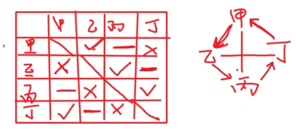
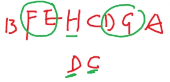
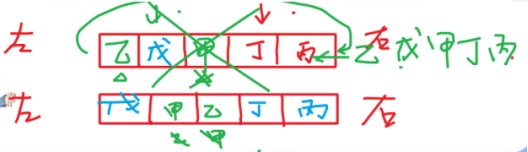

# 分析推理

## 8.1 真假话分析推理

### 8.1.1 矛盾法

`三种矛盾关系`：

①A 和非 A、A 且 B 和非 A 或非 B、A 或 B 和非 A 且非 B；

②所有和有些不，有些和所有不、可能和必然不、必然和可能不；

③A→B 和 A 且非 B。

---

例题 1（2023 四川事业单位） 

某高校关于选派张强和李健谁去德国访学有三种不同的意见： 

①张强去，李健就不去；②张强和李健都去；③张强不去。 

学校领导研究后，同意了一种意见，否定了两种意见，由此可以推出： 

A．张强去 

B．李健去 

C．张强和李健都不去 

D．张强和李健都去

:::details{title=解析}

【答案】A 

【解析】 

条件 1：张强去→李健不去

条件 2：张强且李健

条件 3：非张强 

条件 1、2 矛盾（A→B 与 A 且非 B 矛盾），一真一假。所以条件 3 必为假，张强去，A项正确，当选。 

:::

---

例题 2（2023 浙江省考） 

关于小张、小李书法学习的情况，有如下判断： 

（1）如果小张学习魏碑，那么小李学习汉隶； 

（2）小张既没有学习秦篆，也没有学习魏碑； 

（3）小张或者学习秦篆，或者学习魏碑。 

结果发现，上述判断有两项是错误的。 

根据以上信息，可以得出以下哪项结论： 

A．小张学习魏碑，小李学习汉隶 

B．小张没有学习魏碑，小李学习汉隶 

C．小张学习魏碑，小李没有学习汉隶 

D．小张没有学习魏碑，小李没有学习汉隶

:::details{title=解析}

【答案】C 

【解析】 

条件 1：张魏碑→李汉隶

条件 2：非张秦且非张魏

条件 3：张秦或张魏

条件 2、3 矛盾（非 A 且非 B 与 A 或 B），一真一假。所以条件 1 必为假，A→B 为假，可知 A 且非 B 即张魏碑且李不汉隶正确，C 项当选。 

:::

---

例题 3（2022 青海省考） 

球赛即将进入决赛阶段，五个球迷对决赛队伍做了预测。 

甲∶如果法国无法进入决赛，那么意大利也不会进入决赛； 

乙∶法国没戏，意大利会进决赛； 

丙∶或者法国进入决赛，或者葡萄牙进入决赛； 

丁∶法国和葡萄牙都不可能进入决赛； 

戊∶意大利和葡萄牙进入了决赛。 

结果只有两个球迷预测错误，那么预测错误的球迷是： 

A．甲和丁 

B．甲和丙 

C．丙和戊 

D．丁和戊 

:::details{title=解析}

【答案】A 

【解析】 

条件 1：非法→非意

条件 2：非法且意

条件 3：法国或葡萄牙

条件 4：非法国且非葡萄牙

条件 1、2 矛盾（A→B 与 A 且非 B 矛盾），一真一假。条件 3、4 矛盾（A 或 B 与非 A且非 B），一真一假。则戊一定真，说明进决赛的是意大利与葡萄牙，法国没进决赛，则条件 2 为真，条件 1 为假，条件 3 为假，所以 A 项正确，当选。

:::

---

例题 4（2018 黑龙江） 

某地发生一起爆炸案，经侦查得到以下线索： 

（1）如果甲不是爆炸案元凶，那么乙就是爆炸案元凶； 

（2）甲乙都不是爆炸案元凶； 

（3）乙和丙是爆炸案元凶。 

经进一步侦查，发现前述三条线索只有一条是假的，由此一定可以推出： 

A．甲是爆炸案元凶 

B．丙是爆炸案元凶 

C．甲不是爆炸案元凶 

D．乙不是爆炸案元凶

:::details{title=解析}

【答案】B 

【解析】 

条件 1：非甲→乙

条件 2：非甲且非乙

条件 1、2 矛盾（A→B 与 A 且非 B 矛盾），一真一假。则条件 3 为真，乙和丙是爆炸案元凶，B 项正确，当选。

:::

---

例题 5（2018 国考） 

某省游泳队进行了为期一个月的高原集训，集训最后一日所有队员进行了一次队内测试，几位教练预测了一下队员的成绩： 

张教练说：这次集训时间短，没人会达标。 

孙教练说：有队员会达标。 

王教练说：省运会冠军或国家队队员可达标。 

测试结束后，只有一位教练的预测是正确的。 

由此可以推出： 

A．没有人达标 

B．全队都达标了 

C．省运会冠军达标 

D．国家队队员未达标

:::details{title=解析}

【答案】D 

【解析】 

条件 1：所有不

条件 2：有些

条件 3：省冠军达标或国家队队员达标

条件 1、2 矛盾（所有不与有些矛盾），一真一假。则条件 3 为假，A 或 B 为假则非 A且非 B 为真，即省冠军未达标且国家队队员未达标为真，D 项正确，当选。

:::

---

例题 6（2022 国考副省） 

小陈、小李、小刘 3 人从学校脱颖而出，到市里参加竞赛。5 人预测： 

小陈、小李都获奖； 

小陈、小李至多有 1 人获奖； 

小陈获奖，小李未获奖； 

小陈未获奖，小李获奖； 

若小陈获奖，则小刘也获奖。 

结果发现，只有 1 人预测正确。由此可以推出： 

A．小陈、小李都未获奖 

B．小陈、小刘都获奖 

C．小李、小刘都未获奖 

D．小陈、小李都获奖

:::details{title=解析}

【答案】D 

【解析】 

条件 1：陈且李

条件 2：非陈或非李

条件 3：陈且非李

条件 4：非陈且李

条件 5：陈→刘

条件 1、2 矛盾（A 且 B 与非 A 或非 B），一真一假。则条件 3、4、5 均为假，从条件 5

入手，陈获奖且刘未获奖为真。条件 3：陈获奖且李未获奖为假，且陈获奖为真，由且关系一假为假可知李未获奖为假，则李获奖为真，因此陈、李都获奖，D 项正确，当选。

:::

---

### 8.1.2 假设法

---

例题 7（2019 上海 B 类） 

青少年高校科学营旨在充分利用重点大学的科技教育资源，激发青少年对科学的兴趣，培养青少年的科学精神、创新意识和实践能力。班主任鼓励甲、乙、丙、丁四位同学报名参加暑假举行的科学营。几天后班主任向这四位同学询问录取的情况，他们的回答如下： 

甲：乙被科学营录取了。 

乙：丙被科学营录取了。 

丙：甲或者乙被科学营录取了。 

丁：乙或丙被科学营录取了。 

经过班主任调查，发现只有一位同学的回答与事实相符。 

根据以上陈述，下列哪项为假： 

A．丙说的是真话 

B．乙没有被科学营录取 

C．被科学营录取的不是甲 

D．丁说的是假话

:::details{title=解析}

【答案】C 

【解析】 

条件 1：乙

条件 2：丙

条件 3：甲或乙

条件 4：乙或丙

如果条件 1 为真，则条件 3、4 也为真，所以条件 1 为假，实际非乙；

如果条件 2 为真，则条件 4 也为真，所以条件 1 为假，实际非丙；所以条件 4 为假、条件 3 为真，甲被录取，C 项错误，当选。

:::

---

例题 8（2018 广东） 

下面是某冬日我国北方某些城市的天气情况： 

（1）有些城市有降雪； 

（2）有些城市没有降雪； 

（3）北京和邯郸没有降雪。 

如果三个断定中只有一个为真，那么以下选项中哪个断定一定为真： 

A．北京有降雪，但邯郸没有 

B．所有这些城市都有降雪 

C．所有这些城市都没有降雪 

D．以上各选项都不一定为真

:::details{title=解析}

【答案】B 

【解析】 假设条件 3 为真，则条件 2 也为真，所以条件 3 为假条件 3 为假，有城市下雪，条件 1 为真，所以条件 2 为假，有些不为假，所有都为真，所以所有城市都下雪，B 项正确，当选。

:::

---

### 8.1.3 代入法

什么时候用代入法：题干涉及对象太多，用现有信息推不出什么东西，用代入法。

| A    | B    | A->B |
| ---- | ---- | ---- |
| 真   | 真   | 真   |
| 真   | 假   | 假   |
| 假   | 真   | 真   |
| 假   | 假   | 真   |

`钱建伟（前件为假命题为真），侯建真（后件为真命题为真）`

---

例题 9（2022 四川省考） 

甲、乙、丙、丁 4 位同学参加学校运动会。已知他们 4 人每人都至少获得 1 个奖项，4 人获奖总数为10。关于具体获奖情况，4 人还有如下说法： 

甲：乙和丙的获奖总数为 5； 

乙：丙和丁的获奖总数为 5； 

丙：丁和甲的获奖总数为 5； 

丁：甲和乙的获奖总数为 4。 

后来得知，获得 2 个奖项的人说了假话，而其他人均说了真话。 

根据以上信息，甲、乙、丙、丁 4 人具体的获奖数分别应是： 

A．2、3、2、3 

B．2、4、1、3 

C．2、2、2、4 

D．2、2、3、3

:::details{title=解析}

【答案】C 

【解析】选项中甲都是 2，所以甲获奖数为 2，说假话，因此乙和丙的获奖数不是五，只有 C 项符合，当选。

:::

---

例题 10（2019 青海省考） 

学校要举行文艺汇演，某系准备在唱歌、跳舞、相声、小品中确定一个或几个节目去参加。系领导通过筛选，最终形成以下三种意见。 

（1）对于唱歌和跳舞，至多选择一个； 

（2）对于唱歌和小品，至少选择一个； 

（3）如果选择相声或者小品，就不能选择跳舞。 

最终参加文艺汇演的节目只满足上述一种意见。 

根据以上陈述，以下哪项是正确的： 

A．选择跳舞、相声、小品 

B．选择跳舞，但不选择相声和小品 

C．选择唱歌、跳舞、小品 

D．选择相声、但不选择跳舞和小品

:::details{title=解析}

【答案】C 

【解析】代入 A，条件 1 为真、条件 2 为真、条件 3 为假；代入 B，条件 1 为真、条件 2 为假、条件 3 为真（前件为假，命题为真）；代入 C，条件 1 为假、条件 2 为真、条件 3 为假；代入 D，条件 1 为真、条件 2 为假、条件 3 为真；C 项正确，当选。

:::

---

### 8.1.4 命题的真假判断

`常用知识点`：对于 A→B，①只有 A 且非 B 时命题为假（只有A真且B假为假），②A 为假（前件为假）命题为真，③B 为真（后件为真）命题为真。

---

例题 11（2019 天津事业单位） 

某机关年终考核时，群众对周、吴、郑、王四位处长的考核结果有多种说法，其中，只有一种说法是准确的。 

①如果周处长考核优秀，那么吴处长也考核优秀； 

②考核优秀者是郑处长； 

③考核优秀者是周处长，但吴处长考核不是优秀； 

④考核优秀者是周处长或王处长。 

以下判断为真的是： 

A．① 

B．② 

C．③ 

D．④

:::details{title=解析}

【答案】A 

【解析】 

条件 1：周→吴

条件 2：郑

条件 3：周且非吴

条件 4：周或王 

条件 1、3 矛盾（A→B 与 A 且非 B 矛盾），一真一假。则条件 2、4 均为假，实际情况是非郑、非周且非王，根据前件为假，命题为真可以得知条件 1 为真，A 项正确，当选。

:::

---

例题 12（2020 人行） 

某研究院近日对未来科研方向进行研讨。姜教授提出：既要进行机器人研发,也要进行无人机研发；陈研究员认为：只有进行量子通信研究，才能进行无人机研发；孟博士指出：如果进行机器人研发和无人机研发，那么也要进行量子通信研究。最后经过磋商，只有其中一位的观点被采纳。 

根据这段文字可以推出，可能的磋商结果是： 

A．进行机器人研发和量子通信研究，但是不进行无人机研发 

B．进行无人机研发和机器人研发，但是不进行量子通信研究 

C．进行量子通信研究和无人机研发，但是不进行机器人研发 

D．进行量子通信研究，但是不进行机器人研发和无人机研发

:::details{title=解析}

【答案】B 

【解析】 

题干 1.机器人且无人机 2. 无人机-》量子通信 3.机器人且无人机-》量子通信 侯建真，2 和 3 的箭头后边都是量子通信， 如果有量子通信 2，3 都会真。本题只有一个观点被采纳，是一真两假， 所以一定不能有量子通信。 选 B。 

:::

---

例题 13（2021 黑龙江） 

（1）既去南京，又去深圳。 

（2）只有去广州，才去深圳。 

（3）如果南京和深圳都去，那么去广州。 

如果只采纳一个人的建议，可以推出的是： 

A．去南京和广州，不去深圳 

B．去广州和深圳，不去南京 

C．去广州，但不去南京和深圳 

D．去南京和深圳，但不去广州

:::details{title=解析}

【答案】D 

【解析】 

题干（1）南京且深圳 （2）深圳-》广州 （3） 南京且深圳-》广州 

侯建真，（2）和（3）的箭头后边都是广州， 如果有广州 （2），（3）都会真。本题只有一个建议被采纳，是一真两假， 所以一定不能有广州。 所以不去广州。 选 D。 

:::

---

例题 14（2022 福建事业单位） 

4 张卡片，卡片的一面是大写的英文字母，另一面是阿拉伯数字。4 张卡片向上一面分别是 A、B、5、8。主持人断定，如果一面是 A，则另一面是 5。 

如果试图推翻主持人的断定，需要翻转下列哪两张卡片： 

A．卡片 A 和 5 

B．卡片 A 和 8 

C．卡片 B 和 5 

D．卡片 B 和 8

:::details{title=解析}

【答案】B 

【解析】本题主持人断定是 A-》5 第一种思路：要推翻主持人的断定是找到假命题，A->B 只有 A 且非 B 这一种情况下是假命题，所以要找可能构成 A 且非 B 的选项，在本题中，要推翻 A->5,所以就是看 A 后边是不是非 5，是就是假命题，看 8 后边是不是 A，如果是，同样为假命题。 选择 B 

第二种思路：钱建伟，侯建真。本题中如果前边是非 A,或者后边是 5，那么命题一定是真，所以选择 B。

:::

---

### 8.1.5 两真两假模型

解题思路，第一步找矛盾，第二步假设。

---

例题 15（2019 河北事业单位） 

甲和乙今年都报考了研究生，关于他们的考试有如下四个断言： 

①他们俩人至少有一个考上 

②甲并不必然考上 

③乙确实考上了 

④并非是甲可能没考上 

最后录取结果表明：这四个断言中有两个是真的，两个是假的。 

则下面哪一个结果可以从上述条件推出： 

A．甲考上了，乙没考上 

B．甲和乙都考上了 

C．甲和乙都没考上 

D．乙考上了，甲没考上

:::details{title=解析}

至少有一个=或者甲或者乙

不必然=可能不

并非是甲可能没考上=并非（甲可能不）=甲必然

【答案】A 

【解析】1.或者甲或者乙。 2.甲不必然。 3.乙。 4.甲必然。

2，4 矛盾 ，必然一真一假，那么 1，3 也一真一假。从 1，3 入手，一真一假，如果3 为真，1 一定为真。所以 3 不可为真，3 为假，1 为真。乙未考上，甲考上。选 A。

:::

---

例题 16（2024 四川省考） 

某旅游团去瓷都景德镇旅游，游客们游玩之后，纷纷购买纪念品。关于游客们是否购买了瓷器，有以下一些说法： 

①游客们都买了瓷器 

②该团的王女士买了白瓷 

③有的游客没买瓷器 

④如果该团的郑先生没买青瓷，那么该团的王女士就买了白瓷 

如果上述说法两真两假，那么以下哪项一定为真： 

A．该团的王女士没买瓷器 

B．该团的郑先生买了青瓷 

C．该团的王女士买了白瓷 

D．该团至少一人没买青瓷

:::details{title=解析}

【答案】B 

【解析】1.所有游客都瓷器。 2.王白瓷。 3.有游客非瓷器。 4.郑非青瓷-》王白瓷。1,3 矛盾，所有和有些不，必然一真一假 。那么 2，4 一真一假，假设 2 为真，侯建真，4 也为真，不可，所以 2 为假，王非白瓷；4 为真，4 逆否是：王非白瓷-》郑青瓷。选 B 

:::

---

例题 17（2022 内蒙古） 

欧洲杯比赛期间，小赵、小钱、小孙、小李预测甲、乙两支队伍能否进入决赛。他们的对话如下： 

小赵：如果甲进入决赛，则乙也能进入决赛。 

小钱：我看甲进入决赛没有问题。 

小孙：在我看来，甲能够进入决赛，但乙进不了。 

小李：我的看法是，如果甲不能进入决赛，则乙进决赛。 

结果出来后，他们四人的预测有两个真、两个假，关于甲和乙是否进入决赛，以下推论正确的是：

A．甲和乙都进入决赛 

B．甲和乙都没有进入决赛 

C．甲进入决赛，乙没有进入决赛 

D．甲没有进入决赛，乙进入决赛

:::details{title=解析}

【答案】D

【解析】

1.甲-》乙 ； 3.甲；3.甲且非乙； 4.非甲-》乙 。 

1 和 3 矛盾，一真一假，2 和 4 必定一真一假。如果 2 为真，钱建伟，4 为真。所以 2为假，4 为真。所以甲没有进入决赛，乙进入决赛。选 D 

:::

---

## 8.2 日常分析推理

`日常分析`：给出日常生活中蕴含逻辑关系的若干条件，需要考生抽丝剥茧找到其内在联系并适当推理，此类问题没有固定的解题方法，真正考察了考生的逻辑思维。

`常用方法`：代入法、画表法、画图法、赋值法等。

`解题入手点`：一般可以从确定信息、最大信息入手。 

### 8.2.1 画表法

---

例题 18（2020 事业单位联考） 

某学院邀请 7 位教师甲、乙、丙、丁、戊、己、庚参加硕士论文答辩工作，7 位教授将被分成两组，第一组 3 人，第二组 4 人，且分组必须符合以下要求： 

（1）甲和丙不能在同一个小组 

（2）如果乙在第一组，那么丁必须在第一组 

（3）如果戊在第一组，那么丙必须在第二组 

（4）己必须在第二组 

如果乙在第一组，那么以下哪项一定是真的？ 

A．丙在第一组 

B．丙在第二组 

C．庚在第一组 

D．庚在第二组

:::details{title=解析}

【答案】D

【解析】

乙在 1 组，（2）乙在一组-》丁在一组，可知乙和丁在第一组。甲和丙不能在同一个小组，那么一定有一个在一组.一组里 3 个满了，戊和庚只能在第二组.选 D 

| 一   | 乙   | 丁   | 甲/丙 |       |
| ---- | ---- | ---- | ----- | ----- |
| 二   | 乙   |      |       | 甲/丙 |

:::

---

例题 19（2022 云南省考） 

小孔、小吴、小邓、小丁、小洪 5 人是某街道志愿者，某日他们被安排到南山、东江和北苑 3 个小区进行社区服务。每个小区安排 1 至 2 人，每人只在一个小区服务。已知： 

①安排在南山小区的志愿者最少 

②若小邓、小丁中至少有 1 人安排在南山小区，则小吴安排在北苑小区 

③若小孔、小邓、小丁中至少有 1 人安排在东江小区，则在北苑小区服务的只有小洪 

由此可以推出： 

A．小吴安排在南山小区 

B．小丁、小洪安排在东江小区 

C．小吴、小邓安排在北苑小区 

D．小邓、小丁安排在北苑小区

:::details{title=解析}

【答案】D

【解析】

如图，①可知南山最少，1 个，那么东江和北苑 2 个，③可知北苑有两个人一定不能只有小洪，那么孔，邓，丁都不在东江（小孔、小邓、小丁中至少有 1 人在东江-》在

北苑只有小洪 。逆否命题为：不只有小洪在北苑-》小孔、小邓、小丁都不在东江），那么小吴小洪在东江。②可知小吴不在北苑，那么小邓，小丁不在南山，小邓，小丁在北苑。 小孔在南山（小邓、小丁中至少有 1 人在南山-》小吴在北苑。逆否命题为：小吴不在北苑-》小邓，小丁不在南山）。选 D

| 南山 | 东江 | 北苑 |
| ---- | ---- | ---- |
| 孔   | 吴   | 邓   |
| 孔   | 洪   | 丁   |

:::

---

例题 20（2020 事业单位联考） 

甲乙丙丁四支球队打单循环赛，规则是胜、平、负各积 2 分、1 分、0 分，甲赢了乙，乙赢了丙，丙赢了丁，丁赢了甲；甲至少平了一场，乙只赢了一场；甲和丁积分相同。 

由此可以推出： 

A．丙队积分高于其他队 

B．乙队积分低于丁队 

C．甲队积分高于丙队 

D．四队积分均相同

:::details{title=解析}

【答案】D

【解析】

如图，先画出来，甲至少平了一场，那么甲和丙平。乙只赢了一场,甲丁积分相同，那么丁和乙平。可以看出来所有队都一平一胜一负。两种图都可以。选 D 

:::

---

### 8.2.2 画图法

---

例题 21（2021 广东选调） 

广交会举办期间，某企业将 A～H 这 8 种展品沿直线摆放在所在展区的 1～8 号展位，其中，A 和 B 分别摆放在展位的两端；C 摆放在 D 旁边，C 与 E 之间隔着 1 种展品，C 与 H 相邻，D 在 G 的旁边，F 在 E 的旁边，并且与 B 的距离比与 A 的距离更近，则 6 号或 7 号展位不可能摆放： 

A．展品 D 

B．展品 E 

C．展品 F 

D．展品 H

:::details{title=解析}

【答案】D

【解析】按照题干画图，上边下边是两种可能，C 在 D 左或者右，俩种是反过来的。 可知 6.7 可能是 D,G,E,F.选 D

:::

---

例题 22（2023 事业单位联考） 

甲、乙、丙、丁、戊 5 人围坐在一张圆桌前。已知: 

(1)甲左边相邻的人不是乙或丁； 

(2)乙左边相邻的人不是丙或丁； 

(3)丙左边相邻的人不是乙或戊； 

(4)丁左边相邻的人不是丙或戊； 

(5)戊左边相邻的人不是甲或丁。 

根据以上信息，可以得出以下哪项： 

A．丁左边相邻的是乙 

B．甲左边相邻的是丙 

C．乙左边相邻的是戊 

D．戊左边相邻的是乙 

:::details{title=解析}

【答案】A

【解析】如图，入手原则，从确定信息入手或者谁信息最多从谁入手。所以本题从丁入手，甲乙戊左边都不是丁，丙的左边是丁，丁的左边不是戊，戊只有两种选择，两种情况分别画出来。第一个与题干冲突。第二个图形正确。选 A 

:::

---

### 8.2.3 赋值法

---

例题 23（2017 国考副省） 

在某公司中，李明帮助了王刚，而王刚帮助了赵贤。李明纳税比赵贤多。 

由此可以推出： 

A．王刚纳税比赵贤多 

B．李明纳税和王刚一样多 

C．有人帮助了一个纳税比他多的人 

D．有人帮助了一个纳税比他少的人

:::details{title=解析}

【答案】D

【解析】题干：李明帮了王刚，王刚帮了赵贤

纳税额是一个可以用数量表示的值，我们就可以用赋值法，更清晰！

我们赋值李明是 10，赵贤是 1。

A 选项，王刚数值不一定，有很多可能。B 选项，王刚的纳税额是不确定的。C 选项，王刚的纳税额

有五种可能，0、1、1~10、10、10+，这五种可能都验证以后发现 C、D 里有一个是一直成立的，但是在考场没有时间，我们假设王刚是 5，C 选项在这种情况下不满足，选 D。

:::

---

例题 24（2015 全国事业单位） 

小明、小亮、小川、小海在网球场进行了几场球赛的较量。比赛结果是： 

①小明、小亮对阵小川、小海时，双方势均力敌，不相上下； 

②当小明与小川对调后，小明、小海一方轻而易举地获胜； 

③当小海腿受伤退出比赛，小亮一个人同小明、小川两人同时较量，结果却取胜了。 

假设四人相互配合都很默契，同时排除其他因素对双打比赛的影响，据此推断四人网球技能由强到弱 

的顺序是： 

A．小亮、小明、小川、小海 

B．小海、小明、小亮、小川 

C．小明、小川、小亮、小海 

D．小海、小亮、小明、小川

:::details{title=解析}

【答案】D

【解析】

根据①，明+亮=川+海；

根据②，明＞川；

根据③，亮＞明+川；赋值明 2，川 1，亮 4，则海 5，顺序为：海、亮、明、川，对应 D 选项。

:::

---

### 8.2.4 特殊思维

#### 8.2.4.1 等价思维

---

例题 25（2022 四川省考） 

在年终考评中，黄某带领的团队 7 人中有 4 人被评为优秀。已知： 

(1)黄、丁、陈 3 人中有 2 人是优秀； 

(2)李、杨、肖、贾 4 人中有 2 人是优秀； 

(3)如果杨、贾两人中有人被评为优秀的，则陈也是优秀。 

根据以上陈述，可以得出以下哪项： 

A．陈、肖中至少有 1 人被评为优秀 

B．黄、李中至少有 1 人被评为优秀 

C．丁、肖中至少有 1 人被评为优秀 

D．丁、李中至少有 1 人被评为优秀

:::details{title=解析}

【答案】A

【解析】黄和丁只在第一句话中出现过，除了名字不一样，起到的作用一样的，因此黄和丁等价，所

有关于黄的陈述可以换成丁。

同理，杨和贾是并列的关系，他们在第二三句话中是等价的。

李和肖只在第二句话中出现，他俩作用一样，是等价的。

因此，B 选项可以把黄换成丁，相当于问丁和李，C 选项也可替换成丁和李，D 选项同理为丁和李，因

此，B、C、D 选项同对或同错，选 A。第三句话：非陈→非杨且非贾，肖优秀！

:::

---

例题 26（2023 江苏事业单位） 

某县有县领导每周一到周五值班接待群众来访制度，五个工作日上午、下午均有一人值班，且上午、下午值班的人各不相同。每位县领导的接待日不连续，书记和副书记不能同一天值班。下周刘书记、张县长、李副书记及江副县长王副县长等 5 位领导值班，已知排定 

（1）下周一下午张县长 

（2）下周三上午江副县长 

（3）下周五下午王副县长 

根据以上条件，关于下周值班人员，下列哪项正确： 

A．刘书记周一值班 

B．张县长周四值班 

C．李副书记周五值班 

D．王副县长周三值班

:::details{title=解析}

【答案】B

【解析】已经排定的：

| 周一   | 周二 | 周三     | 周四 | 周五     |
| ------ | ---- | -------- | ---- | -------- |
|        |      | 江副县长 |      |          |
| 张县长 |      |          |      | 王副县长 |

已知两个书记各两天，不能连着，可以是李刘李刘，也可以是刘李刘李，因此，可以互换，是等价的。

A 选项的刘书记和李副书记是等价的，推不出来一定是谁；C 选项的李副书记和刘书记等价的，推不出来；D 选项王副县长和张县长等价，不确定。选 B。

:::

---

#### 8.2.4.2 极限思维

---

某单位举行职工象棋比赛，李、王、吴、许、马、朱、田 7 人进入了决赛，对于最终结果，甲、乙、丙、丁 4 人预测如下：

|      | 第一名 | 第二名 | 第三名 | 第四名 | 第五名 | 第六名 | 第七名 |
| ---- | ------ | ------ | ------ | ------ | ------ | ------ | ------ |
| 甲   | 马     | 田     | 李     | 王     | 朱     | 吴     | 许     |
| 乙   | 李     | 王     | 吴     | 许     | 朱     | 马     | 田     |
| 丙   | 马     | 王     | 许     | 朱     | 李     | 吴     | 田     |
| 丁   | 马     | 李     | 田     | 许     | 朱     | 吴     | 王     |

比赛结束后，发现他们四人预测的名次正确率都超过了一半。 

根据以上信息，可以推出获得第三名的是： 

A．李 

B．吴 

C．许 

D．田

:::details{title=解析}

【答案】A

【解析】

问题说四人预测的名次正确率都超过了一半，则一人最少对４个，最少对１６个！

如果第一名是马，有三个人能对，如果第一名是李，只有一个人能对。

最多的情况：如果第一名是马，第二名是王，第四名是许，第五名是朱，第六名是吴，第七名是田，

一共是 15 个人预测正确，加上第三名无论是谁，最多能有 16 个正确。

问题说的是最少有 16 个人正确，那就只能有 16 个人正确，只有这种情况发生。B 吴是第六名，C 许是第四名，D 田是第七名，第三名是李，选 A。

|      | 第一名 | 第二名 | 第三名 | 第四名 | 第五名 | 第六名 | 第七名 |
| ---- | ------ | ------ | ------ | ------ | ------ | ------ | ------ |
| 甲   | `马`   | 田     | 李     | 王     | `朱`   | `吴`   | 许     |
| 乙   | 李     | `王`   | 吴     | `许`   | `朱`   | 马     | `田`   |
| 丙   | `马`   | `王`   | 许     | 朱     | 李     | `吴`   | `田`   |
| 丁   | `马`   | 李     | 田     | `许`   | `朱`   | `吴`   | 王     |

:::

---

### 8.2.5 特殊模型

#### 8.2.5.1 不同角度分类模型

例题 28（2022 事业单位联考）

在研究生小刘的书架上放着 15 本图书，除从图书馆借阅的 9 本之外，其他均系自购。其中包括中文 图书 8 本，英文原版书 7 本。

若其中从图书馆借阅的中文图书至多 7 本，则可以得出以下哪项：

A． 自购的中文图书至少 2 本

B． 自购的英文原版书至少 1 本

C． 自购的中文图书多于从图书馆借阅的英文原版书

D． 自购的英文原版书少于从图书馆借阅的中文图书

:::details{title=解析}

【答案】D

【解析】根据已知条件，设借阅中文 x 本，可表示：

|           | 借阅 9 本 | 自购 6 本                                |
| --------- | --------- | ---------------------------------------- |
| 中文 8 本 | 设 x      | 8-x                                      |
| 英文 8 本 | 9-x       | 横看：7-（9-x）竖看：6-（8-x） 因此，x-2 |

从表格可知：借阅中文 x＞自购英文 x－2 借阅英语＞自购中文，对应 D 选项。 

:::

---

例题 29（2023 浙江省考）

某地区中小学教师中，毕业于师范类院校的女教师多于毕业于非师范类院校的男教师，所以，该地区中小学女教师比男教师多。

要使上述推理成立，最适合填入画横线位置的是：

A．毕业于师范类院校的教师少于毕业于非师范类院校的教师

B．毕业于师范类院校的教师多于毕业于非师范类院校的教师

C．毕业于师范类院校的女教师比毕业于非师范类院校的男教师多

D．毕业于非师范类院校的女教师比毕业于非师范类院校的男教师多

:::details{title=解析}

【答案】A

【解析】

|      | 师范 | 非师范男 x |
| ---- | ---- | ---------- |
| 男   |      | x-         |
| 女   | 设 x |            |

想要最后结论是女教师比男教师多，已知师范类女教师比非师范类男教师多，若非师范类女教师也比师范类男教师多，则女教师的整体比男教师多！这道题更难一些，没有这个选项。

D 选项，只知道女教师两部分均大于非师范男教师，不知道师范类男教师情况，无法使结论成立。

C 选项，重复了题干的条件，还有两个空没说到。

B 选项，令非师范类女教师为 y，师范类男教师为 y+，无法确定女教师整体和男教师的多少。

A 选项，非师范男已经小于师范女，非师范整体想大于师范，需要非师范女比师范男大，把整体拉上来，可以使结论成立。

:::

---

#### 8.2.5.2 包含关系模型

例题 30（2019 江西法检）

某个饭店里，一桌人边用餐边谈生意。其中，1 人是哈尔滨人，2 人是北方人，1 人是广东人，2 个人 只做电子设备生意，3 个人只做服装生意。假设以上的介绍涉及这餐桌上所有人，那么，这一餐桌上最少可能是几个人，最多可能是几个人：

A．最少可能是 3 个人，最多可能是 8 个人

B．最少可能是 5 个人，最多可能是 8 个人 

C．最少可能是 5 个人，最多可能是 9 个人 

D．最少可能是 3 个人，最多可能是 9 个人

:::details{title=解析}

【答案】B

【解析】按南北方分类一共有 3 个人，按从事的生意分类一共有 5 个人，如果他们之间没有交集，就一共有 8 个人；如果他们之间有交集，是包含关系，则 5 个人。所以最少 5 个人，最多 8 个人。

:::

---

#### 8.2.5.3 多重身份模型

---

例题 31（2022 江苏 A 类） 

甲、乙、丙、丁 4 人为室友，来自江苏、浙江、湖南、湖北，毕业时都考上了研究生，录取她们的有师范大学、医科大学、财经大学、农业大学，已知：甲考上的不是农业大学，考上农业大学的是江苏人，丙考上了师范大学，丁是湖北人。

根据上述信息，可以推出以下哪项： 

A．丙是湖南人 

B．甲是浙江人 

C．丁考上了财经大学 

D．乙考上了农业大学

:::details{title=解析}

【答案】D

【解析】已知条件如下：

| 师范 | 医科 | 财经 | 农业   |
| ---- | ---- | ---- | ------ |
|      |      |      | 江苏人 |
| 丙   |      |      |        |

因为，丁是湖北人，要在第二行和第三行都占一个位置，所以不能是师范大学或者农业大学的。丁只

能是医科大学或者财经大学。题里还有个条件没用到，“甲考上的不是农业大学”，因此考上农业大学的只能是乙，对应 D 选项。

:::

---

例题 32（2022 江苏 A 类） 

乙、丙、丁 4 人为室友，来自江苏、浙江、湖南、湖北，毕业时都考上了研究生，录取她们的有师范大学、医科大学、财经大学、农业大学，已知：甲考上的不是农业大学，考上农业大学的是江苏人，丙考上了师范大学，丁是湖北人。

如果考上医科大学的是湖南人，那么以下哪项为假： 

A．甲考上了医科大学 

B．丁考上了财经大学 

C．丙不是浙江人 

D．丙不是湖南人

:::details{title=解析}

【答案】C

【解析】能够确定的条件如下：

| 师范 | 医科   | 财经   | 农业   |
| ---- | ------ | ------ | ------ |
|      | 湖南人 | 湖北人 | 江苏人 |
| 丙   |        | 丁     | 乙     |

因此，师范是浙江人，湖南人是甲，选 C。

:::

---

#### 8.2.5.4 数独模型

---

例题 33（2018 江苏省考） 

以下是一个 4×4 的图形，共有 16 个小方格，每个小方格中均可填入一个词。要求图形的每行、每列 

均填入“爱国”“敬业”“诚信”“友善”4 个词，不能重复，也不能遗漏。 

根据以上信息，依次填入图形中①②③④处的 4 个词应是：

| ①    | ②    | ③    | ④    |
| ---- | ---- | ---- | ---- |
| 敬业 |      | 友善 |      |
| 爱国 | 敬业 |      |      |
|      |      |      | 诚信 |

A．爱国、敬业、诚信、友善 

B．诚信、爱国、敬业、友善 

C．诚信、友善、爱国、敬业 

D．友善、爱国、敬业、诚信

:::details{title=解析}

【答案】C

【解析】此类题从最大信息入手，即说谁的多，从谁入手。这里“敬业”多，第三列和第四列的“敬

业”只能在第一行和第四行；第四行第四列是诚信，则第四行的敬业只能在第三列，第四列的敬业只能在第一行④处。对应 C 选项。

:::

---

#### 8.2.5.5 冠军模型

`甲乙丙三个人参加一个项目，最后只有一个冠军，叫冠军模型`

---

例题 34（2023 广东省考） 

甲、乙、丙 3 人同时申请某个课题项目。评审专家组进行评审后，最终通过了其中 1 人的申请。专家们最初的预测如下： 

①专家一：甲的申请没有通过。 

②专家二：乙的申请通过了。 

③专家三：丙的申请没有通过。 

如果只有 1 名专家预测正确，则下列推论必然错误的是： 

A．专家一预测正确 

B．专家三预测正确 

C．甲的申请通过了 

D．乙的申请通过了

:::details{title=解析}

【答案】D

【解析】把三句预测都翻译成谁可能通过了：①乙或丙；②乙；③甲或乙。这三个里，无论是甲还是丙通过，都符合只有一个专家预测正确。如果乙通过，则三个人都预测正确，所以一定不是乙。

:::

---

例题 35（2019 上海市考） 

在国家社科基金重大项目招标中，甲、乙、丙、丁、戊、已等六所高校参与了投标。根据相关规则，最终只能有一所高校中标。关于究竟哪所高校是中标者，公布结果前参与投票的三位评审专家谈了各自的看法： 

（1）中标的高校不是甲就是乙； 

（2）中标的高校不是丙； 

（3）戊和己两所高校均未中标。 

对照后来公布的中标结果，发现上述三位专家中只有一人的看法是正确的。 

根据以上信息，可以确定下列哪项中的三所高校均未中标： 

A．甲、戊、己 

B．丙、戊、己 

C．甲、乙、丁 

D．甲、丙、丁

:::details{title=解析}

【答案】C

【解析】先翻译专家预测的中标结果：

①甲或乙。

②甲或乙或丁或戊或已。

③甲或乙或丙或丁

题里说了只有一人是看法正确的，那么出现两次以上的就不可能了，甲、乙、丁都出现多次，对应 C选项。

:::

---

