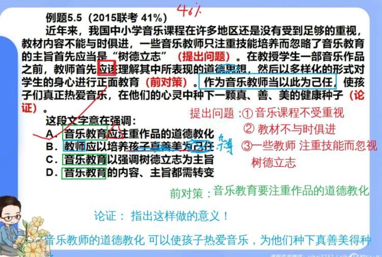

# 第五章 中心理解题目疑难点

## 5.1 如何抓准对策 
### 5.1.1 抓准对策句的关键做法 
例题 5.1（2019 黑龙江） 

为了帮助贫困地区脱贫，长期以来，社会各界以多种形式开展帮扶，扶贫思路更加清晰，扶贫手段更加多样，文化扶贫、旅游扶贫、电商扶贫等新方式效果显著，脱贫攻坚实现换挡提速。但一些尚未脱贫的地区，因为自然条件恶劣，发展脱贫产业难度较大`（转折引出问题）`。要啃下扶贫的“硬骨头”，`还需打好科技牌（后对策）`。最适合做这段文字标题的是： 

**A．打好脱贫攻坚科技牌**（对策的同义替换，当选） 

B．啃下扶贫的“硬骨头”（宽泛，没有说怎么“啃”） 

C．选好脱贫攻坚新方式（宽泛）

D．脱贫攻坚实现换挡提速（出处有误，出自转折之前） 

:::info
【参考答案】A 

:::

---

例题 5.2（2018 山东） 

近代以来人类的技术发展过程与古代不同。古代技术发展只是偶发事件，<u>如火药、指南针等</u>，尽管在军事史上产生过重大影响，但由于结构简单，后续没有重大改进。而近代技术则不然，从织布机到蒸汽机，进而到内燃机、电动机，技术的进步是连续的，也是一个可期待的线性过程`（引出话题并分析）`，<u>因此可瞄准未来，进行过程上的超前式跨越</u>`（前对策）`。如钱学森在中国基础工业非常薄弱的情况下，就主张重点发展导弹而不是飞机；美国在人造地球卫星和载人航天落后于苏联的情况下，便直接推出阿波罗登月计划。这些都是跨越式发展的典型表现`（举例论证）`。这段文字意在强调： 

**A．跨越式发展是抢占技术发展先机的前提**（翻译为：想抢占先机要跨越式发展） 

B．现代技术发展的路径与古代有本质的区别（区别比较联系类选项） 

C．勇气和魄力是支持跨越式发展的精神品质（无中生有） 

D．对技术改进的无限追求才能实现跨越式发展（对策的对策，不针对原文，无中生有） 

:::info
【参考答案】A 

想实现跨越式发展，要追求技术 

想在未来有所发展，可超前式<u>跨越</u>发展 

:::

---

例题 5.3（2022 上四川） 

中国接入国际互联网以来，互联网信息技术得到迅猛发展，在网络技术、移动芯片、智能终端、云计算、大数据、卫星导航等多个领域实现了重大突破，取得了一批显著的成就，网络技术自主创新能力显著增强、智能终端制造业加快赶超、不断培育新技术新应用形成新业态。但应该看到，与世界先进水平相比，我们还存在一定差距`（转折引出问题）`。目前世界局势波诡云谲，中国必须掌握核心技术，在新时代才能避免受制于人，掌握我国互联网发展的主动权`（后对策）`。这段文字意在说明： 

A．核心技术突破才是一个国家科技实力的彰显（中性表达）

B．我们与世界先进水平之间依然存在一定差距（是问题不是对策，原文给出对策优先选对策） 

C．互联网发展的主动权应掌握在我们自己手里（不是做法而是目标） 

**D．新时代更需突破互联网核心技术这个“命门”** 

:::info
【参考答案】D 

想要避免受制于人，掌握互联网发展主动权 

要掌握核心技术 

:::

---

例题 5.4（2020 下事业编联考） 

重点国有景区门票降价，不但直接触及景区的经济利益，而且伤及一些景区长期形成的“门票依赖”发展模式，因此必然会遭遇各种阻力和障碍`（提出问题）`。根据相关规定，重点国有景区门票降价不得只降低淡季价格、不降低旺季价格；不得以经营管理者在政府指导价范围内自主下浮价格替代政府降价；不得通过不合理设置“园中园”门票，提高其他游览服务价格，将门票、相关游览服务项目强制捆绑销售等方式冲减降价实效，搞“明降暗升”等`（分析问题）`。这些规定明确指向此前景区门票降价中出现的种种“招数”，而<u>只有这些“招数”彻底失灵失效了</u>，景区门票价格形成机制、成本监审机制和外部监督机制才算真正建立`（后对策）`。这段文字意在说明，重点国有景区门票降价： 

A．必须尽快建立与之相关的<u>法律监督机制</u>（没抓住对策重点，片面、杂糅。） 

B．应从理念上摒弃“门票依赖”的发展模式（是对策，但和原文对策不对应） 

C．有助于推动旅游业持续、稳定、健康地发展（意义类选项，原文有对策优先选对策） 

**D．关键在于将景区门票降价的规定落在实处** 

:::info
【参考答案】D 

景区门票价格相关机制的建立 要让假降价失灵

:::

---

例题 5.5（2015 联考） 

近年来，我国中小学音乐课程在许多地区还是没有受到足够的重视，教材内容不能与时俱进，一些音乐教师只注重技能培养而忽略了音乐教育的主旨首先应当是“树德立志”`（提出问题）`。在教授学生一部音乐作品之前，教师首先<u>应该</u>理解其中所表现的道德思想，然后以多样化的形式对学生的身心进行正面教育`（前对策）`。作为音乐教师当以此为己任，使孩子们真正热爱音乐，在他们的心灵中种下一颗真、善、美的健康种子`（论证）`。这段文字意在强调： 

A．音乐教育应注重作品的道德教化 

B．<u>教师</u>应以培养孩子真善美为己任（杂糅） 

C．音乐教育以强调树德立志为主旨（出处有误，不是对策） 

D．音乐教育的内容、主旨都需转变（主旨被忽略，但不需要转变） 

:::info
【参考答案】A

:::

---

### 5.1.2 借助问题和论证确定对策 
例题 5.6（2023 浙江） 

在社会文化的变革中，如果要创新，就必须要有新的思维，必须突破原有的观念体系和知识框架，必须要对社会已经蔓延的<u>“常识”</u>进行反思和批判（前对策）。这里的“常识”，指既定的思想框架和方法路径。尽管<u>这种思想框架和方法路径</u>可能是人类智慧和实践的一种积累，但是随着历史的发展，<u>它</u>很可能又变成了一种枷锁，限制和捆绑着人们的创造力`（分析论证）`。我们的反思、修正、突破和创新，都需要不断地去做各种各样的尝试`（重复对策）`。这段文字意在强调： 

A．“常识”容易让人墨守成规（问题表述） 

**B．要创新就必须突破“常识”**（论证反复提到“常识”，选项最好也出现“常识”） 

C．突破和创新需要大胆尝试（缺少高频词“常识”，且属于重复对策的表述） 

D．要警惕“常识”的负面影响（不符合原文内容） 

:::info
【参考答案】B 

首句：如果要创新 就必须突破尝试 

:::

---

例题 5.7（2019 山东） 

在 5000 多年文明发展进程中，中华民族创造了博大精深的灿烂文化。在当下，如何“让收藏在禁宫里的<u>文物</u>、陈列在广阔大地上的<u>遗产</u>、书写在古籍里的<u>文字</u>都活起来”，已成为我们必须面对的现实问题`（提出问题）`。试想，如果传统文化失去了与时代的连接、缺少了与现代人的情感沟通和心灵默契，“仅止于几个人在书房中互相叹赏”，那和一堆零散的符号、呆板的素材又有什么区别`（前对策）`？只有从“沉睡”中再出发，从“馆舍天地”走向“大千世界”，才能涵养出更具时代特色的、富有创新力的文化自信`（论证）`。这段文字旨在强调： 

A．中华民族拥有博大精深的传统文化（属于引出话题的部分） 

B．如何让文物“活起来”是我们必须面对的问题（片面） 

C．文物应走出封闭状态，向公众开放（片面，只提及文物） 

**D．传统文化应加强与时代的连接** 

:::info
【参考答案】D 

传统文化要和时代链接 要和这个时代的人沟通交流！

:::

---

例题 5.8（2021 事业单位联考） 

成绩要求相对较低，导致部分考生视艺考为进入高等学府的“绿色通道”或迅速成名的捷径，于是<u>扎堆报考、突击报考</u>等现象也就随之出现。另外，由于高中教学与艺考不能有效衔接，一个巨大的艺考培训市场应运而生，但市场内部存在行业垄断、恶性竞争、干扰院校招考正常秩序等乱象，<u>破坏了艺术类专业招生</u>和培养的健康生态`（提出问题）`。对此，教育部门应针对时弊，对艺术类专业招生加强规范，严格入校管理，进一步完善优化招录程序`（后对策）`。这段文字意在说明： 

A．“艺考”不等于“易考”（未提到对策） 

**B．艺术类专业招生亟待规范** 

C．艺术类人才更需提升文化素养（未提到对策） 

D．教育部门应多举措促进艺考公平（原文的问题是招生混乱，不是艺考不公平） 

:::info
【参考答案】B 

对策：教育部门应规范艺术类招生 

:::

---

例题 5.9（2021 国考副省） 

一般而言，城市群之间的交通干线分布着许多城市，聚集着大量产业和人口，从而构成经济带。加强经济带规划和经济带上城市建设，是建设现代化区域发展体系和促进区域协调发展的重要方面`（提出话题并分析）`。为此，应依托重要交通干线聚集经济要素，形成纵向或横向的<u>经济发展轴</u>，充分发挥其对统筹区域协调发展的作用`（前对策）`。比如，沿海经济带、长江经济带、陇海兰新经济带和京广京哈经济带等已经集聚了大量人口、产业，城市分布也比较密集，形成了比较明显的<u>经济发展轴</u>，已成为承东启西、连南贯北的经济主骨架`（论证）`。这段文字意在说明： 

A．经济带建设对区域协调发展具有重要意义（对策之前内容，不重要） 

B．我国区域经济发展应以城市群建设为依托（无中生有） 

C．交通干线承担着聚集经济要素的重大使命（中性表达） 

D．形成经济发展轴是城市群建设的长远目标（语义表对策：长远来看，城市建设要形成经济发展轴） 

:::info
【参考答案】D 

第 1 句 经济带的构成；第 2 句，经济带建设的意义；第 3 句，为此，要形成经济发展 

轴；第 4 句，论证形成经济发展轴的重要意义。 

被论证的是重点，第 4 句话论证形成经济发展轴的意义，即重点是要形成经济发展轴。

:::

---

## 5.2 如何选择“对策与问题” 
`原文有对策选对策，原文只有问题没有对策，可以选针对性的对策或概括问题的选项，这两个选项一般不同时出现，即使同时出现，一定有一个存在致命问题。` 

例题 5.10（2020 湖南） 

当前我国正处于人口结构高速转变的时期，农村人力资源开发将需要同时面临“农村劳动力转移的难度加大”与“农村劳动力存量的整体素质趋于降低”两大问题`（提出问题）`。从农业农村发展的要求出发，今后一个时期，开发农村人力资源，优化农村人力资本结构必须着眼于提升农村人力资源的自我发展能力和辐射带动能力，通过“以点带面”加快促进`农村劳动者整体素质`的提高，从而有效`缓解当前人力资源日益短缺的问题`，促进农业农村平稳发展`（后对策）`。

这段文字作者主要强调的是： 

A．当前我国农村人力资源开发的问题（原文有对策，问题选项不选） 

B．农村劳动者整体素质提升的策略（对策的对策） 

C．当前农村人力资源日益短缺的问题（原文有对策，问题选项不选） 

**D．农村劳动力资源短缺的解决办法** 

:::info
【参考答案】D 

问题：农村劳动力资源短缺；对策：提升农村劳动力的整体素质。

:::

---

例题 5.11（2015 联考） 

目前，各城市的城管机构设置不尽相同，一般分为城建监察大队、城市管理局、城市管理行政执法局、城市管理委员会四种`（引出话题）`。由于城管工作实际是各自为政，没有一部专门的全国性法律来指导，各地方政府根据立法权限制定了一些地方性条例。但差异很大，难以系统化，并由此导致近年来各地不断出现一些“城管暴力执法”事件，影响到社会安定`（提出问题）`。这段文字意在说明： 

A．当前我国城市多头管理之“乱”（宽泛，问题概括不正确） 

B．城管执法问题是社会关注的焦点（未提到问题或对策） 

C．城管纳入法制轨道是当务之急（该对策针对的问题是城管没有法律管理，对策没有针对性） 

**D．有必要制定全国性的城管法律** 

:::info
【参考答案】D 

问题：没有全国性的城管法律，地方性的城管法律没有系统化。

:::

---

例题 5.12（2022 联考） 

长期以来，考试大纲规定了考试的内容、范围、知识点，规定了各学科知识点的考试权重，规定了各个知识点的考试题型，其“标准”明确、具体、直观，对教师教学的导向极其强烈`（引出问题）`。一方面，它缩小了国家课程标准关于各学科教学内容的范围；另一方面，它规定了各学科知识点在考试中的权重，教师的学科教学活动“做题化”“训练化”倾向越发严重`（分析问题）`。在考试大纲的这种强大的导向下，教学过程几乎“窄化”“异化”成了考试训练过程，让教育教学活动陷入应试教育的“泥潭”无力自拔`（总结问题）`。这段文字意在说明： 

A．考试大纲的强导向作用亟待弱化（考试大纲的强导向作用无法弱化，只要存在大纲就会有强导向作用，除非取消考试大纲，且对策没有针对性） 

B．考试大纲的存在不符合时代要求（无中生有） 

**C．考试大纲的出现强化了应试教育** 

D．考试大纲偏离了素质教育的要求（无中生有） 

:::info
【参考答案】C 

问题：考试大纲让教育教学陷入应试教育泥潭。

:::

---

例题 5.13（2022 联考） 

石窟造像和刻经在千百年风吹日晒等自然营力影响下，由于卸荷裂隙、风化裂隙切穿石窟岩体，裂隙成为`水`的渗流通道。`降雨`时，雨水沿裂隙进入石窟内，`水`沿经文岩体石壁漫流，对经文题刻造成严重溶蚀、软化等侵蚀破坏；或在石窟内形成`积水`，使石窟长期处于`潮湿`状态，加剧经文的风化破坏。严重风化破坏的面积约 80 平方米。遭受`渗水`侵蚀的 43、44、59、60 等窟刻经造像风化破坏严重`（提出问题）`。石刻经文由发现初的 40 万字到目前保存较好的仅 24 万字，若再不进行科学抢险大修，20 年内这处经窟将风化不存`（后对策）`。

这段文字主要介绍了： 

A．石窟抢险大修应着力于加固（对策的对策） 

B．风化是石窟急需解决的问题（问题概括不正确） 

C．风吹日晒使石窟受损程度严重（问题概括不正确）

**D．渗水严重是石窟面临的大问题** 

:::info
【参考答案】D 

问题：渗水（问题不是风化：全文一直在强调水，水导致风化严重，并且风化是自然存在的现象，无法解决）。 

对策：要进行抢险大修。 

:::

---

## 5.3 如何体现作者态度
例题 5.14（2018 江西） 

人车争道是影响我国城市交通安全的<u>顽疾</u>之一`（提出问题）`。“斑马线之争”不仅让市民出行心惊胆战，造成交通拥堵事故频发，还严重影响了公共交通文明和城市形象。据公安部交管局统计，近三年来，全国共在斑马线发生机动车与行人的交通事故 1.4 万起，造成3898 人死亡`（分析问题）`。

这段文字主要阐述的是： 

A．交通出行与每个人生活息息相关（中性表达，未体现问题） 

**B．倡导礼让斑马线需要<u>长期</u>坚持**（针对问题的对策） 

C．斑马线文明是城市文明的缩影（中性表达，未体现问题） 

D．机动车驾驶员法律意识、文明意识淡薄（无中生有） 

:::info
【参考答案】B 

问题：我国一直存在人车争道问题。 

:::

---

例题 5.15（2023 吉林省考） 

“挖矿”，简单说就是利用专用计算机即“矿机”来计算生产虚拟货币的过程。“挖矿”是一种形象的说法，却也很典型地透露了虚拟货币的生产状况：`高耗能、高碳排放`。有数据显示，一家拥有 1 万台“矿机”的矿场，`2021 年前 4 个月，纳税仅 9 万元，月均耗电量却高达 4500 万度`，折算能耗约为 1.5 万吨标煤。从文中数据来看： 

A．“挖矿”产业链需要再完善（不符合作者态度） 

**B．“挖矿”产业有治理的必要** 

C．提高“挖矿”技术可降低环保成本（无中生有） 

D．高耗能是“挖矿”产业的最大掣肘（不符合作者态度）

:::info
【参考答案】B 

作者态度：消极态度，反对“挖矿”，要进行治理。

:::

---

例题 5.16（2022 天津） 

伴随着社会发展，家庭教育面临着复杂多变的形势和前所未有的困境。一个非常突出的问题是，一些通行的家庭教育方式方法，违背了孩子身心健康成长的心理规律和教育教学规律。家庭教育的知识本位导致家长形成一种担忧孩子“输在起跑线上”的恐慌心理。因此，很多家长带着孩子奔波于各种校外辅导机构，<u>提前学习</u>各科知识`（提出问题）`。儿童心理成熟是一个自然的过程，教育不能改变其发展的主要时间进程，只有儿童心理和认知水平成熟到一定程度以后，人为教育和训练才会起作用。人为地提前训练，可能一时一地占有一定优势，但这种优势不会长期保持下去`（分析问题/后观点）`。这段文字意在说明： 

A．<u>提前学习</u>违背了儿童心理成熟发展规律 

B．一切教育形式都必须遵循人格发展的规律（未体现问题：提前学习） 

C．知识本位已成为我国家庭教育的“背景底色”（未体现问题：提前学习） 

D．人为教育只有在儿童认知水平成熟后才有意义（反推不出原文问题） 

:::info
【参考答案】A 

问题：提前学习。 

“只有……才”不一定是对策，也可能是论证，结合前后文分析。

:::

---

例题 5.17（2022 联考） 

与其它生命形式一样，适宜、稳定的自然环境，是人类文明得以存在和延续的重要外部条件，纵观地球生命的进化史，仅仅由于温度、水汽循环或者氧气含量的变化超出了当时地球生命的承受范围，`就造成了四次生物大灭绝事件`。我们人类的形成历史仅有 500 万年，在此期间，虽然没有发生过像前四次生物大灭绝那样剧烈的环境变化，但是作为文明程度日益提升的人类，即使拥有了其它生物无法比拟的改造环境能力，却仍然在适应环境上表现出了极大的弱点，比如对温度的耐受性不高、对光照十分敏感、容易因环境的变化引发各种疾病等等，`可以说人类在大自然面前仍然非常脆弱`。这段文字主要说的是： 

A．人类文明的发展是个漫长的过程（历程类选项） 

**B．人类文明的形成与存在并不容易**

C．自然环境是人类文明存在的基础（中性表达，体现不出作者态度） 

D．人类将面临着大自然的严峻考验（时态错误，人类一直面临大自然严峻考验） 

:::info
【参考答案】B 

作者态度：人类非常脆弱，面对大自然非常不容易。

:::

